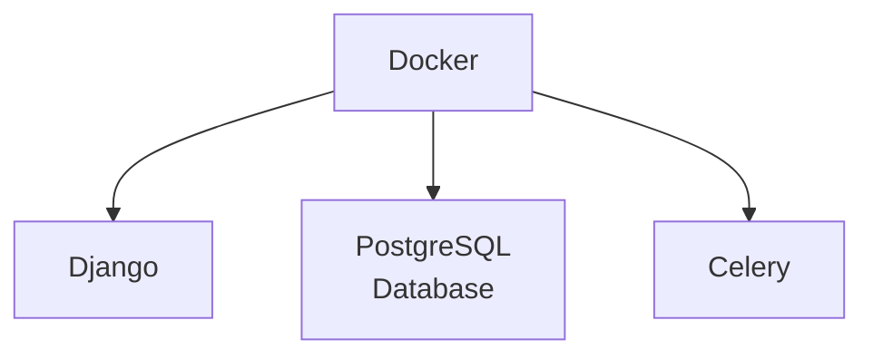

GeoSight is built on a modern web stack that leverages the power of Django, PostgreSQL, and Cloud Native GIS (vector tiles, COGS) for geospatial capabilities. The architecture is designed to be modular, scalable, and maintainable, allowing for easy integration of new features and data sources.

### Key Components

- **Django**: The web framework that powers the application, providing a robust backend for handling requests, managing data, and serving the frontend.
- **PostgreSQL**: The relational database that stores all application data, including user information, geospatial data, and application settings.
- **GeoDjango**: An extension of Django that adds support for geographic data, enabling advanced geospatial queries and operations.
- **Docker**: Used for containerization, allowing the application to run consistently across different environments.
- **Celery**: A distributed task queue that handles background tasks, such as data processing and notifications, ensuring the application remains responsive.

### Architecture Diagram

