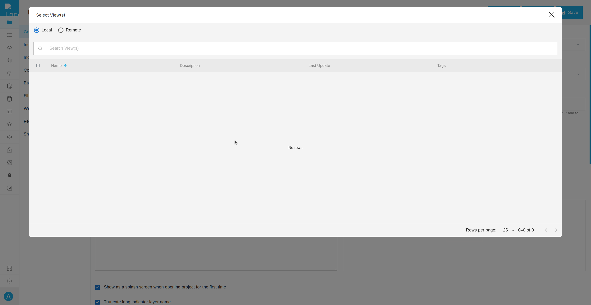

# GeoSight Plugin

GeoSight has several plugins available for use. 
By default, these plugins are inactive. 
To enable them, you can modify the environment variable PLUGINS.

_Environments:_
```
# Required for tenant configurations
APP_DOMAIN=localhost

# Specify the plugins to enable or disable
# Use a comma-separated list

# GeoSight plugins:
# - tenants
# - cloud_native_gis
# - reference_dataset
PLUGINS=tenants,cloud_native_gis,reference_dataset
# -----------------------------
```

## 1. tenants

The Tenants plugin enables GeoSight to support multiple applications across different domains. Each tenant has its own domain and stores its data in a separate schema.

When enabling the tenants plugin, the APP_DOMAIN environment variable must be configured. APP_DOMAIN represents the domain used by the main application.

For example:

```
If the domain is geosight.example.com, set APP_DOMAIN=geosight.example.
If the domain is example.com, set APP_DOMAIN=example.
```
For more details about tenants, refer to the documentation: [Django Tenants Documentation](https://django-tenants.readthedocs.io/en/latest/).


## 2. cloud_native_gis

Cloud Native GIS is a feature in GeoSight that allows users to upload their own GIS files as context layers.
Currently, only vector layers are supported, but raster layer support will be added in the future.

In GeoSight, a new type of context layer, "Cloud Native GIS Layer," has been introduced. 
When selected, additional details will appear below, displaying an upload form for the file.


_image 1. New type of Cloud Native GIS Layer_


_Image 2. The layer will be served as vector tiles._


_Image 3. Clicking 'Editor' will open Maputnik, allowing you to easily edit the style._

For more details about tenants, refer to the [github repository](https://github.com/kartoza/CloudNativeGIS/).

## 3. Reference Dataset

The Reference Dataset serves as a local version of GeoRepo. 
Users can upload their own vector files, similar to GeoRepo, which can then be used as a reference view in GeoSight.



_Image 4. If activated, a 'Local' tab will appear, allowing users to utilize the local reference dataset._


_Image 5. If activated, new view type options will be displayed as a tab._

