# End-to-end testing

## Introduction
[E2E](https://www.techtarget.com/searchsoftwarequality/definition/End-to-end-testing)
verifies working order of a system from start to end,
taking into account real world scenarios the system can run(simulate user experience)

Most of the projects of the applications at the company are mainly in Django with a React frontend.

To accomplish E2E testing, we use [playwright](https://playwright.dev/).
It supports all the major browsers used today.

## Getting started

To get started with Playwright, you need to ensure you have playwright installed in your device locally.
There are a variety of playwright packages, but as per our standards, we will use Playwright Node.js package.

### Installing Node.js

To set up Node.js in Debian/Ubuntu or Fedora,
the binary distributions for Node.js are available at [Nodesource](https://github.com/nodesource/distributions).
The binary setups are directly installed.

For NixOS, the configuration can be found at [NixOS packages](https://search.nixos.org/packages).
You can go ahead and search for the Node.js version best suited.
The configuration for that package is then added to `etc/nixos/configuration.nix`.
```nixos
environment.systemPackages = [
    pkgs.nodejs_20
  ];
```

For NixOS users, it is an added advantage if `direnv` is installed.
When you navigate into the specific directory e.g., ci-tests, your environment will be set up.

**NOTE:** For this to work for Nix-OS users, ensure the directory has an `.envrc` and `default.nix` file.
`shell.nix` file also works.


### Installing playwright using npm

At the root of your project directory `Project`, navigate to `playwright`.

```bash
cd playwright
```

In the `playwright` directory, there are two more directories:

```bash
$ ls
ci-tests staging-tests
```

To set up a new playwright project use:
```bash
npm init playwright@latest
```

To update an existing project use:
```bash
npm install -D @playwright/test@latest
```

To configure playwright step by step, you will have to:

- To install all browsers and all its dependencies:
```bash
npx playwright install --with-deps
```

- To install one browser and its dependencies
```bash
npx playwright install chromium --with-deps
```

## Setting up playwright and usage

### For continuous integration(`CI`)

Playwright does support Continuous Integration.
For more information, visit the [playwright ci docs](https://playwright.dev/docs/ci-intro).

Navigate to `playwright/ci-tests` directory.

In the directory ensure the below files are present:

```bash
$ cd ci-tests
$ ls
package.json playwright.config.ts
```

Then you can proceed with setting up playwright:

- To update npm dependencies
```bash
npm install
```

- To install CI dependencies
```bash
npm ci
```

- To install playwright package, browsers and linux dependencies
```bash
npx playwright install --with-deps
```

- To run tests:
```bash
npx playwright test
```
By default, this test will run in `headless` mode(No browser will be opened).

### For staging tests


#### Linux/WSL based systems

In setting up environment for staging tests, it uses the same approach as in setting up for CI.
The only difference is that installing dependencies for CI won't be required.

**NOTE:** Both `ci-tests` and `staging-tests` directory will have scripts to assist in setting up the environment easily.

The scripts are:

- `create-auth.sh`: Used to create a cookie file with the session state saved.
- `record-test.sh`: Used to record new tests.
- `run-tests.sh`: Used to run tests.

These scripts check if you have the required environment is set up, if it is not, the script will set up everything.
After setting up the environment, the script will proceed to run the next step.

- Start off by creating the session state file.


  1. Shows how to run the script in your terminal
  2. The script will prompt you if you want to save the `auth.json` file.

- Proceed to log in.

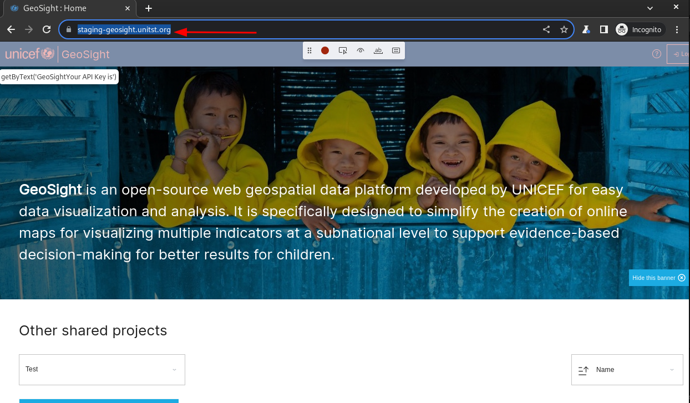

- The `auth.json` will be created. You can then proceed to record your tests.


- To record your tests, proceed to run the next script `record-test.sh`.
The script takes a name argument for the file to be created `./record-test.sh demo`.


- The script will open a browser and load the required page.
It will use the session state that was previously created.

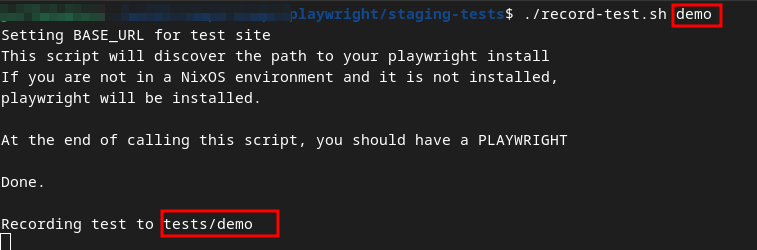

- Click on the page elements to record a test.


**NOTE:** For playwright version 1.40 and above, you get a mini-toolbar that helps you to:

  - Assert if an element is visible.
  - Assert if an element contains a specific text
  - Assert if an element has a certain value

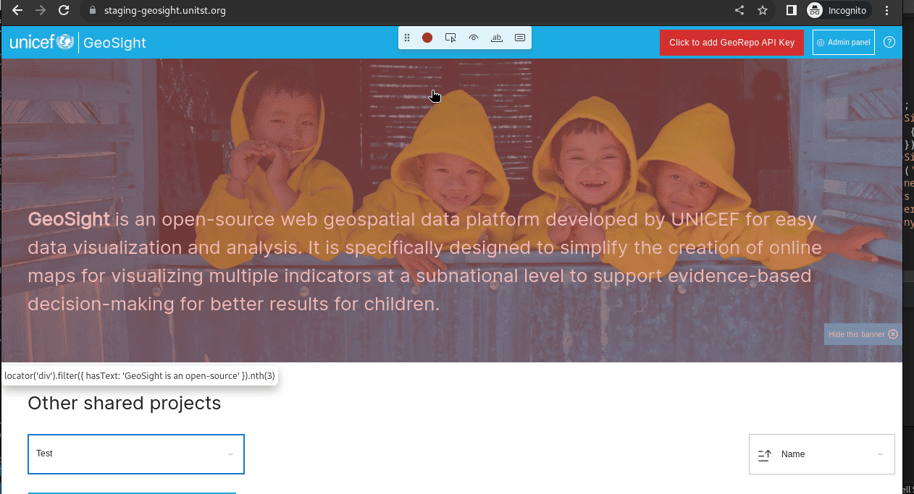

- This is the generated script from the above action of recording tests.
`expect` is used in assertions as seen below.

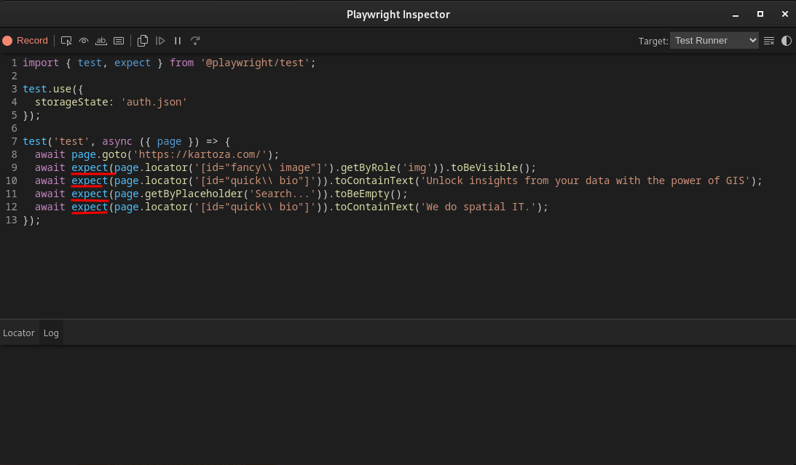


- To run the tests, use `./run-tests.sh`. 

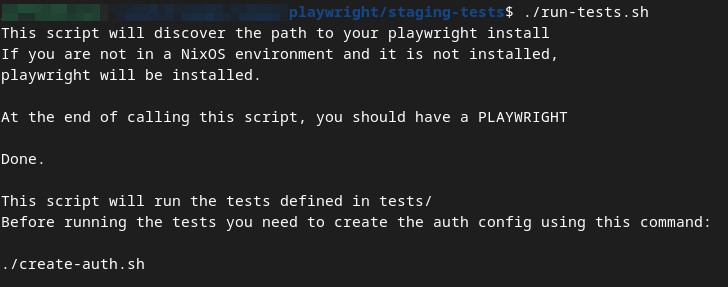

- It will open a GUI playwright test runner with all tests. You can then proceed to run the tests.

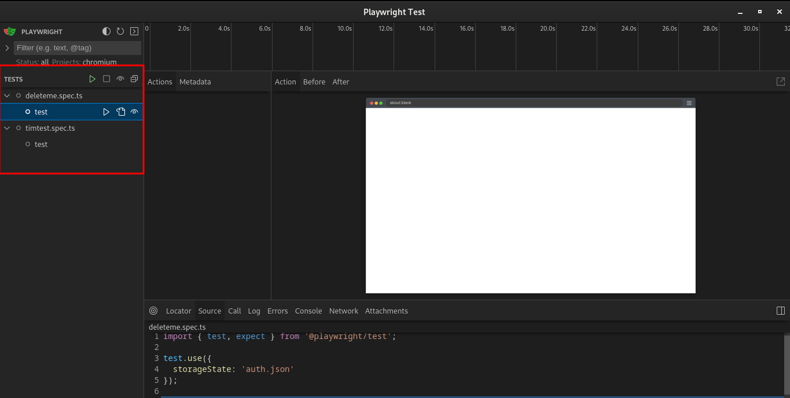

#### Windows based systems

This is strictly for windows based systems not using WSL.

On Visual Studio Code, click on the `Run and debug` icon.


Click on the drop-down button.
You will be able to see the options available.


##### Create an authentication file

Click on `Playwright runner: Authentication`.
It will check if you have playwright installed, and if it is not installed, it will be installed.

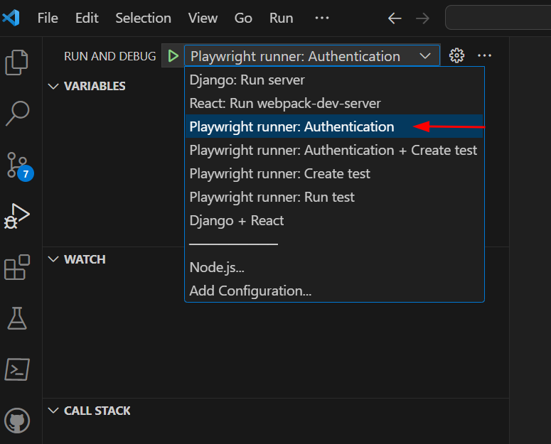

After the installation is complete, it will create an authentication file.
This file is necessary as you will be able to save a session state.
In this case, to save the logged-in session.

Click on Log in.


Enter your details.
Proceed to Sign in.
Once signed in, close the browser window.


If you look at the files in Visual Studio Code, you will notice the `auth` file has been created.


##### Recording tests

The next step will be to record our steps.
Click on `Playwright runner: Create test`.

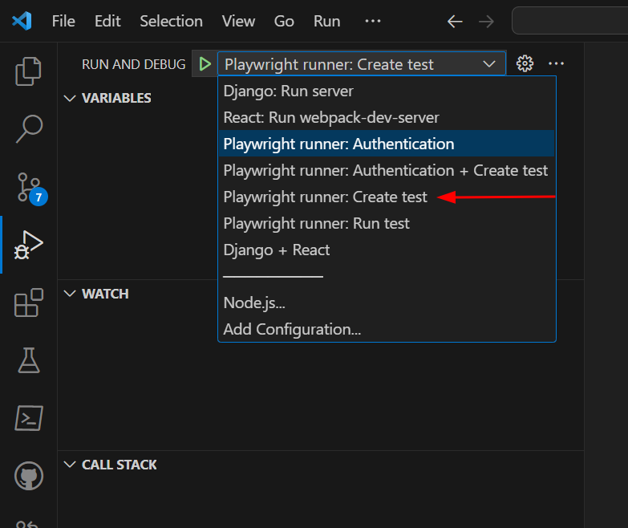

It will prompt the file name.


It will start a browser session.
At the top, this is a panel with tools used for testing.


You can start by;

1. Click on the tool highlighted with `1`.
2. Click on the text highlighted with the arrow labelled `2`
3. Look at the text box that appears after clicking on the text.
Click the green tick.

We have recorded a test to assert if that element contains that text.


Proceed to click on `Demo GeoSight project`.

It will open the below page.

Click on `district` available on the map the click on the highlighted tool on the panel.
Click on the name at the top of the pop-up.

Click on the tool again then click on the value of the pop-up.

Basically what we have done is record a test to assert if the pop-up is visible when a district is clicked on the map.


You can proceed to the search bar on the top right.

Click on the highlighted tool on the panel.

Click on the search bar(asserts that the search bar is empty).

Enter a value for example `somalia` in this case then click on search.

Click on the highlighted tool again then on the search bar.

This asserts if the value typed in the search bar did not change or clear after clicking search.

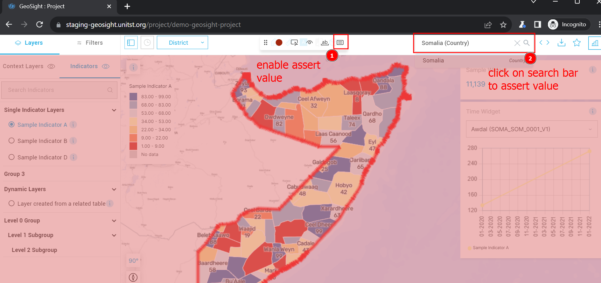

After recording tests, you can proceed to close the browser.
You will see the test file has been generated in the `tests` folder under `staging-tests`.


**Note:** You can create an authentication file and start recording tests by using one option.
Click on `Playwright runner: Authentication + Create test`.


##### Running tests

To run the tests, Click on `Playwright runner: Run test`.


It will start up a browser session whereby you can run the tests.

On the browser session;

1. Shows the recorded test.
When you click on the triangle icon next to it, the test will execute.
2. Shows the view panel. You can view the tests execute step by step.
3. Shows the script or where the check fails.


You can use the playwright extension as well to run the tests.

Click on the testing icon, and then click on the test you want to run.
Click on the triangle next to it.

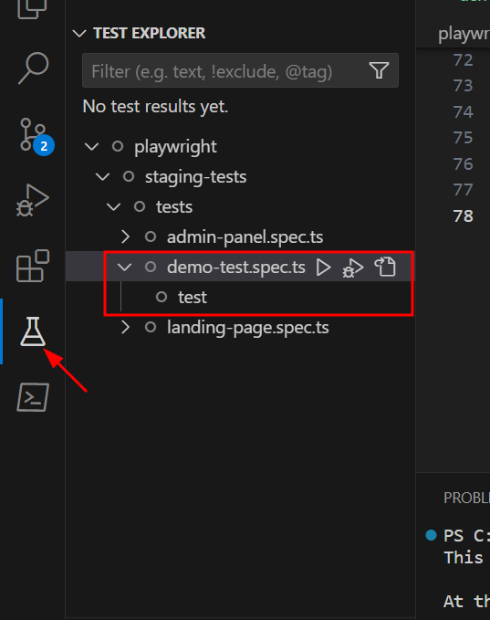


### Setup using visual studio code

Install extension `Playwright extention`

Click on the vscode's extension icon:


Search for `playwright test`, select the below playwright test extension:

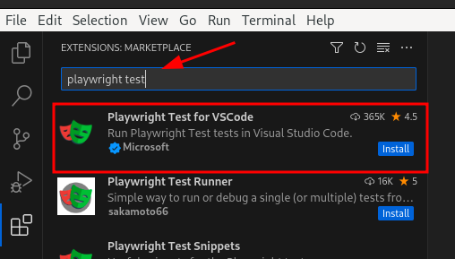

Install the extension:

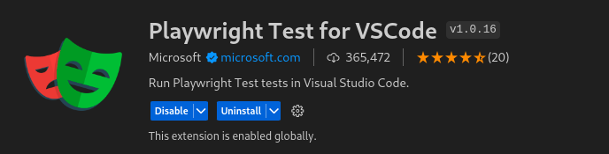

On your keyboard, press `ctrl + shift + P`.
Search for `playwright`, select `Install Playwright`.

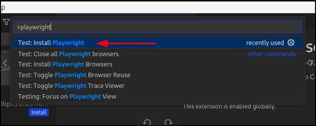

It will open up the following menu:


For option `1`: You can choose to install one or all the browsers.

For option `2`:
- Use `TypeScript` as a default(current preferred standard).
- You can enable to add `GitHub actions` if the tests are for `CI`.
- Enable to `Install Linux dependencies` if you are on Debian/Ubuntu.
You can check this option if you are installing playwright for the first time.

Press `Ok` to proceed:
It will install and set up the project.


### Running playwright tests in visual studio code

To run tests in vscode, click on this testing icon.


It will scan your `tests` directory for playwright tests.


To run, click on the triangle icon:

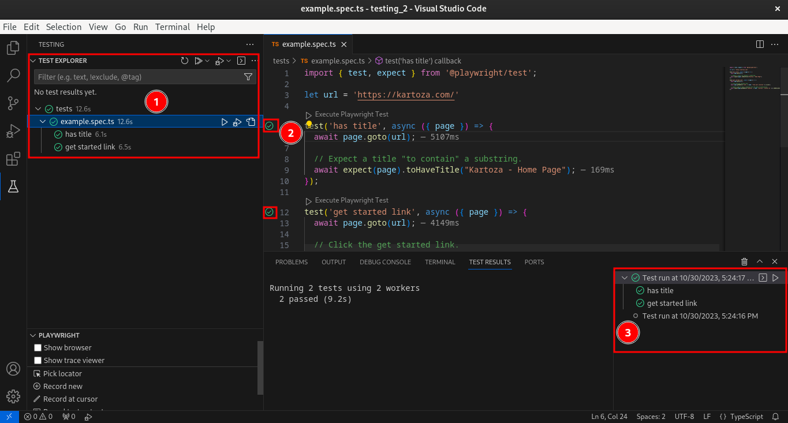

- `1`: Lists down all tests functions. You can test normally and also debug from here.
- `2`: You can run the test functions from here.
- `3`: Shows the test results for each session.

The tests will run and the results shown.

For more information, look at the [playwright docs for vscode](https://playwright.dev/docs/getting-started-vscode).
