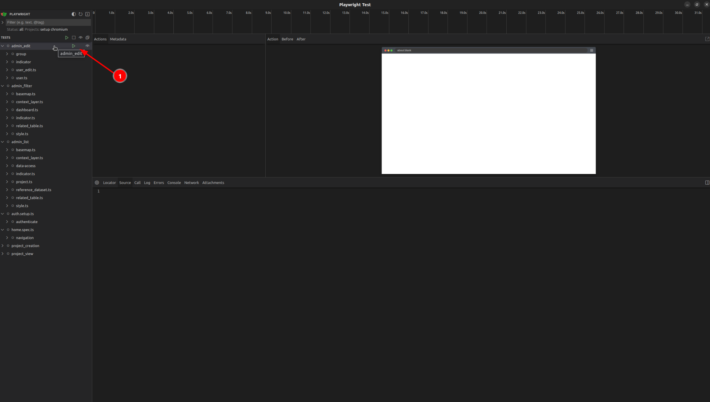

# End to end test

GeoSight implements end-to-end testing to ensure the frontend functions correctly. For this purpose, we utilize Playwright.

The Playwright tests can be found in the `playwright/ci-test` folder.


## How to run end to end test

### Prerequisites

1. To ensure the end-to-end tests are functioning properly, you must run the development server. For setup instructions, please refer to [GeoSight Setup Guide](https://unicef-drp.github.io/GeoSight-OS-Documentation/developer/setup/).
2. You must have the correct database configuration. This involves deleting the current database and loading the appropriate fixtures.
3. Navigate to the `playwright/ci-test` directory to access the tests. Inside, you will find multiple folders.
4. To identify the database used for each folder, consult the README file located within the respective folder.

### How to Run

1. Navigate to the `playwright/ci-test` directory.
2. Check the README inside the folder to understand the purpose of the tests.
3. After selecting the correct folder and ensuring the correct database:
   - Run `npm install`
   - Run `npm ci`
   - Run `npx playwright install --with-deps`
   - Execute the tests with `npx playwright test {targeted folder}` (e.g., `npx playwright test tests/project_creation`)
4. Wait until the tests are completed.

### How to Run in UI Mode

- You can run the tests in UI mode to view each step and see images of each step.
- To do this, run `npx playwright test --ui`.
- This will display the UI mode interface as shown below:



- Hovering over a folder allows you to click the play button for a specific folder or individual test.

### How to Add a New Test

1. **Check an Existing Test File**:  
   - Review one of the existing `.ts` files inside the respective folder to understand the structure and flow.
   
2. **Create a New Test File**:  
   - Copy the structure from an existing `.ts` file and create a new `.ts` file inside the respective folder for the new test.

### If You Think the New Test May Affect Other Tests

1. **Create a New Folder**:  
   - If you believe that the new test could potentially impact the other tests, create a new folder for it.

2. **Add Fixtures**:  
   - Inside the new folder, create a `README.md` file and specify the correct fixture for the tests.

3. **Update the CI Configuration**:  
   - After setting up the new test folder and fixture, go to `.github/workflows/tests.yaml`.
   - On line 98, find the `test_suite` list.
   - Add a new element to the list, for example:  
     ```yaml
     { name: "E2E Tests: Admin New Test", path: "tests/new_test", workers: 3, script_load: "make load-test-data" }
     ```

4. **Push to GitHub**:  
   - Push the changes to GitHub and create a pull request.

5. **Wait for the GitHub Workflow**:  
   - Once the pull request is created, wait for the GitHub workflow to pick up the new tests and run them.