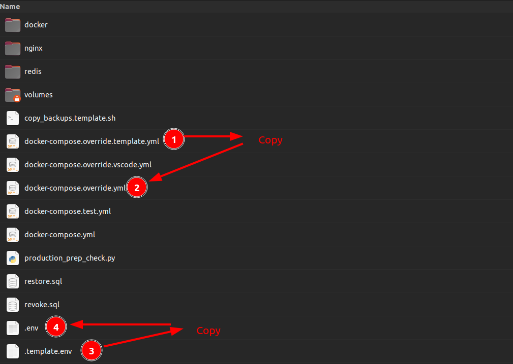

# Code preparation

This steps, you need to update some files to make the project works.

## Copying files

Go to deployment and

```
Copy the `template.env` to `.env`
Copy the `docker-compose.override.template.yml` to `docker-compose.override.yml`
```



## Note for Apple Silicon

**Note for Apple Silicon**
Before proceeding with the setup, if you are developing on an Apple Silicon or
other AMD-based devices, please ensure to uncomment line 17 in
the [deployment/docker/Dockerfile](https://github.com/unicef-drp/GeoSight-OS/blob/main/deployment/docker/Dockerfile#L17).

```
#ARG PLATFORM=linux/arm64
```

🪧 Now that the codebase is set up, you are ready to run the application.

1. If you are using **VS Code**, please refer to the [Run with VSCode](run-with-vscode.md) guide.
2. If you are using **PyCharm**, please refer to the [Run with PyCharm](run-with-pycharm.md) guide.
3. If you are not using an IDE and prefer to work directly with a text editor, please refer to the [Run without IDE](run-without-ide.md) guide.

   Note: With this approach, you won’t have access to integrated debugging features provided by full IDEs.