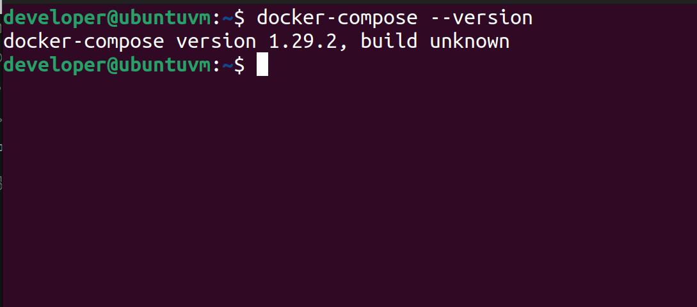

## Docker

We assume in our notes that you are using the current Ubuntu LTS - though we try to keep things generic so that you can repeat on other distros or WSL2 on windows.

We recommend using the official Docker packages (not those provided by your distro) and assume membership of the docker group. See [docker.io's guide](https://docs.docker.com/engine/install/ubuntu/) for setup notes and below for adding yourself to the docker group.

```
sudo usermod -a -G docker $user
```
(Restart your computer after making this change)

You need to have docker-compose installed - version 1.29 or later should work fine.



## Dependencies installation

The project provide **make** command that making setup process easier.
To install make on your machine or virtual box server, do:

```
sudo apt install make
```

Project has recipe that you can use to run the project in one command.
This recipe needs docker-compose to be able to use it.
To install it, do:

```
sudo apt install docker-compose
apt install ca-certificates curl gnup lsb-release  
```

## Docker installation

The project needs docker to be able to run it. To install docker, please follow these instructions.

```
curl -fsSL https://download.docker.com/linux/ubuntu/gpg | sudo gpg --dearmor -o /usr/share/keyrings/docker-archive-keyring.gpg     
```

On the next prompt line:

```
echo \
"deb [arch=$(dpkg --print-architecture) signed-by=/usr/share/keyrings/docker-archive-keyring.gpg]https:download.docker.com/linux/ubuntu \
$(lsb_release -cs) stable" | sudo tee /etc/apt/sources.list.d/docker.list > /dev/null
```

Run apt update:

```
sudo apt-get update
```

This will install docker
```
sudo apt-get install  docker-ce-cli containerd.io
```

This will check if installation of docker was successful
```
sudo docker version
```
And it should return like this

```
Client: Docker Engine - Community
 Version:           20.10.9
 API version:       1.41
 Go version:        go1.16.8
 Git commit:        c2ea9bc
 Built:             Mon Oct  4 16:08:29 2021
 OS/Arch:           linux/amd64
 Context:           default
 Experimental:      true

```

### Manage docker as non-root

This will ensure that the docker can be executed without sudo.
```
sudo systemctl daemon-reload
sudo systemctl start docker
sudo usermod -a -G $USER
sudo systemctl enable docker
```

Verify that you can run docker commands without sudo.
```
docker run hello-world
```

For more information how to install docker, please visit [Install Docker Engine](https://docs.docker.com/engine/install/)


🪧 Now that you have the docker, move on to the [Step 2 - Cloning](cloning.md).