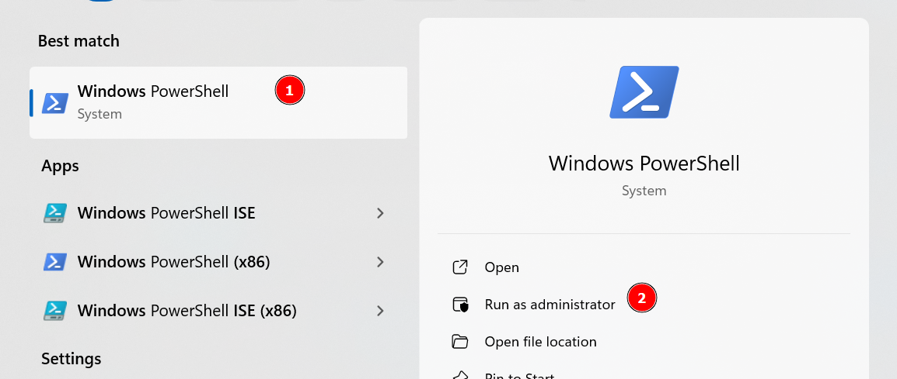
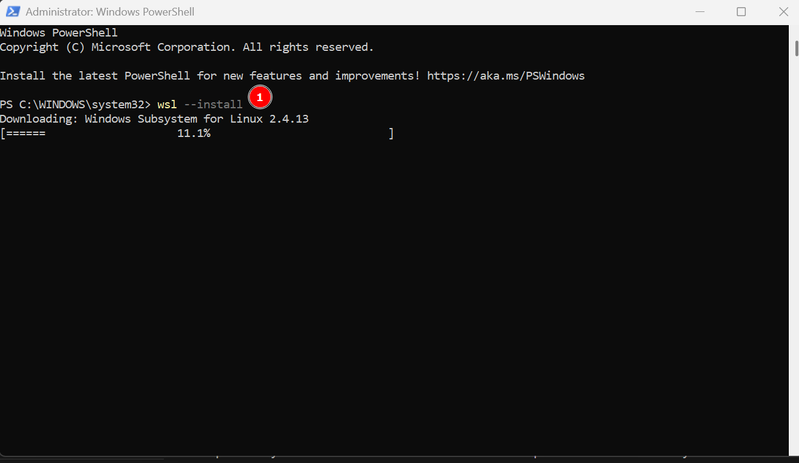
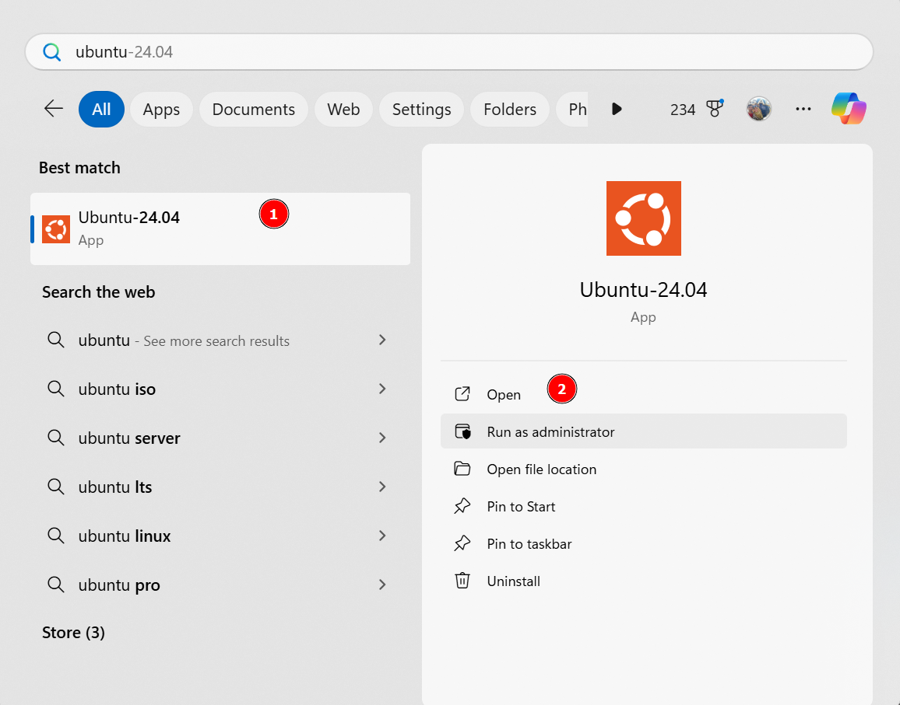

## Setup Docker with WSL2 on Windows

### WSL2
WSL2 is needed to run linux environment in Windows. Follow step by step below to install WSL2.

Open Powershell as Administrator



Install wsl2 with below command

```
wsl --install
```



Once completed, you need to restart the machine. You can check if the installation is completed successfully by checking the list of installed distribution from the Powershell.

```
wsl --list
```

By default, the Ubuntu is chosen and installed after running the first command. However if there is no distribution that is installed like image below, we can then install it manually.


To list all the available distribution, we can run command:

```
wsl --list --online
```

The results:

```
The following is a list of valid distributions that can be installed.
Install using 'wsl.exe --install <Distro>'.

NAME                            FRIENDLY NAME
AlmaLinux-8                     AlmaLinux OS 8
AlmaLinux-9                     AlmaLinux OS 9
AlmaLinux-Kitten-10             AlmaLinux OS Kitten 10
Debian                          Debian GNU/Linux
FedoraLinux-42                  Fedora Linux 42
SUSE-Linux-Enterprise-15-SP5    SUSE Linux Enterprise 15 SP5
SUSE-Linux-Enterprise-15-SP6    SUSE Linux Enterprise 15 SP6
Ubuntu                          Ubuntu
Ubuntu-24.04                    Ubuntu 24.04 LTS
archlinux                       Arch Linux
kali-linux                      Kali Linux Rolling
openSUSE-Tumbleweed             openSUSE Tumbleweed
openSUSE-Leap-15.6              openSUSE Leap 15.6
Ubuntu-18.04                    Ubuntu 18.04 LTS
Ubuntu-20.04                    Ubuntu 20.04 LTS
Ubuntu-22.04                    Ubuntu 22.04 LTS
OracleLinux_7_9                 Oracle Linux 7.9
OracleLinux_8_7                 Oracle Linux 8.7
OracleLinux_9_1                 Oracle Linux 9.1
```

We will use the latest Ubuntu version, 24.04 LTS. To install it, run command:

```
wsl --install Ubuntu-24.04
```


Once ubuntu is installed, we can setup the user account for Ubuntu. Search for ubuntu from the search bar and click Open to run it.



It will open a terminal where you can setup username and password for your Ubuntu.


After your user account is created, you will see below image that indicates the installation is successful.


You should update your system after this by running command:

```
sudo apt-get update && sudo apt-get upgrade
```

**Install Git**

```
sudo apt-get install git
```

**(Optional) Generate SSH key pair**

The SSH are preferred when fetching and pushing codes to GitHub. Please follow [this link](https://docs.github.com/en/authentication/connecting-to-github-with-ssh/generating-a-new-ssh-key-and-adding-it-to-the-ssh-agent?platform=linux#generating-a-new-ssh-key) to generate SSH key pair and add it into your GitHub account.

**(Optional) Install GPG on WSL2**

GPG signing keys are used to sign the commits. WSL2 can use the keys from Windows by following [this tutorial](https://gist.github.com/matthiasr/473072eeffe449459e3ccd0f5192afc7). Next, we need to update the configuration inside WSL2, edit or create if this file does not exist: `~/.gnupg/gpg-agent.conf`.

```
default-cache-ttl 34560000
max-cache-ttl 34560000
pinentry-program "/mnt/c/Program Files (x86)/GnuPG/bin/pinentry-basic.exe"
```

It is recommended to explicitly restart the gpg agent to force these changes. Alternatively, restart Windows at this point.

```
gpgconf --kill gpg-agent
```

Once the key is generated, please follow [this link](https://docs.github.com/en/authentication/managing-commit-signature-verification/adding-a-gpg-key-to-your-github-account) to add it into your GitHub account.


### Install Docker Desktop

Follow [this guide](https://learn.microsoft.com/en-us/windows/wsl/tutorials/wsl-containers#overview-of-docker-containers) to install docker desktop that integrates with WSL2. After docker is installed and running, we recommend to disable the `Resource Saver` feature as it may cause unexpected issue during development.


### Install VSCode

Follow the installation steps from [this link](https://code.visualstudio.com/docs/setup/windows) to setup the VSCode on Windows. The VSCode CLI will also be installed in the WSL2 and you can check by running below command in the WSL2 Ubuntu terminal.

```
code --version
```

It will return output like below:

```
1.100.2
848b80aeb52026648a8ff9f7c45a9b0a80641e2e
x64
```


🪧 Now that you have the docker and VSCode, move on to the [Cloning](../cloning.md).
