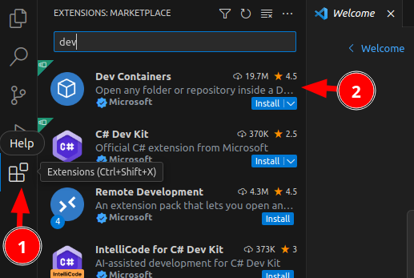
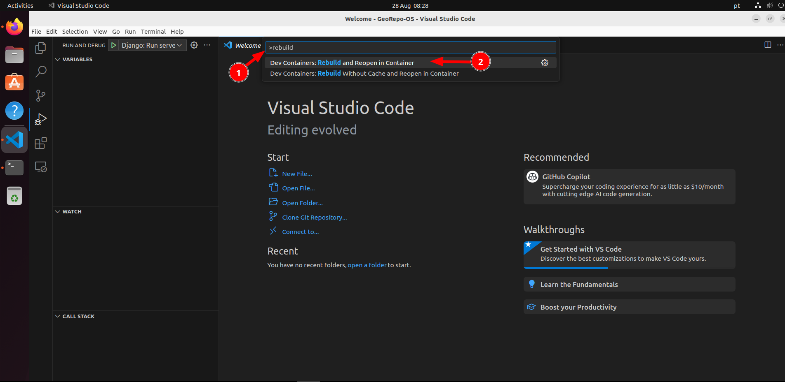
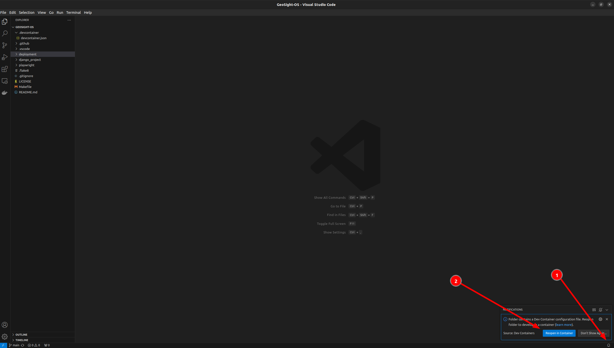
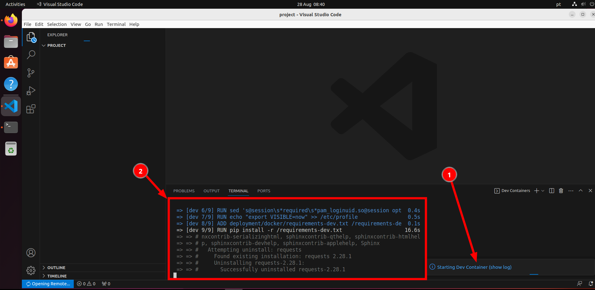
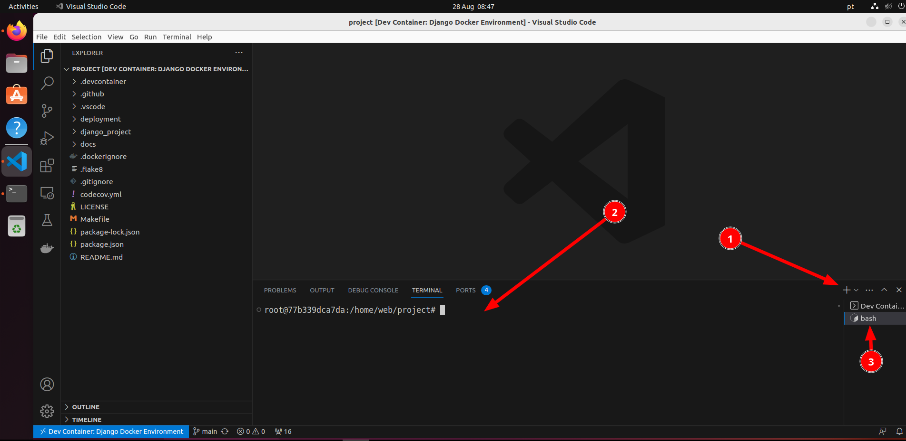
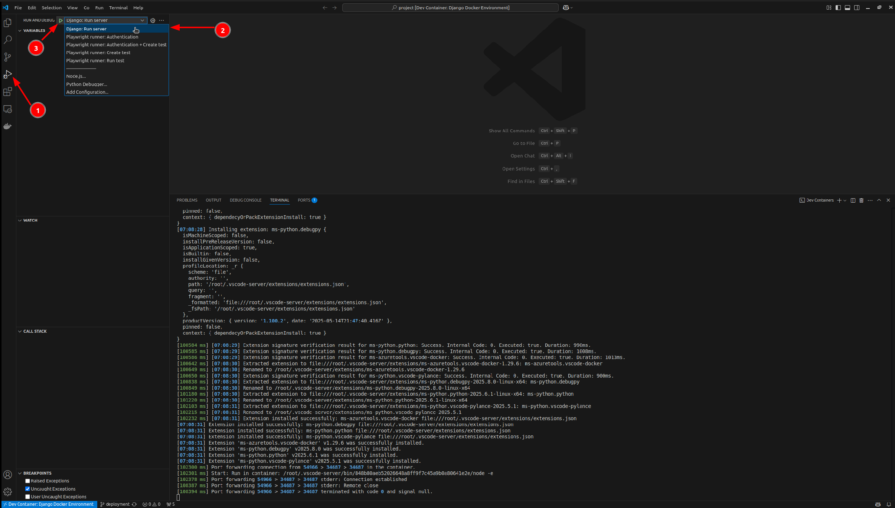
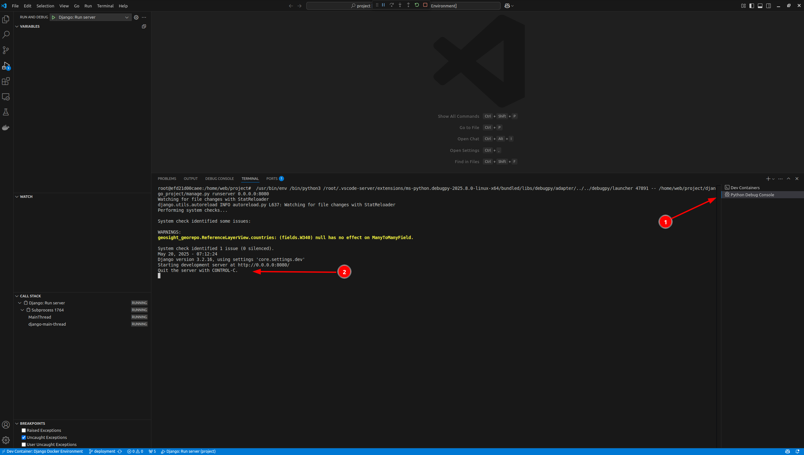

# Run with VSCode

## Prerequisites

You should have [VSCode](https://code.visualstudio.com/) installed (using PyCharm is also possible).

If using VSCode (our recommended IDE), you need the the VSCode [Dev Containers](https://marketplace.visualstudio.com/items?itemName=ms-vscode-remote.remote-containers) extension installed (minimum version 0.304.0).

  


## Open project

Open the project in VSCode (1️⃣, 2️⃣) by navigating the place on your file system where you checked out the code in the pre-requisites step above (3️⃣).


Accept the 'trust authors' prompt


# Building the dev environment

This section covers the process of building and running the application from your IDE.

🚩 Make sure you have gone through the [IDE Setup Process](ide-setup.md) before following these notes.

Press `Ctrl -> P` 1️⃣ and then `>`and search for `Rebuild`. Select `Dev Containers: Rebuild and Reopen in Container`2️⃣. This will essentially mount your code tree inside a docker container and switch the development context of VSCode to be inside the container where all of the python etc. dependencies will be installed.



If the option above is not visible, you can click on the bell icon in the bottom-right corner (1). 
If the DevContainers extension is already installed, an option to Reopen in Container will appear (2). 
Simply click on this option, and it will automatically build the development containers for you.



Once the task is running, a notification 1️⃣ will be shown in the bottom right of the VSCode window. Clicking in the notification will show you the setup progress 2️⃣. Note that this make take quite a while depending on the internet bandwidth you have and the CPU power of your machine.



At the end of this process, you will see a message like this:

```
[229365 ms] Port forwarding 53251 > 46727 > 46727 terminated with code 0 and signal null.
```

Once you see that, you can continue the next step below.<br>
Note that the Port forwarding can changes everytime you deploy, so as long as it says `terminated with code 0 and signal null`, you are done and can continue to next step.

## Open a dev container terminal

Open  terminal within the dev container context by clicking the `+`icon in the terminal pane 1️⃣. The new terminal 2️⃣ will show up in the list of running terminals 3️⃣



## Run django migration

```
cd /home/web/project/django_project
python manage.py migrate
```

## Create super user

```
cd /home/web/project/django_project
python manage.py createsuperuser
```

During this process you will be prompted for your username (defaults to root), email address and a password (which you need to confirm). Complete these as needed.


## Run application

After completing the steps above, You need to run the app.<br>
Click `Run and Debug` button 1️⃣ and then select `Django: Run server` 2️⃣. After it is selected, click `Start Debugging` 3️⃣.



After run, it will a new tab in the right bottom. 
You need to wait Python debug to finish by saying `Quit the server with CONTROL-C.`3️⃣,




## Viewing your test instance

After completing the steps above, you should have the development server available on port 2000 of your local host:

```
http://localhost:2000
```


The site will be rather bare bones since it will need to be configured in the admin area to set up the theme etc.

🪧 Now that the application is set up, you may begin making updates or choose to work with the provided demo data. For instructions, please refer to the [Demo Data Guide](demo-data.md).