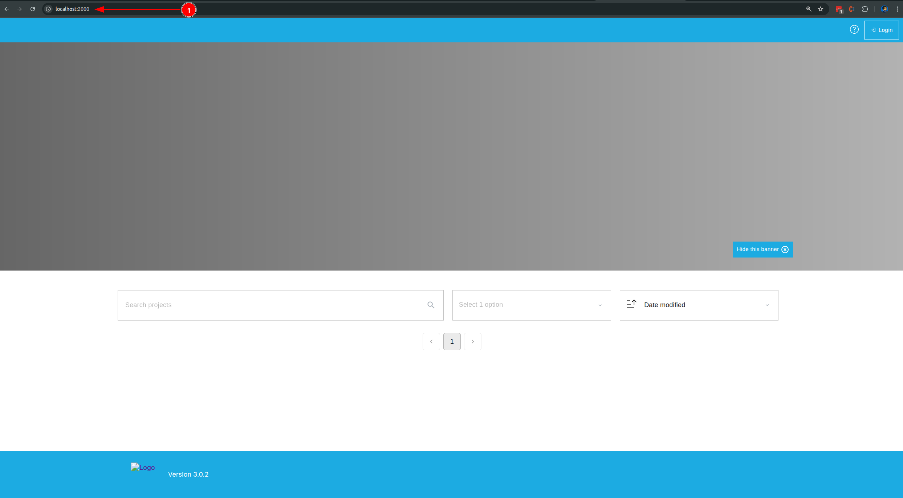

# Run without IDE

If you're using a text editor other than an IDE (such as VS Code, Sublime Text, or Vim), you can run the application manually from the terminal:

1. Navigate to the root directory of the project.
2. Open a terminal and execute the following command:

```
make dev
```

Note: With this approach, you won’t have access to integrated debugging features provided by full IDEs.

## Viewing your test instance

After completing the steps above, you should have the development server available on port 2000 of your local host:

```
http://localhost:2000
```



By Default, we can use the admin credential:
```
username : admin
password : admin
```

🪧 Now that the application is set up, you may begin making updates or choose to work with the provided demo data. For instructions, please refer to the [Demo Data Guide](demo-data.md).