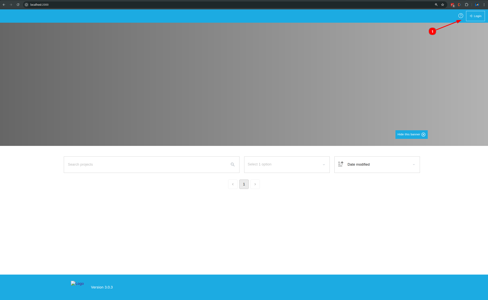
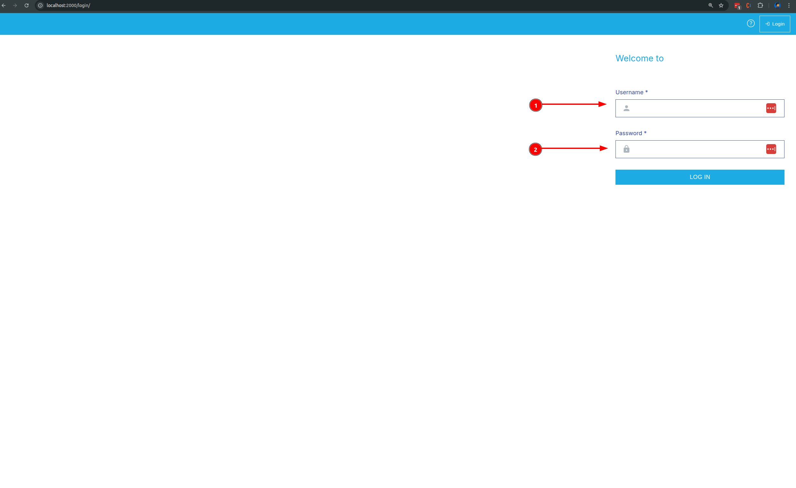
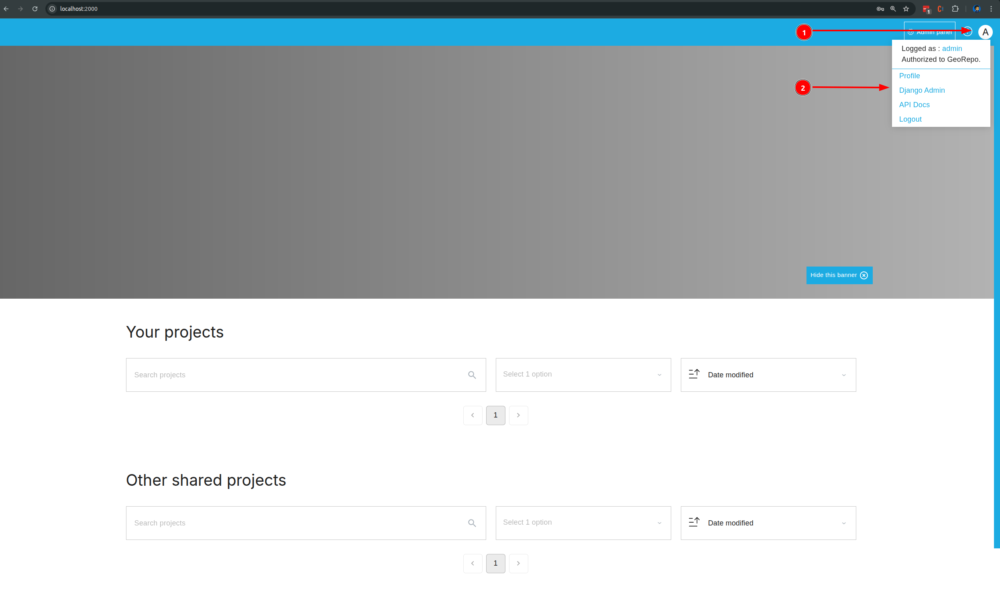
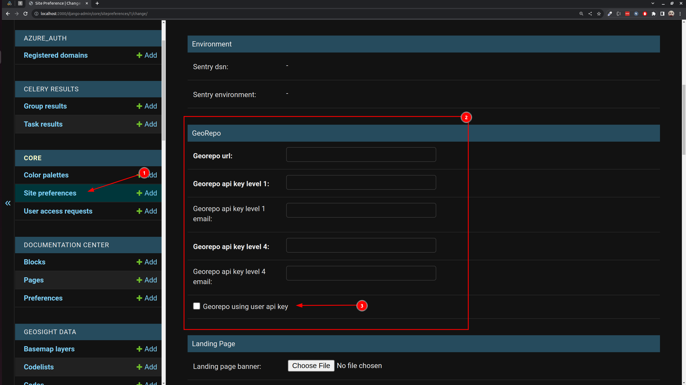
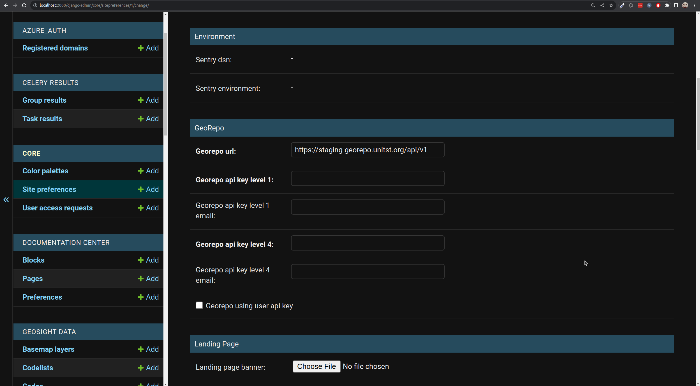
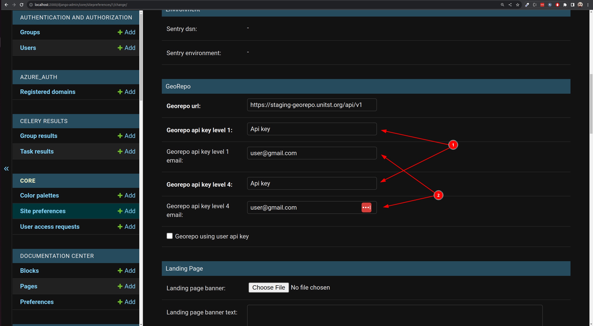
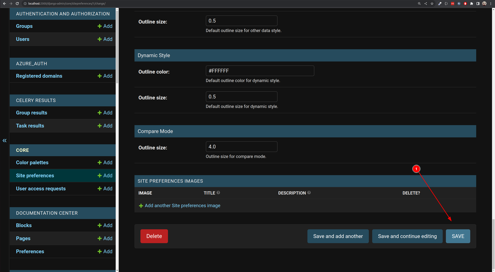

# Setup the georepo config

GeoSight is able to use GeoRepo instance for the administrative boundary.
But before it can be used, you need to put our georepo config in django admin properly.

First, you need to login to site.

Login as admin

After logged in, click "white circle" on the top-right 1️⃣  and click `django admin`  2️⃣.

Find `Site preferences` 1️⃣  and click it and find GeoRepo section 2️⃣. Uncheck `Georepo using user api key` if you want to not force user to put their own georepo api key, instead using GeoSight api key 3️⃣.

First you need to decide which georepo instance you are going to use.
Put in Georepo url input with <url georepo>/api/v1

Example, we are going to use https://staging-georepo.unitst.org/
So the GeoRepo url is https://staging-georepo.unitst.org/api/v1

There are 2 types of georepo api key, which is level 1 and level 4.
You can ask georepo admin to provide those 2 key or you can put your own api key for both of those.

To do that, you can go to <your Georepo url>/profile.
In this case, it is https://staging-georepo.unitst.org/profile
And you can check documentation how to generate it.
https://unicef-drp.github.io/GeoRepo-OS/user/api/guide/#generating-an-api-key

One user can just have 1 api key, so for that you can put the same api key to level 1 and level 4.
So, you can fill Georepo api key level 1 and level 4 with your api key 1️⃣  and Georepo api key level 1 email and level 4 email with your email in georepo 2️⃣.

Then click `save` button 1️⃣ in the most bottom of the page and the site is ready.

