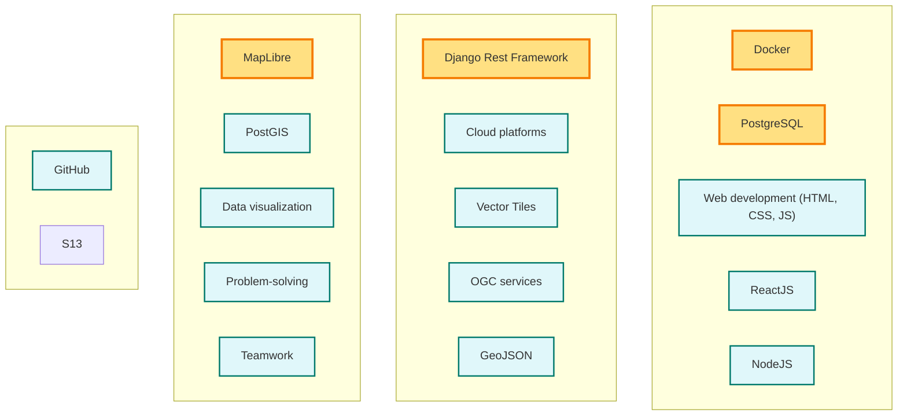

## Skills Needed

GeoSight is a complex web-based business intelligence platform that requires a diverse set of skills for effective development and maintenance. Here are some of the key skills needed:

- Proficiency in web development technologies (HTML, CSS, JavaScript)
- Experience with front-end frameworks (e.g., React, Angular, Vue.js) - we use ReactJS in this project.
- Knowledge of back-end technologies (e.g., Node.js, Python, Ruby) - we use Python and NodeJS in this project.
- Familiarity with database management systems (e.g., PostgreSQL, MongoDB) - we use PostgreSQL in this project.
- Understanding of RESTful APIs and microservices architecture - we use the Django Rest Framework for our APIs.
- Experience with cloud platforms (e.g., AWS, Azure, Google Cloud) - this is only needed if you want to deploy GeoSight on the cloud.
- Knowledge of geospatial technologies (e.g., GIS, mapping libraries) - in particular we use MapLibre, Vector Tiles, OGC services, GeoJSON and PostGIS.
- Familiarity with data visualization tools and libraries (e.g., D3.js, Tableau) - these will inspire you to create better visualizations in GeoSight.
- Strong problem-solving skills and attention to detail - we want to maintain a high quality codebase.
- Ability to work collaboratively in a team environment - we are a small team and we want to work together to make GeoSight better.
- Good understanding of version control systems (e.g., Git) - we use GitHub for version control.
- Use of GPG for signing commits and tags - this is a requirement for all contributors to GeoSight.
- Use of SSH for secure access to the repository - this is a requirement for all contributors to GeoSight.
- Basic knowledge of Linux command line - this is useful for development and deployment.
- Docker skills - we use Docker for containerization and deployment.

