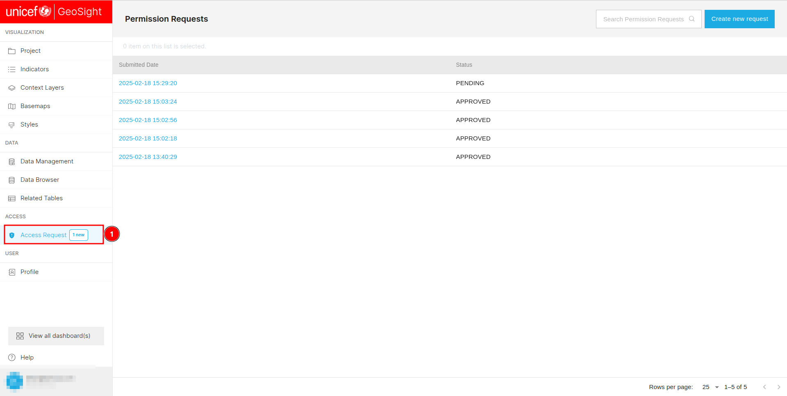
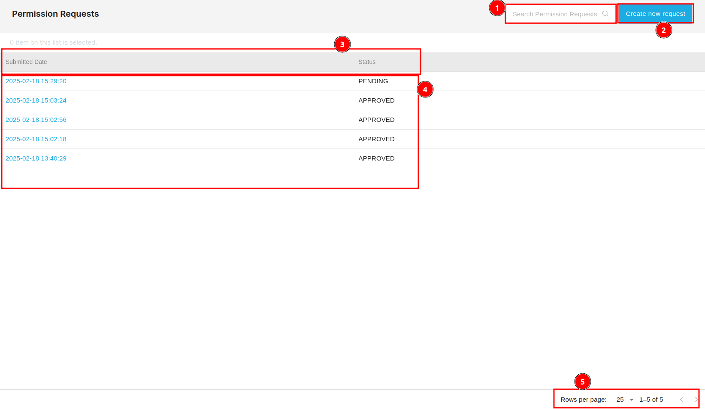
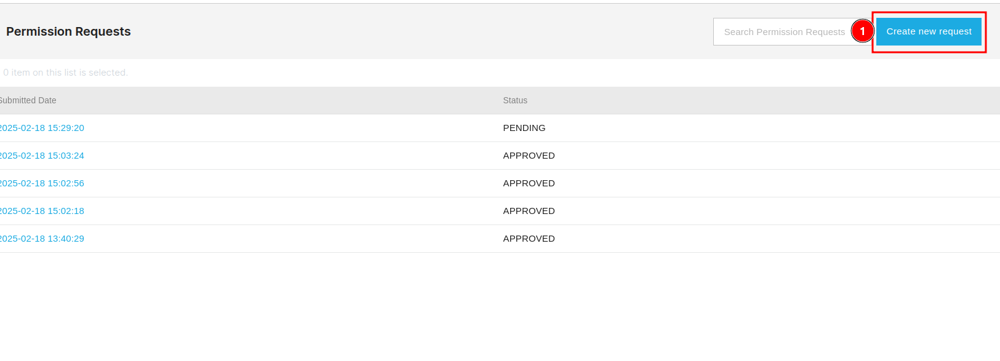
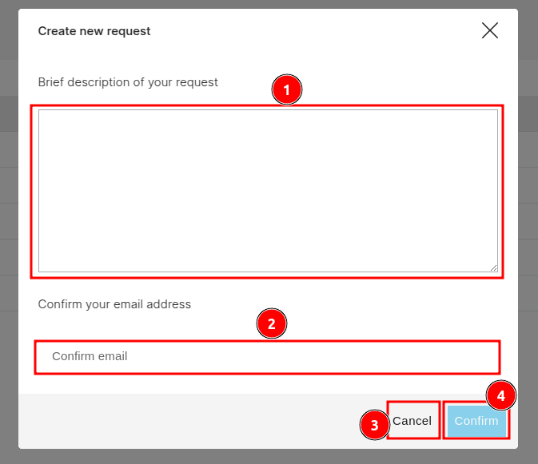
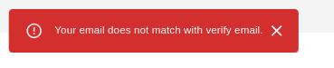
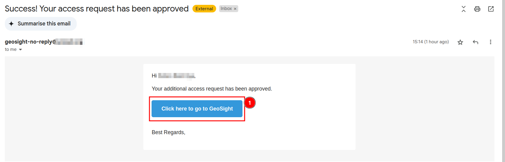
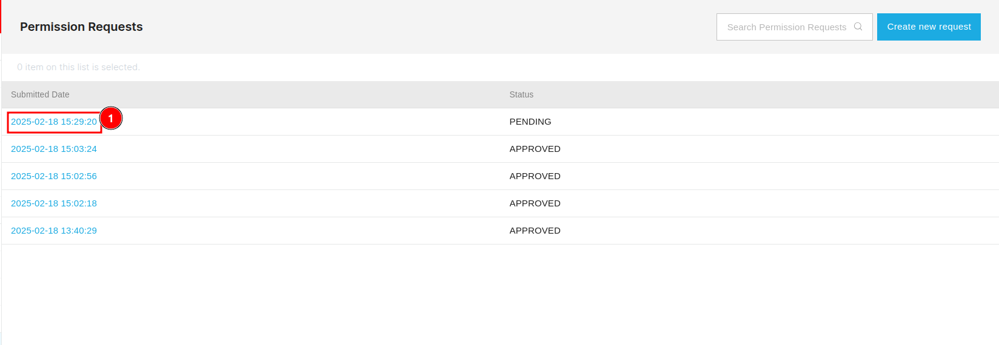
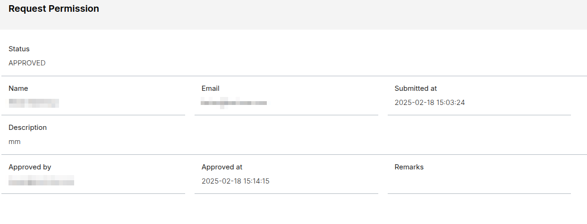
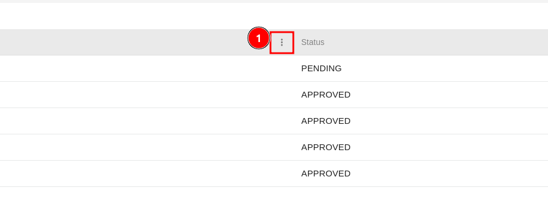
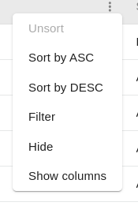

# Access Request

You can access the `Permission Requests` page by clicking on the 1️⃣ `Access Request` tab.

You can search for a specific permission by entering its name in the 1️⃣ `Search bar`. You can create a new request by clicking on the 2️⃣ `Create new request` button. Additionally, you can sort the data in ascending or descending order by clicking on the 3️⃣ `Column headers` of the respective column. The available data is displayed in the 4️⃣ `Table`. To navigate through the pages, you can use the 5️⃣ `Pagination` at the bottom of the page.

## How to Create New Request?

You can click on the 1️⃣ `Create new request` button to create new request, this will open a pop-up window.

To create a new request, you need to provide a description in the 1️⃣ `Description` field and enter a verified email address in the 2️⃣ `Email` field. After filling in the details, click on the 4️⃣ `Submit` button to submit the request. If you wish to cancel the process, click on the 3️⃣ `Cancel` button.

### Request Error

You will receive the following error message if the email address you provided is not verified.

## Approval request email.

You will receive an email once your request is approved. You can click on the 1️⃣ `Click here to go to GeoSight` button to access the GeoSight.

## How to view request details?

You can view your request by clicking on the 1️⃣ `Submitted date`, which works as a link and redirects you to a new page where you can find all the details associated with the request.

You can view all the details associated with the request, including the name and email of the person who submitted the request, the description of the request, the status of the request, and the submitted date. If the request is approved, you can also view the email of the person who approved the request, along with the approval date and any remarks.

## Meaning of request status?

If your request is not approved, it will be marked as 1️⃣ `PENDING`. If your request is approved, it will be marked as 2️⃣ `Approved`. 

## How to modify column visibility?

You can modify the columns by clicking on the 1️⃣ `Three dots`. This will open a dropdown menu.

You can use this options to modify the column visibility.

