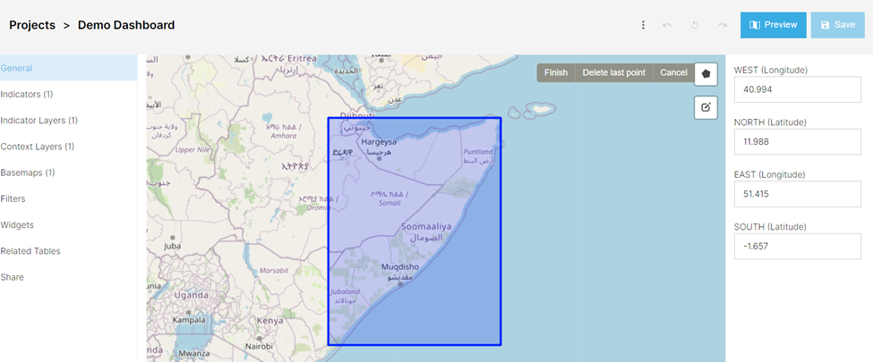
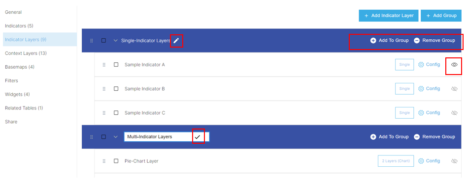

# Creating a Project
The Project is an interactive, map-based dashboard designed to visualize and analyze spatial data. It enables users to display multiple contextual and indicator layers, apply filters to indicator datasets, and use a range of analytical tools such as zonal analysis and overlays. Indicator data can also be summarized and presented through interactive widgets.

A Project can be configured by following these steps:

1.	Navigate to the Project section under the admin panel. 

2.	Click Create New Project

## General Tab
1. Provide the Name of the Project

2. Select Project Category (create new one if needed)

3. Adjust the Project URL (if needed)

### General Settings for Indicator Data
If a Project is intended for visualizing indicator data (layers), configure the following settings:

4. Select a Geospatial Reference Dataset

    a. Choose the geospatial reference dataset that will be used to visualize indicator data. Depending on the plugins installed in your GeoSight instance, you can select either a **Local** or **Remote (GeoRepo)** repository of reference layers.

    Leave this field empty (or clear the selection using the **X** icon) if the map will only use contextual layers.

    b. Select the Repository Type
    Open the **View** dropdown and choose the type of reference dataset:
    - **Local**
    - **Remote (GeoRepo)**

    c. Select the View
    - For a **Local** repository, select the required **View** (reference dataset).
    - For a **Remote (GeoRepo)** repository:
        1. Select the main **Dataset**
        2. Then select the appropriate **View**

5. Define the Default Level
    Specify the administrative level at which the dashboard will open by default. Examples typically include:
    - **Level 0** — Country / Territory
    - **Level 1** — Province / Governorate / State
    - **Level 2+** — Lower administrative levels such as Districts, Subdistricts, etc.

6. Define Available Levels

Enable or disable specific administrative levels as needed. For example, you may want to create a web map that only supports a single admin level (e.g. country level).

This setting allows you to:
- Control which administrative levels are available to users
- Reduce the display of empty datasets
- Manage datasets across different geographic scales more effectively

Note that this setting can be overwritten for each Indicator Layer.

7. Select the Mapping Method

The mapping method defines how indicator data is joined with the reference layer.

    GeoRepo generates a new Ucode for every new version of an administrative unit. For example:
    - `AGO_V1` = Angola boundary, version 1
    - `AGO_V2` = Angola boundary, version 2

    If indicator data references `AGO_V1`, it will not display on a reference layer using `AGO_V2`, because the Ucodes differ.

    However, if both versions represent the same geographic entity and share similar geometry, they will also share the same **Concept UUID**. In this case, legacy data referencing `AGO_V1` can still be mapped to `AGO_V2` boundaries when using the **Concept UUID** mapping method.

    a. Latest Ucode
    This option joins indicator data with geographic boundaries using the **Ucode** field.

    b. Concept UUID
    This option joins indicator data with geographic boundaries using the **Concept UUID** field.

### Other General Settings

8. Define the Map Extent

Define the initial map extent displayed when the Project opens.

You can configure the extent in one of the following ways:

    a. Enter Coordinates Manually
    Provide the latitude and longitude coordinates for the corners of the extent.

    b. Draw a Polygon
    Use the polygon drawing tool by selecting the **pentagon icon** in the top-right corner of the map interface.

## Indicators Tab

5.	Complete the Indicator tab.
    
    a.	This does not display these indicators. 

    b.	Select “Add Indicator”

        i.	Search for the appropriate indicators

        ii.	Click the check box

        iii. Click “Apply selections”. 

        iv.	The number in parentheses shows the number of indicators you’ve selected.

## Indicator Layers Tab

6.	Complete the Indicator Layers tab

    a.	Add individual indicators using the “Add Indicators” button. 

    b.	To group indicators, select “Add Group”. 

        i.	You can name the group by selecting the pencil icon and entering the name in the text box. 

        ii.	You can add indicators to the group by selecting “Add to group” or adding a single indicator and dragging it into the group. 

        iii. Similarly, groups can be nested within one another, but an indicator must be present within a group as well for the group to save
        
The eye symbol  represents the chosen indicator layer that will first visualize when the project is opened.
    
Types of Indicator Layers include:

### Single Layers 
Visualizing single and simple indicators. They are the base type of Indicator Layer, and simply display one dataset and within the chosen reference dataset.

### Multi-Indicator Layers 
Analysis tools that visualize multiple layer values in proportion to one another via pie or bar charts. 
    
    When defining this style, users will be prompted to select the desired indicators as well as determine one appropriate color for that indicator. 

### Dynamic Layers 
Customizable layers that can be created by using a custom expression tailored by user feedback.

    Users will be prompted to define SQL expressions that allow for data to be filtered and selected from other datasets for visualization.

### Related Tables 
Layers that allow for Splicing and the manipulation of previously uploaded related tables. See Related Tables for more details.

    
### Configure Layers
The Configure option allows for project specific visualization adjustments. This can be useful when the indicator default does not fit your needs.

        i.	General allows users to adjust metadata and available administrative levels.

        ii. Style allows for adjustments to data classifications for the given reference dataset.

        iii. Label allows for the customization of administrative polygon labels.

        iv.	Pop-Up allows users to customize the text box (including data) when a given administrative polygon is selected.

## Context Layers Tab

7.	Complete the context layers tab.
    
    a.	Add individual context layer using the “Add Context Layers” button. 

    b.	To group context layers, select “Add Group”. 

        i.	You can name the group by selecting the pencil icon and entering the name in the text box. 

        ii.	You can add context layers to the group by selecting “Add to group” or adding a single context layer and dragging it into the group. 

        iii. Similarly, groups can be nested within one another, but a context layer must be present within a group as well for the group to save.

## Basemap Tab

8.	Complete the basemap tab. 

    a.	Basemaps are neither indicators or context layers, but the bottom map that both are imposed over.
        
        i.	These maps show the shapes of landmass and depending on the details, country borders, roads or general information that is not available via an indicator or context layer
    b.	Add individual basemaps using the “Add Basemap” button. 

        Other options include Satellite images and a topographic map

    c.	To group basemap, select “Add Group”. 

        i. You can name the group by selecting the pencil icon and entering the name in the text box. 

        ii. You can add basemap to the group by selecting “Add to group” or adding a single basemap and dragging it into the group. 

        iii. Similarly, groups can be nested within one another, but a basemap must be present within a group as well for the group to save.

        iv.	Use the Open Street Map basemap (OSM) as it shows country borders and when zoomed, local roads. 

## Sharing Tab

9.	Complete the Share Tab to control the sharing and control of access to the project. 

    a.	Allows for permission control for specific users, groups or the general public.

    b.	The permissions are as follows:

        i.	List allows for users to see the presence of a project. 

        ii.	Read allows them to view it. 

        iii. Write allows them to edit the project and make changes. 

        iv.	Share allows them to control access to the project.
    
        v.	Owner allows complete control, including the ability to delete the project. 

