# Data Browser

You can access the data browser page by clicking on the 1️⃣ `Data Browser` tab from the left navigation bar.

[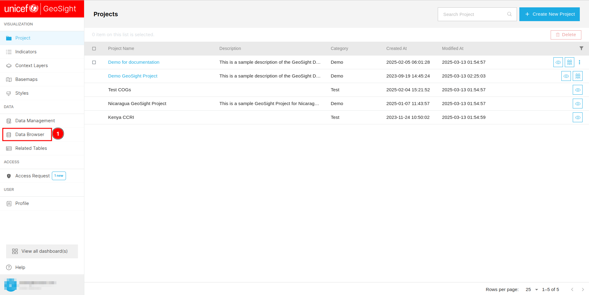](./img/data-browser-img-1.png)

You can filter the data by group using the 1️⃣ `Group all admin levels` toggle button. To add an existing indicator to a project, click on the 2️⃣ `Add to New Project` button after checking the checkbox of the respective indicators. You can filter the data based on indicators using the 3️⃣ `Filter by indicators` option, or filter by views using the 4️⃣ `Filter by view`. Additionally, you can filter data by levels using the 5️⃣ `Filter by level`. To deselect selected indicators, use the 6️⃣ `Clear selection` button. If you want to delete selected indicators, click on the 7️⃣ `Delete` button. To sort the data, click on the 8️⃣ `Column` header of the respective column. You can navigate through different pages using 9️⃣ `Pagination`.

[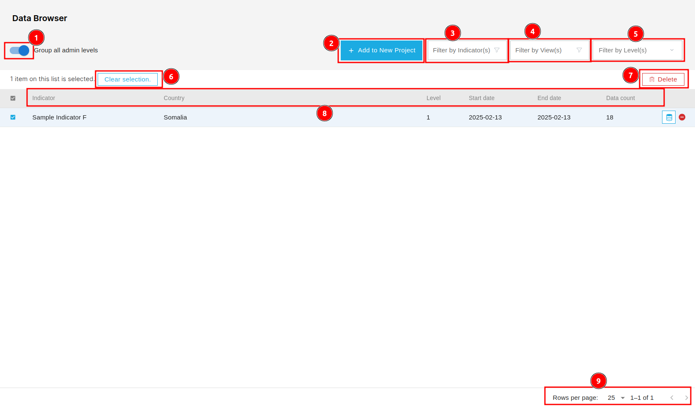](./img/data-browser-img-2.png)

## How to add indicator to a new project?

To add an existing indicator to the project you first need to check the 1️⃣ `Checkbox` of the respective indicators. After that, click on the 2️⃣ `Add to New Project` button. This will redirects you to the create page.

[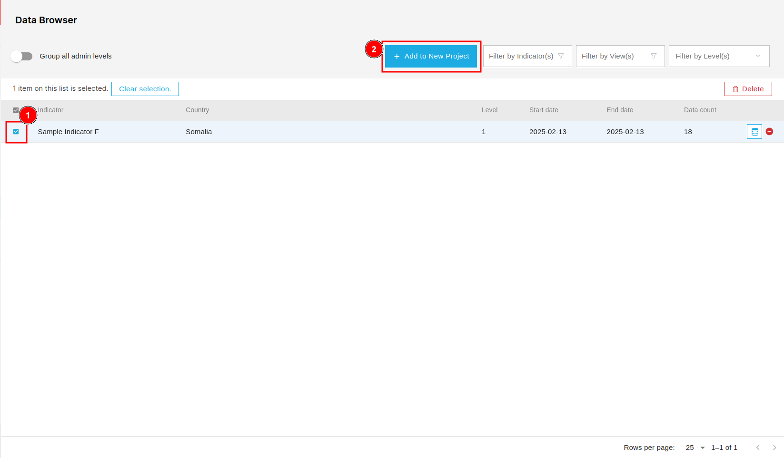](./img/data-browser-img-3.png)

To add an indicator to a project, you need to fill in some information. First, select the type of information from the 1️⃣ `Navigation bar`, then complete the corresponding 2️⃣ `Form` with the required details. You can undo or redo changes using the 3️⃣ `Buttons`. To view the details on the map, click on the 4️⃣ `Preview` button. Once all required information is filled in, click on the 5️⃣ `Save` button to save the form.

[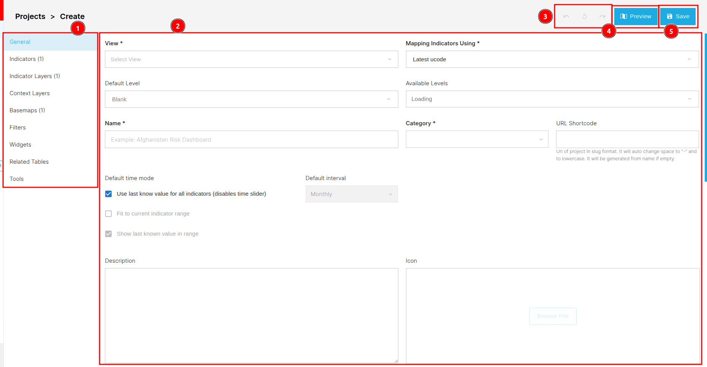](./img/data-browser-img-4.png)

* For more details click [here](../../manual/data/data-browser.md#add-to-new-project).

## How to filter data by indicators?

To filter data by indicators, click on the 1️⃣ `Filter by indicators`, this will open a pop-up window.

[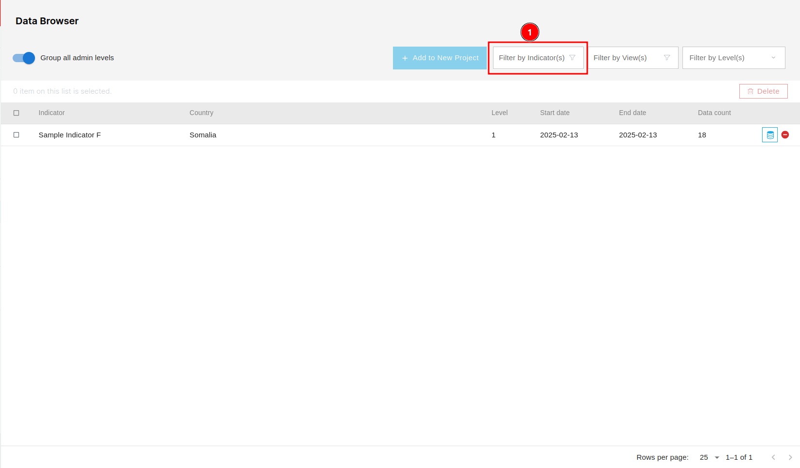](./img/data-browser-img-5.png)

You can search for any specific indicator using the 1️⃣ `Search` field. To sort the data, click on the 2️⃣ `Column` header of the respective column. To select an indicator, check the 3️⃣ `Checkbox` next to it—you can also select multiple indicators. Navigate through the pages using the 4️⃣ `Pagination`. Once you have selected the required indicators, click on the 5️⃣ `Update selection` button to apply the changes.

[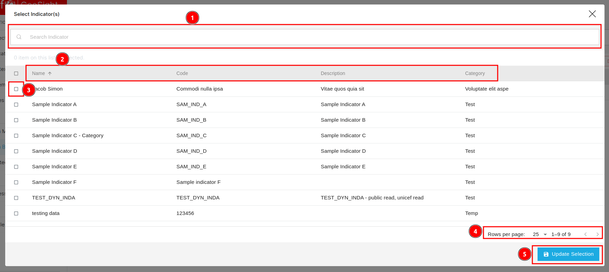](./img/data-browser-img-6.png)

## How to filter by views?

To filter data by views, click on the 1️⃣ `Filter by views`, this will open a pop-up window.

[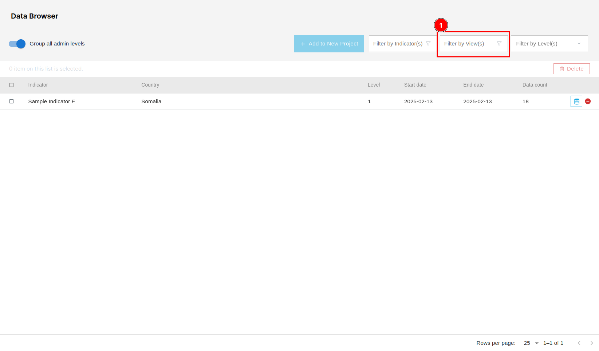](./img/data-browser-img-7.png)

You can specify whether you want to choose the 1️⃣ `Local` or 2️⃣ `Remote` views, and the form's UI will adjust accordingly. To search for a specific view, use the 3️⃣ `Search` field. To sort the data, click on the 4️⃣ `Column` header of the respective column. Select a view by checking the 5️⃣ `Checkbox` next to it, you can also select multiple views. Navigate through the pages using the 6️⃣ `Pagination`. Once you have selected the required views, click on the 7️⃣ `Update selection` button to apply the changes.

[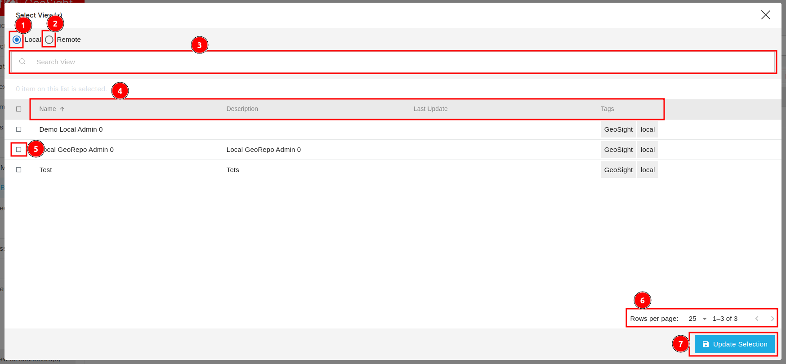](./img/data-browser-img-8.png)

## How to filter by level?

To filter data by level, click on the 1️⃣ `Filter by level`, this will open a dropdown menu.

[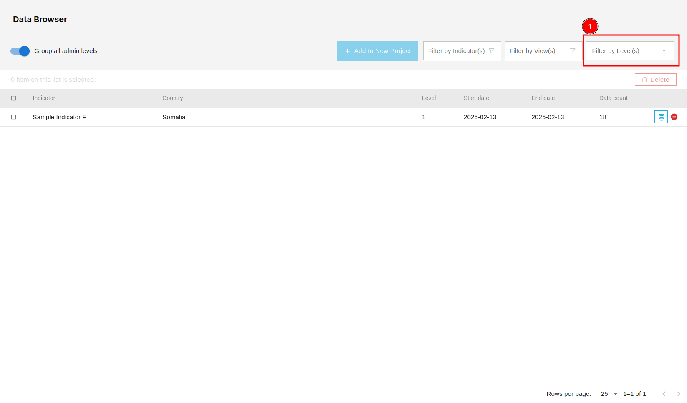](./img/data-browser-img-9.png)

You can select the level based on which you want to filter the data by checking the checkbox of the respective level. Multiple levels can be selected.

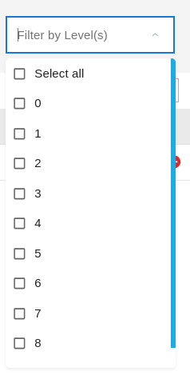

## How to delete selected indicators?

To delete any indicator, first check the 1️⃣ `Checkbox` of the respective indicator. Then, click on the 2️⃣ `Delete` button to remove the selected indicators. This will open a delete confirmation pop-up window.

[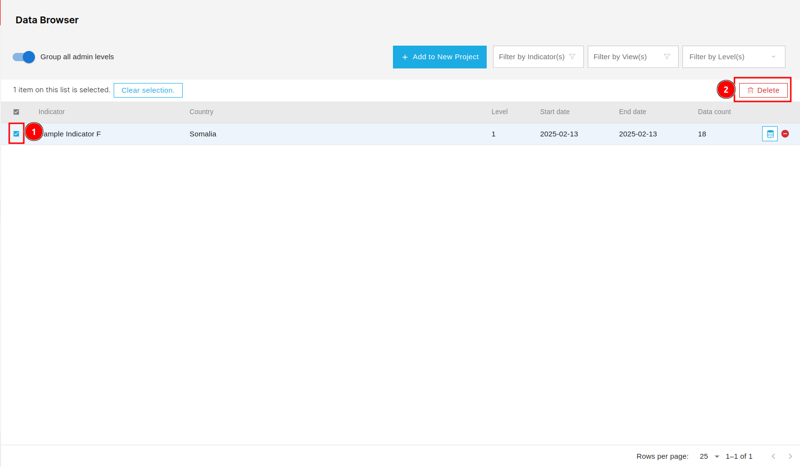](./img/data-browser-img-11.png)

To delete the indicator click on the 1️⃣ `Confirm` button . To cancel the deletion, click on the 2️⃣ `Cancel` button.

[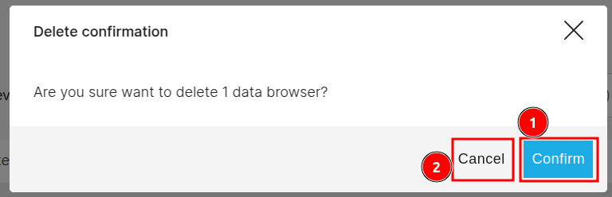](./img/data-browser-img-12.png)

## How to access additional utility functions?

There are some utility 1️⃣ `Functions` available, such as browsing data and deleting data. You can use them by clicking on the respective icons.

### Browse Data

You can browse data by clicking on the 1️⃣ 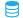 icon. This will redirects you to the data browser page.

[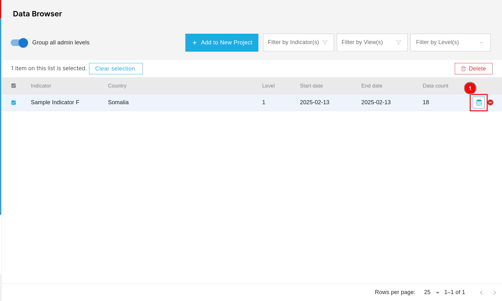](./img/data-browser-img-14.png)

On this page you view all the related data to the respective indicator.

[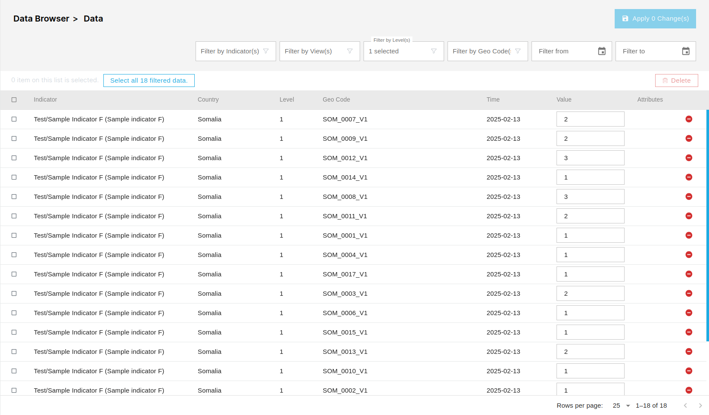](./img/data-browser-img-16.png)

* For more information click [here](../../manual/data/data-browser.md).
