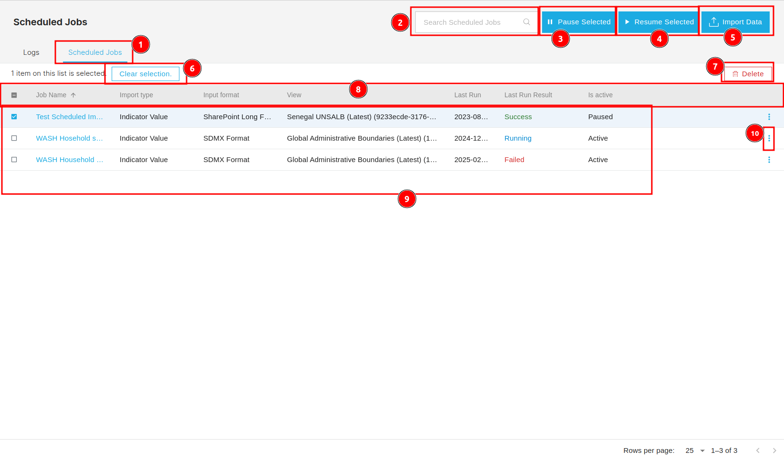
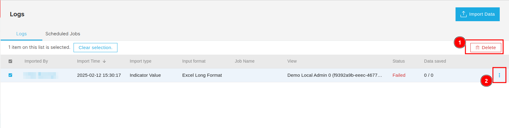

# Data Management

You can access the `Data Management` page by clicking on the 1️⃣ `Data Management` tab. To view the logs, click on the 2️⃣ `Logs` tab, and if you want to access `Scheduled Jobs`, click on the 3️⃣ `Scheduled Jobs` tab. To import data, click on the 4️⃣ `Import` button. If you need to deselect the selected logs, use the 5️⃣ `Clear selection` button. You can also delete the selected logs by clicking on the 6️⃣ `Delete` button. To arrange the logs in ascending or descending order, click on the 7️⃣ `Column Header` of the respective column. The available data is displayed in the 8️⃣ `Data Table`. To navigate through pages, use the 9️⃣ `Pagination` located at the bottom of the page. Click on the `<` and `>` buttons to move through the pages.  

The layout of the `Scheduled Jobs` section differs from the `Logs` layout. To access the `Scheduled Jobs` section, click on the 1️⃣ `Scheduled Jobs` tab. To search for a specific job, use the 2️⃣ `Search bar`. To pause a scheduled job, click on the 3️⃣ `Pause` button, and to resume it, click on the 4️⃣ `Resume` button. If you want to import data, click on the 5️⃣ `Import Data` button. To deselect the selected jobs, use the 6️⃣ `Clear selection` option. You can delete the selected jobs by clicking on the 7️⃣ `Delete` button, or alternatively, you can use the 🔟 `Three dots` to delete a specific job. To arrange the jobs in ascending or descending order, click on the 8️⃣ `Column Header` of the respective column. The available data is displayed in the 9️⃣ `Data Table`.

## How to Import Data?

You can click on the 1️⃣ `Import Data` button to import the data, this will redirects you to the import data page.

### General

The `General` section contains general information about the logs. You can access this section by clicking on the 1️⃣ `General` tab, although it is selected by default. The 2️⃣ `Section` displays information about the logs, including the `Import Type` and the corresponding `Input Format`. The available input formats vary depending on the selected import type. You can save the information by clicking on the 3️⃣ `Submit` button.

For the detailed information you check the [user manual](../../manual/data/data-management.md#general).

### Attributes

The `Attributes` section is used to specify the attributes required for data import. You can access this section by clicking on the 1️⃣ `Attributes` tab. You can upload an Excel file by using the 2️⃣ `Excel file` option. You can select the relevant sheet from the uploaded file by choosing from the 3️⃣ `Sheet name` dropdown. The 4️⃣ `Row number of the header` field allows you to specify the row containing the header information. You can select the 5️⃣ `Geo Code Column` to specify the column containing geographical codes. The 6️⃣ `Indicator` option lets you choose between a `Selected Indicator` or a `Data-Driven Indicator Column`. Finally, you can select the column containing the values to be imported by choosing from the 7️⃣ `Value Column` dropdown.  

For the detailed information you check the [user manual](../../manual/data/data-management.md#attributes).

### Reference Layer & Time

You can access the `Reference Layer & Time` section by clicking on the 1️⃣ `Reference Layer & Time` tab. You need to select the reference layer from the 2️⃣ `Drop-down`. After selecting the layer, you can click on the `Template` button next to this field to download the layer. You also need to define the 3️⃣ `Admin Level`. You can either use the `Any Level (Data Driven)` option or select the `Specified Level`. After this, you need to select the 5️⃣ `Date Time Setting`, which is also a mandatory field. You can choose the `Selected Date` option to pick the date from the picker, or you can select the `Data-Driven Date` option to choose the column and the date-time format from the drop-down menu otherwise you can go with `Now (Current date/time of the run)` option.

For the detailed information you check the [user manual](../../manual/data/data-management.md#reference-layer--time).

### Aggregation

You can access the `Aggregations` section by clicking on the 1️⃣ `Aggregations` tab. To `handle` multiple aggregations, you can specify this in the 2️⃣ `Handling multiple values`, which allows you to choose the `Last value` or opt for `Aggregate`. You can also specify the `Aggregate admin level` in the 3️⃣ `Aggregate admin level`.

For the detailed information you check the [user manual](../../manual/data/data-management.md#aggregations).

## How to Delete Data?

You first need to check the checkbox of the respective field and then click on the 1️⃣ `Delete` button, alter natively you can click on the 2️⃣ `Three dots` and then click on the `Delete` to delete a specific field. This will open a confirmation dialog box.

To delete the log click on the 2️⃣ `Confirm` button otherwise you can click on the 1️⃣ `Cancel` button.

Please prefer [user manual](../../manual/data/data-management.md) for the detailed information.
