# Related Table

You can access the `Related Table` page by clicking on the 1️⃣ `Related Table` tab. You can search for a specific table by entering its name in the 2️⃣ `Search bar`. To deselect selected tables, use the 3️⃣ `Clear selection` button. You can edit any table by clicking on the 4️⃣ `Edit` button, and delete any table by clicking on the 5️⃣ `Delete` button. Alternatively, you can use the 🔟 `Three dots` to delete any table. To delete or edit a record, you must first check the checkbox of the respective record. You can sort the data in ascending or descending order by clicking on any 6️⃣ `Column header`. To filter the data in the table, click on the 7️⃣ `Filter` icon. The available data is displayed in the 8️⃣ `Data` table, with some additional 9️⃣ `Actions` available. You can navigate through pages using the `11 Pagination` located at the bottom of the page.  

[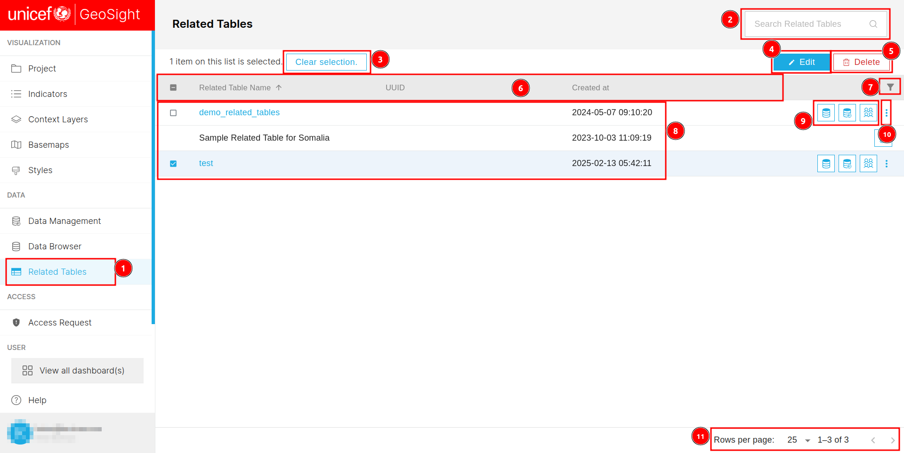](./img/related-table-img-1.png)

## How to Edit Related Table?

You are required to check the 1️⃣ `Checkbox` of the relevant record you want to edit. Then, click on the 2️⃣ `Edit` button. This will redirect you to the edit page.  

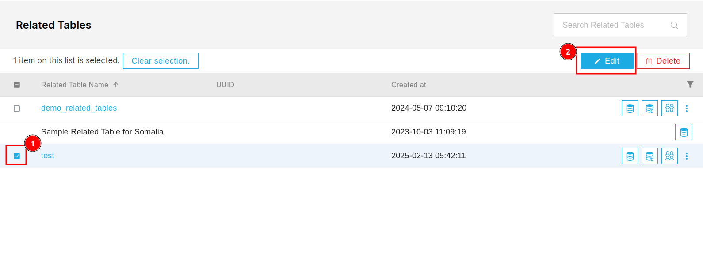

### General

You can access the general section by clicking on the 1️⃣ `General` tab, although this tab is selected by default. All the fields are initially disabled. To make them editable, you are required to check the 2️⃣ `Checkbox` of the respective field. After completing the insertion of the new data, you can use the 3️⃣ `Submit` button to save the changes. 

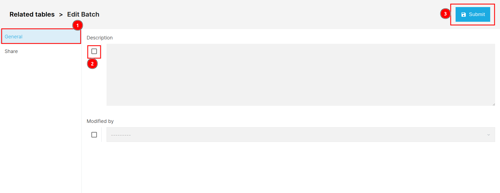

### Share

You can access the share section by clicking on the 1️⃣ `Share` tab. The fields are initially disabled. To make them editable, check the 2️⃣ `Checkbox` of the respective field. This will enable the 3️⃣ `Functionality`. After filling in all the updated information, click on the 4️⃣ `Submit` button to save the changes.  

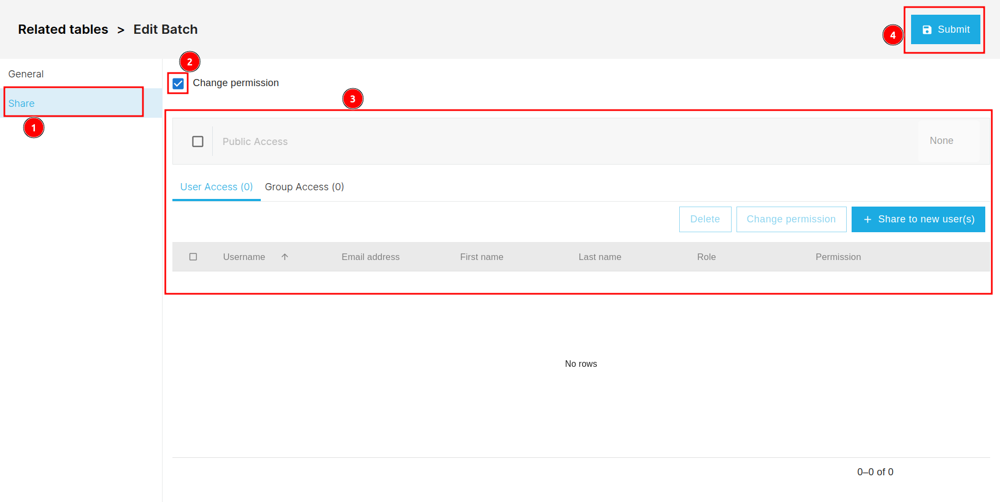

Click [here](../share.md) to see how the share process works.

## How to Delete Related Table?

To delete the record, you are required to check the 1️⃣ `Checkbox` of the respective record you want to delete. Then, click on the 2️⃣ `Delete` button, alternatively you can click on the 3️⃣ `Three dots` and select `Delete` to delete the record. This will open the confirmation dialog box.

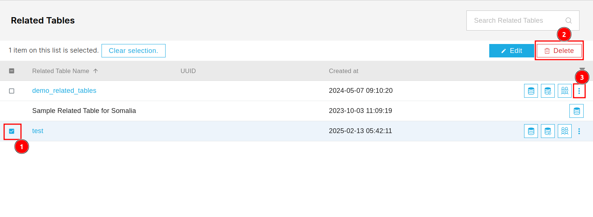

You can delete the record by clicking on the 2️⃣ `Confirm` button otherwise you can click on the 1️⃣ `Cancel` button to cancel the deletion process.

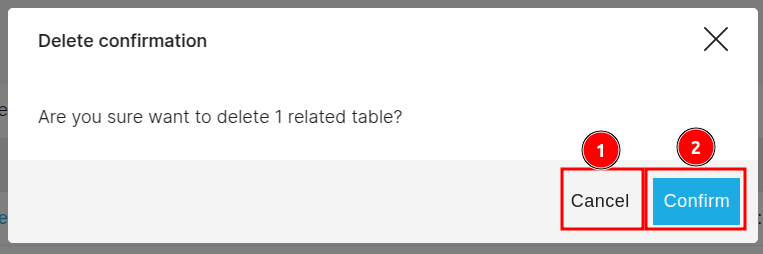

## How to Filter Data?

You can click on the 1️⃣ `Filter` icon to filter the data in the table. This will open the filter dialog box.

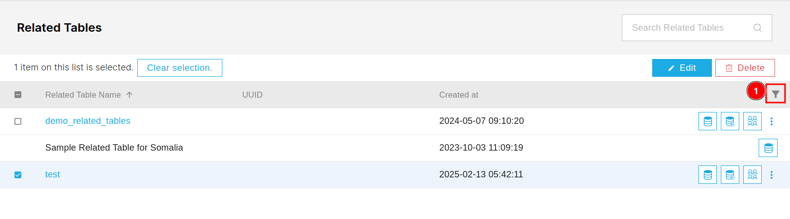

You are required to fill the 1️⃣ `Fields` on the basis you want to filter the data then click on the 2️⃣ `Apply Filters` button to apply the filters.

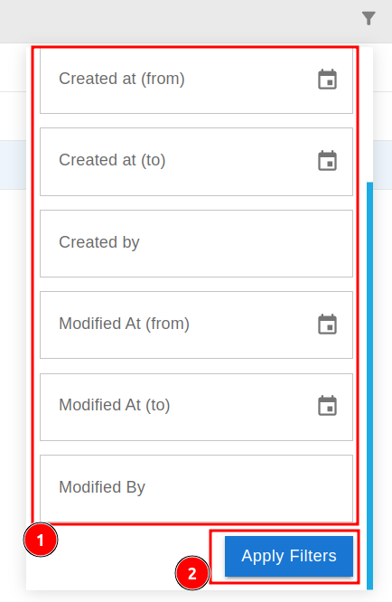

## How to Browse Data?

You can click on the 1️⃣ `Browse Data` icon to browse the data, this will redirects you to the browse data page.

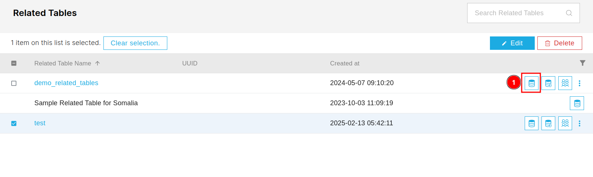

This page contains all the information about the record.

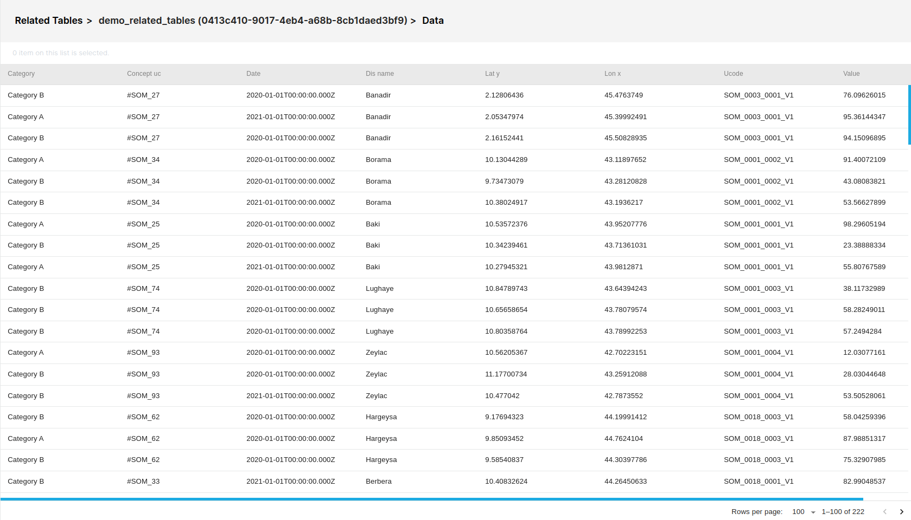

## How to Replace Data?

You can access the replace data page by clicking on the 1️⃣ `Replace Data` icon. This will redirects you to the Replace data page.

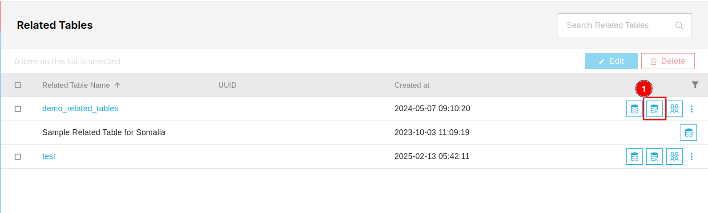

This page is basically the `Data Management > Import Data` page.

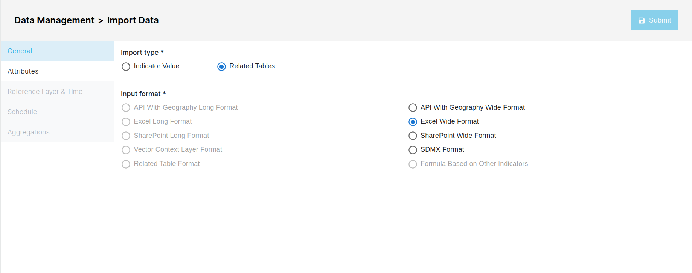

## How to Share Data?

You can click the 1️⃣ `Group` icon to share the respective data. 

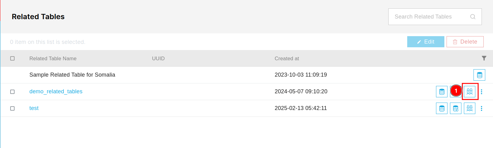

This will open the share pop-up window.

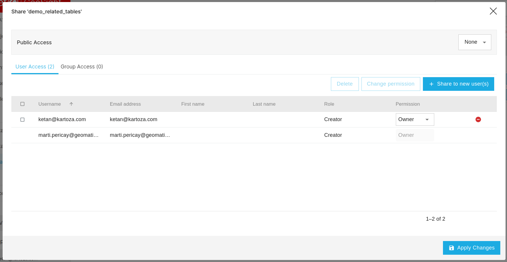
