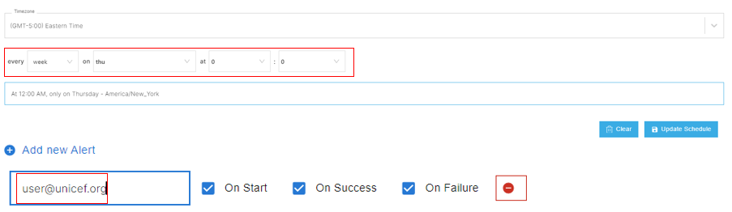
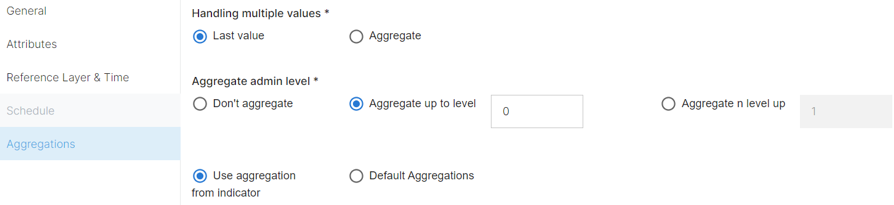

# Importing Data
Within GeoSight, information uploading, and harvesting are essential features that can intake a variety of data formats in a single instance or repeatedly at established intervals. A variety of formats are accepted, such as:
-	APIs
-	Excel files
-	SharePoint sites
-	SDMX files 

Data imports can be scheduled, changes in data on these sites will be incorporated into GeoSight on a regular basis. 
Importantly, due to the construction of indicators, data is imported around indicators (and indicators are not constructed around datasets). As such, before importing data, ensure that an indicator has been created.

## How to Import Data
Prepare data for intake to conform to how the program reads data. 

There are two formats: 

### LONG Format
The Long Format can import multiple indicators, geographies, and dates at once.
   - Geography Code to connect it to administrative datasets. 
                 
   - Often an OCHA PCODE but may be a UCODE.
  
   - Indicator code is the shortcode and connects the data to an indicator. 
            
   - Date is used to identify the timeline of the data incase of multiple uploads.
  
   - Value column

### WIDE Format
The Wide format allows for a larger number of datasets to be uploaded at once for a single date only. 

  - Geography code 
           
  - Value column

For all formats there are two essential columns, _a geography code_ and _a value_ that must be included.

## General Tab

Complete the General Form to tell GeoSight what you are uploading 
   
   a.	Select the “Import type”
      
    i. Indicator value OR Related table
        
  b.	Select the input format
  	
    i. API 

    ii.	Excel 
    
    iii. SharePoint 
    
    iv.	Vector context layers.
       
    v.	SDMX files

    If uploading a related table to an indicator the ‘Import type’ must be the related table. 

    Once the table has been uploaded, the user can return and reuse the related table to upload to the indicator. 
    
    You must connect with a pre-existing related table and creating it before you upload to an indicator is the only way to create one.

## Attributes Tab

Complete the Attributes tab to connect to the data.

   a.	Connect to the origin of the data. 
  
    i. Excel file: identify it on your computer 
        
    ii. API/SDMX/SharePoint: paste the link or path.
        
    iii. Vector Context Layer: pick the context layer
b.	Identify the column that contains your geography code.

c.	Select the indicator. 

       i.	Click the “Select an Indicator” button OR the “Data-Driven Indicator Column”. (Codes must match indicator shortcodes.)
       ii.	Identify the column that contains the value for the indicator (ie; the shortcode).

There are a variety of ways users can upload datasets.

    Although much of the process is identical, the Attributes page is directly responsible for communicating with GeoSight, how/what the data source is. As such, for this area will be different as different formats require various ways to identify the data source.
    
### Importing Share Point Data

Importing SharePoint data allows users to connect to excel tables and datasets stored on the cloud. This can be useful because users can share and collaborate on datasets, without having to download a local file that would be removed from the cloud.
1.	All datasets must be in the proper SharePoint folder, owned by DAPM. At this time, any other location on SharePoint is not available.

2.	Paste the link on the Attributes page. This will allow GeoSight to connect to the data source.

3.	Utilize the "+ Select an Indicator" button to connect columns with indicators

### Importing API Data

API data is quite simple, as it is regularly updated and maintained data from an outside organization. 

1.	Identify the API link from the REST service.

2.	Paste the link on the Attributes page. This will allow GeoSight to connect to the data source.

3.	Click the key list, this will bring up the GeoJSON where users can identify the proper lines that contain the data.

4.	Identify the geocode column.

5.	Utilize the "+ Select an Indicator" button to connect columns with indicators.

### Importing SDMX Data

SDMX stands for Statistical Data and Metadata eXchange is a unique data sharing format developed and coordinated by the United Nations. Data for UNICEF can be accessed from the data warehouse in this format.
1.	Locate the SDMX link from the proper source such as the UNICEF Data Warehouse and paste it. This will allow GeoSight to access the data.

2.	Identify the proper columns for data and geocodes, and pick an indicator.

3.	Verify the data through the Retrieved Data viewer.

### Importing Formula from Other Indicators

GeoSight is a unique platform that allows users to utilize different datasets in order to combine them for further analysis. 

This can be useful to users who want to use other, shared, data in order to enhance their own dataset.
Users can only define pre-existing indicators with uploaded data and upload this new analysis into another pre-existing indicator.

1.  Users can select the indicator which is the destination for the aggregated dataset.
2.  “Indicators that will be used” allows for users to select the indicators they would like to analyze.
3. A reference layer from the “Reference Layer & Time” page.
4. The Generate get_value allows users to select an indicator, time series and data format in order to generate the proper code to identify the dataset. 
5. A formula can be defined using coding language in the expression box.

### Importing Vector Context Layers
The Vector Context Layer option allows for users to summarize vector (point, line, polygon) GIS data that is stored as context layers. 

This can be useful to turn infrastructure or survey data into an aggregate indicator so it can be combined with and used to enhance other indicators. It can also be used to extract some form of data from a context layer stored by another organization that cannot be accessed otherwise.

NOTE: Users can only summarize string (numeric) data stored in context layers. Any text values will be lost and it is recommended you continue with context layers or prepare the data differently if you would like to aggregate these values.

1.	Select the context layer you would like to summarize and the destination indicator.

2.	Determine the Geometry Type
    
    a.	Point
    
    b.	Line
    
    c.	Polygon

3.	Create an SQL filter that isolates desired data points (optional).

4.	Define the spatial operator which clarifies how to summarize incongruent shapes that may not fit within administrative boundaries.

        Intersect-
        The data overlaps with an administrative area.

        Within-
        The data is near the administrative areas, within X meters.

        Completely Within- 
        The data is entirely encapsulated by an administrative area.

        Centroid Within- 
        Only if the interior center of the shape is within the administrative area.

5.	Determine how you want the data to be aggregated. 

### Importing Related Table Format

Importing Related Table data is not the same as importing a Related Table. Related tables are large, multi-column datasets that can be filtered a variety of ways. Once these are uploaded, they can be filtered and summarized to be added as a single value per administrative area to an indicator.

1.	Select your desired indicator and related table.

2.	Identify the geocode column.

3.	Determine an SQL filter to select specific values from the related table (optional).

4.	Determine an aggregation for values.

## Reference Layer & Time Tab
This tab aims to connect the data, with the Reference Dataset in GeoRepo for storage.

a.	Choose the reference layer 

    i.	To connects the dataset to the reference dataset within GeoRepo.

b.	Select a Admin Level. 

    i.	Can choose a specific level 

    ii.	Can choose a data driven option which allows GeoSight to read the codes and choose. 

c.	Select the type of Geographic code (this will usually be a WFP Code). 

d.	Select the date 
(any data type)

    i. Data driven

    ii.	Select own date
    
    iii. Select current date

## Schedule Tab
The Schedule tab is used to automate importing data. (optional) 

  a.	Not available for excel files.

  b.	Select “Scheduled Import”

    i. Will users to name the scheduled job. 

  c.	Click “Job Schedule” 

    i. A pop-up (figure 12) will allow users to set when data is uploaded from the source API or SharePoint. 

    ii. This can be done every minute, day, week, or month, etc. 

  d.	Finally, you can add alerts to notify you when jobs are successful or fail via “Add new alert”. 

## Aggregations Tab
Complete the Aggregations tab to allow for the scaling up of data to lower resolutions (higher administrative areas) or, combine multiple values (optional) 

  a.	If selecting “handling multiple values” option, use multiple data uploads over different time periods. 

  b.	“Last value” will use the most available data 

  c.	“Aggregate” option will combine all versions of the data. 

  d.	You can use the aggregation rules from the indicator or redefine your own aggregation style. 

  e.	The “aggregate admin level” allow you to decide what levels you want aggregated. 

    Users can utilize pre-defined aggregation rules from the indicator, or create your own. 

## After Import

Scheduled jobs can be monitored under the data importer in the left-hand column. 

Select submit in the upper right-hand corner and can be Paused or Deleted at any time.

Validate the data to adjust errors in their data that they might have missed. 

  a.	Access the Logs (figure 14)

  b.	Select the “Data” button for the most recent upload under your name. 

  c.	This will bring you to a table of the data. 

      i. Adjust values if needed.

      ii. Select the box that allows you to select all the values.

      iii. Click “Validate”. This will finally complete the data upload.

## Failed Runs

Any failed runs can be run again using the _Rerun_ tool. 

This preserves the information of your run and allows for easy changes to any mistakes that may have been made.