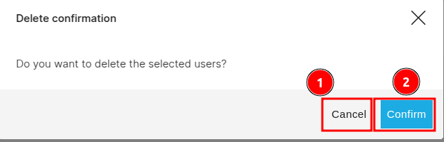
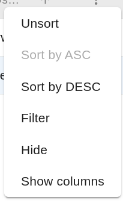

# Share Project

To share the project click on the 1️⃣ `icon`, this open a share project page.

You can click on 1️⃣ `Public Access` to define user permissions. Choose `None` to make the project public or `Read` to make it private. Click on the 2️⃣ `User Access` tab to view the table of users who can access the project, or click on the 3️⃣ `Group Access` tab to view the table of groups with access to the project.
You can delete a user by clicking on the 4️⃣ `Delete button`. To change user permissions, click on 5️⃣ `Change Permission`. To share the project with new users, click on 6️⃣ `Share to new users`. You can view the list of users who have access to the project in the 7️⃣ `Table`, this table includes the user's information such as username, email, first name, last name, and role. At the bottom of the page, you can see the 8️⃣ `Pagination`, which displays the current number of records and the total number of records. To apply the changes you can click on the 9️⃣ `Apply Changes` button located at the bottom of the page.

## How to delete the user

First you need to check the 1️⃣ `Checkbox` of the respective users you want to delete, then you will be able to delete the use by clicking on the 2️⃣ `Delete` button.

This will open the delete confirmation dialog-box. To delete the user click on the 2️⃣ `Confirm` button otherwise click on the 1️⃣ `Cancel` button to cancel the process.

## How to change permissions

To change the permissions, you need to check the checkbox of the respective users whose permissions you want to change, then you will be able to change the permissions by clicking on the 1️⃣ `Change Permission` button.

This will open the update permissions form. To close the form click on the 1️⃣ `X icon` otherwise click on the 2️⃣ `List` dropdown to select the permission (eg. read, write) and then click on the 3️⃣ `Apply Changes` button to apply the changes.

## How to share to new users

To share the project with new users, click on the 1️⃣ `Share to new users` button. This will open the `Select User` page.

Click on the 2️⃣ `Permissions` dropdown menu to select the desired permissions you want to grant to the new user. You can search for the user by entering the username in the 3️⃣ `Input field`. You can view information about the available users in the 4️⃣ `Table`, and select a user by checking the checkbox next to the corresponding user. To complete the process click on the 5️⃣ `Update Selection` or you can click on the 1️⃣ `X` icon to close the page.

## How to sort the records of the table?

You can arrange the order of the data in the table by clicking on the 1️⃣ `Column header`. The data will be sorted in ascending or descending order. By clicking on the 2️⃣ `three dots` you will get more option to sort the data.

* These are the options you will get after clicking on the three dots. You can apply any of the option by clicking on it.

    

    * **Unsort:** This option will remove the sorting from the data.

    * **Sort by ASC/DESC:** This option will sort the data in ascending or descending order.

    * **Filter:** By this option you can sort the data based on the specific value. To sort the data select the column name, then select the operator (eg. is equal to, is not equal to, etc.) and then enter the value.

    * **Hide:** This option will hide the column from the table.

    * **Show columns:** This option allows you to select the columns according to your preference.

## How to remove the user

Click on the 1️⃣ `Remove icon` to remove the user, then a confirmation dialog box will appear. To remove the user click on the `Confirm` button otherwise click on the `Cancel` button to cancel the process.

