# Basemap Page

You can access the `Basemap` page by clicking on the 1️⃣ `Basemap` tab.

[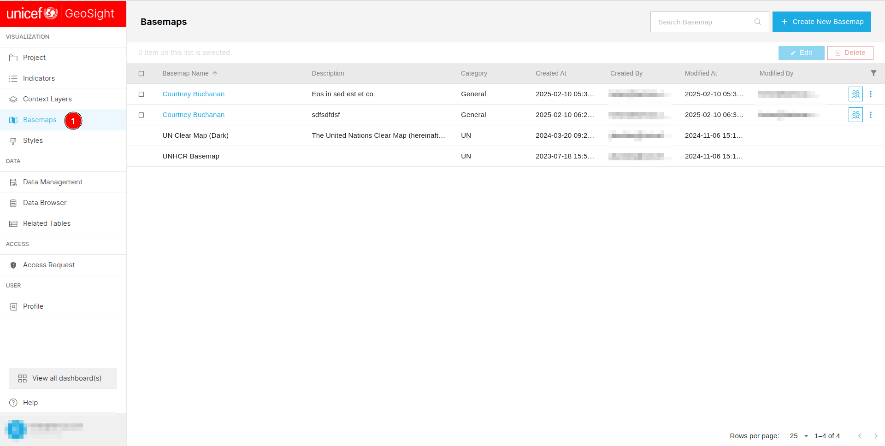](./img/basemap-img-1.png)'

You can search for a specific basemap by entering its name in the 1️⃣ `Search Basemap` field. To create a new basemap, click on the 2️⃣ `Create Basemap` button. Deselect a basemap using the 3️⃣ `Clear selection` button. Edit a basemap by clicking the 4️⃣ `Edit` button, or delete it using the 5️⃣ `Delete` button, before editing or deleting any basemap you need to check their respective checkboxes. Change the order of data in the table by clicking on any 6️⃣ `column header`. View the list of available basemaps in the 7️⃣ `Data Table`. Navigate through the table using the 8️⃣ `Pagination` at the bottom of the page, and use the `<` and `>` buttons to move between pages. The pagination displays the current number of records on the page along with the total number of records in the database.

[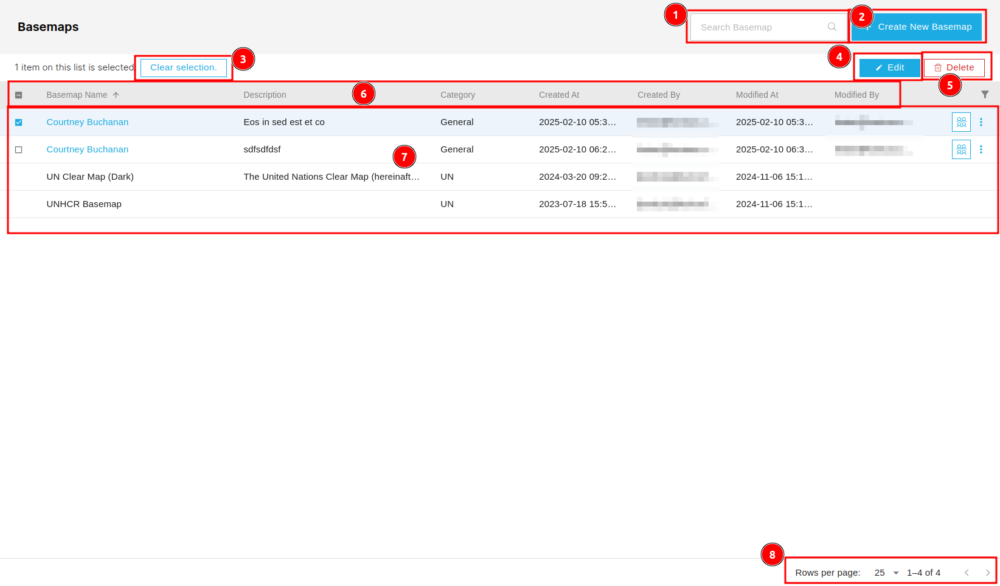](./img/basemap-img-2.png)

## How to Create New Basemap?

You can create a new basemap by clicking on the 2️⃣ `Create Basemap` button, this will redirects you to the `Create Basemap` page.

[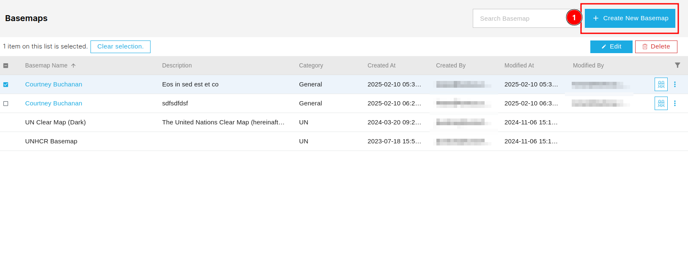](./img/basemap-img-3.png)

You can open the general section by clicking on the 1️⃣ `General` tab, although this tab is selected by default. Fill the necessary informations in the 2️⃣ `Form` and then click on the 3️⃣ `Save` button to save the basemap.

[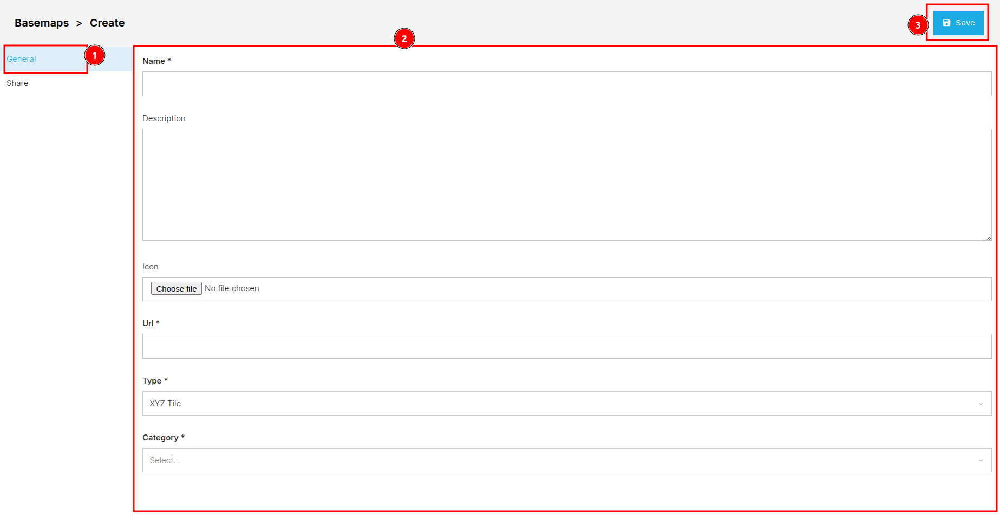](./img/basemap-img-4.png)

After saving the basemap you will be notify by an alert message.

## How to Edit Basemap?

### General

To edit any basemap you need to first check the checkbox of the respective basemap in the table and then click on the 1️⃣ `Edit` button, this will redirects you to the editing page.

[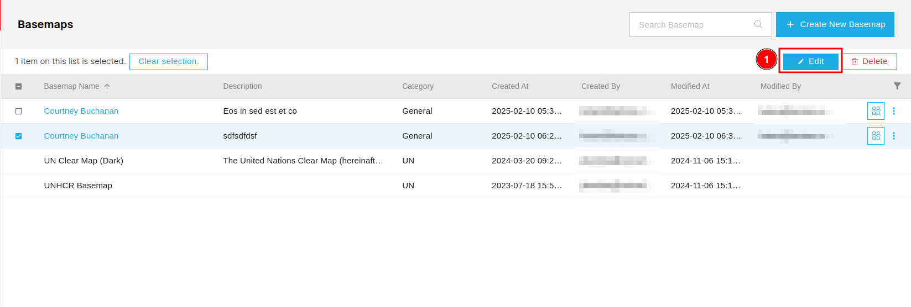](./img/basemap-img-6.png)

Edit basemap is same as the create new basemap page the only difference is that fields are disable for the editing initially you need to check box of the respective field to make it editable, then you can insert the new data to the field and to end the editing you click on the `Save` button to save it.

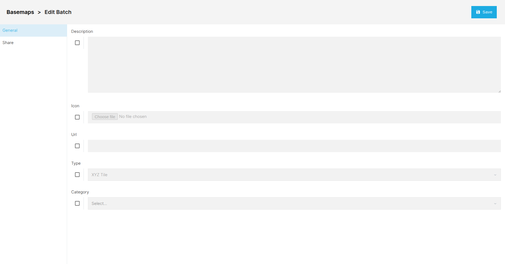

### Share 

Initially, all fields are disabled. To enable them, click on the 1️⃣ `Change Permission` checkbox, then you can proceed further. To see the process of how the share process works click [here](../share.md)

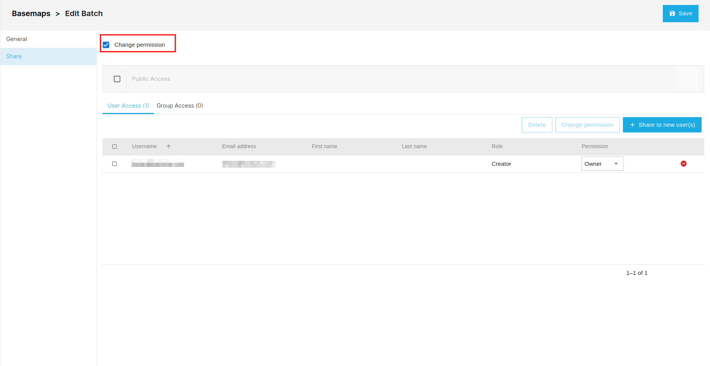

## How to Delete Basemap?

You need to first check the checkbox of the respective basemap in the table and then click on the 1️⃣ `Delete` button. This will open the confirmation dialog box.

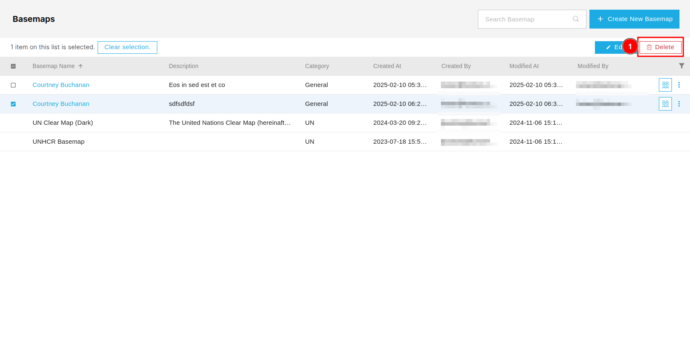

To delete the basemap click on the 2️⃣ `Confirm` button , otherwise click on the 1️⃣ `Cancel` button to cancel the deletion.

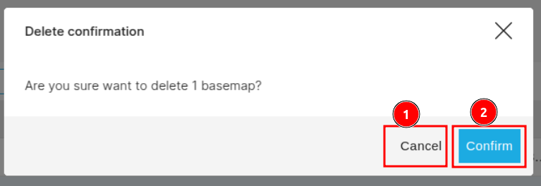

## How to Share Basemap?

To share the basemap click on the 1️⃣ `Group Icon`, this will redirects you to the share page. To see how the share process works click [here](../share.md).

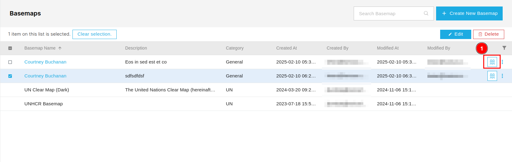

## How to Filter Data?

You can filter the bu clicking on the 1️⃣ `Filter` icon, this will open a form fill the necessary informations and click on the 2️⃣ `Apply filter` button to apply the filter.

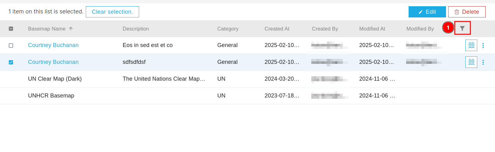
