# Context Layers Page

You can access the context layer page by clicking on the 1️⃣ `Context Layers` tab.

[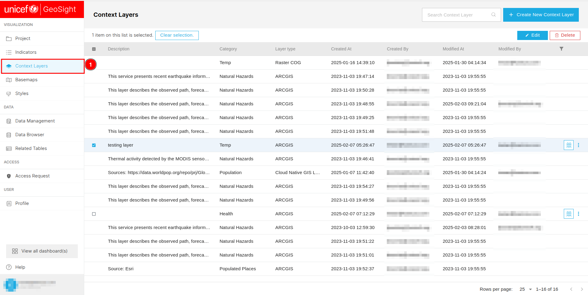](./img/context-layer-img-1.png)

You can use the 1️⃣ `Search` field to find specific layers. Create a new context layer by clicking the 2️⃣ `Create New Layer` button. To clear your selection, click on the 3️⃣ `Clear Selection` button, or manually deselect checkboxes. Use the 4️⃣ `Edit` button to modify a layer after selecting it. Delete selected layers by clicking the 5️⃣ `Delete` button. Sort data in ascending or descending order by clicking on the 6️⃣ column headers. To filter data based on specific criteria, use the 7️⃣ `Filter` icon. Share context layers by clicking the 8️⃣ `Share` icon. Remove a selected context layer by clicking the 9️⃣ three dots. At the bottom of the page, the 🔟 `Pagination` shows the number of records on the current page and the total records available in the database.

[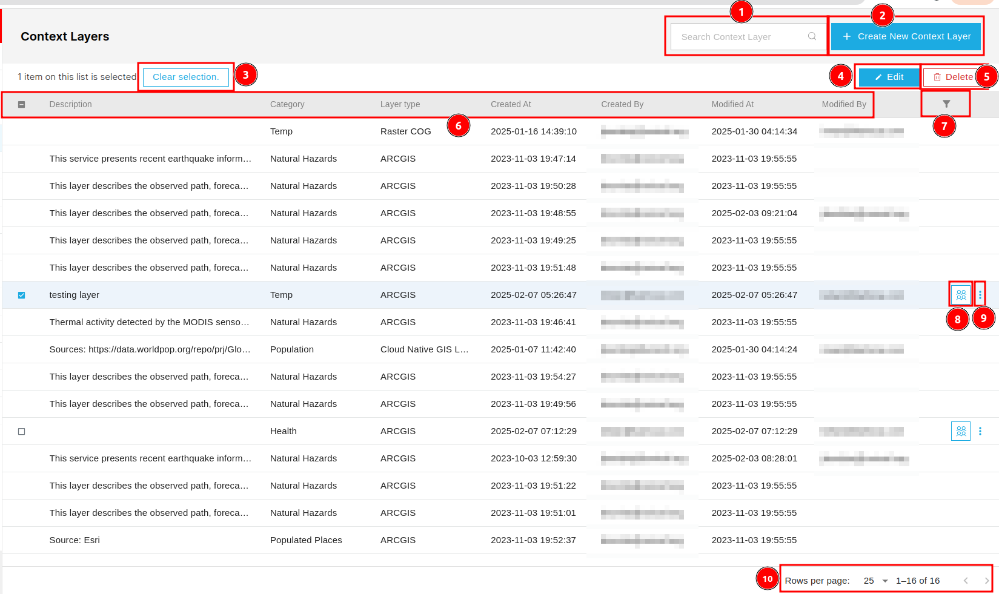](./img/context-layer-img-2.png)

## How to create new context layer?

You can create new context layer by clicking on the 1️⃣ `Create New Context Layer` button. This will redirected you to the create context layer page.

[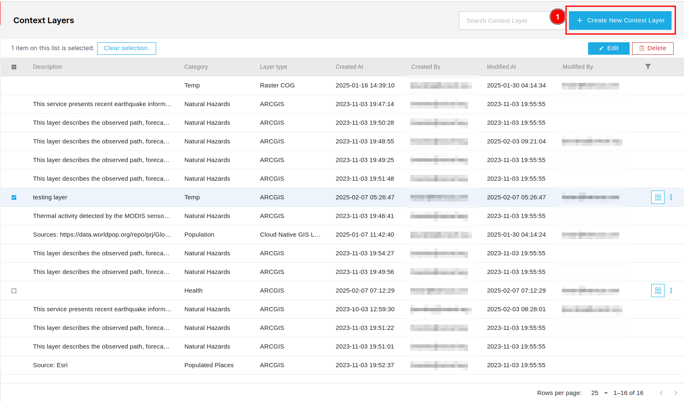](./img/context-layer-img-3.png)

### General

You can access this tab by clicking on 1️⃣ `General`, although it is selected by default. To create a new layer, fill in the necessary details in the 2️⃣ `form`, and then click the 3️⃣ `Save` button to save the layer.

[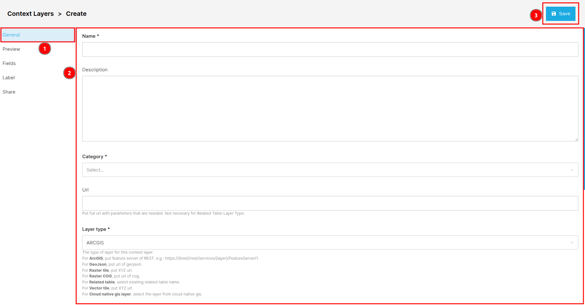](./img/context-layer-img-4.png)

## Preview

You can access this tab by clicking on 1️⃣ `Preview`. This tab is used to preview the layer.

[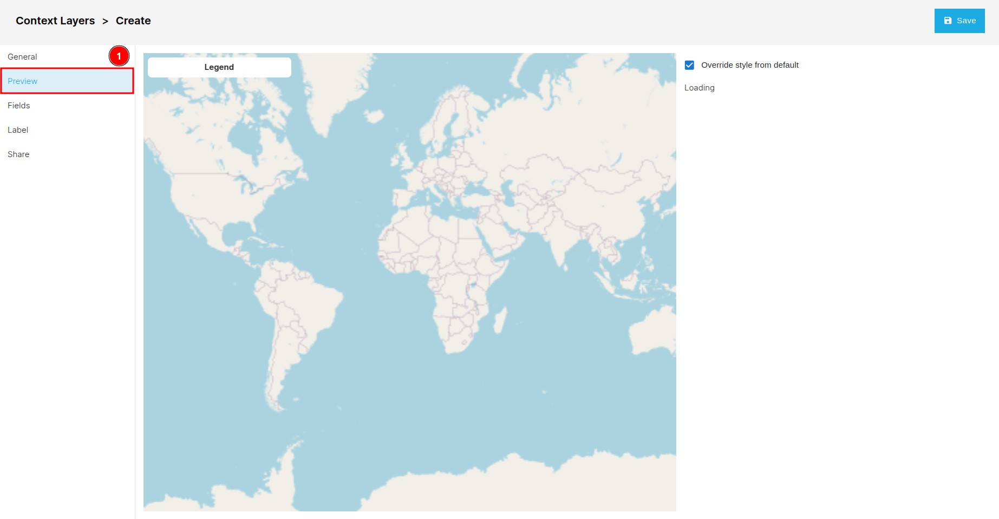](./img/context-layer-img-5.png)

## Fields

You can access the field tab by clicking on the 1️⃣ `Field`.

## Label

You can access the Label tab by clicking on the 1️⃣ `Label`.

## Share

You can access the share tab by clicking on the 1️⃣ `Share`. Click [here](../share.md) to learn about how the sharing process works.

[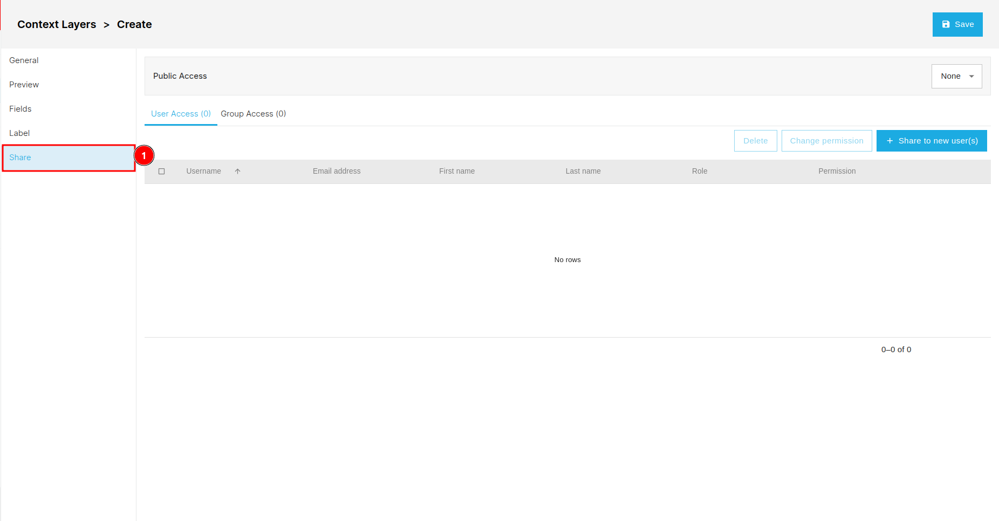](./img/context-layer-img-8.png)

## How to edit context layer?

If you want to edit an existing context layer, first check the 1️⃣ `checkbox` respective context layer, then click on the 2️⃣ `Edit` button. This will redirect you to the edit context layer page.

[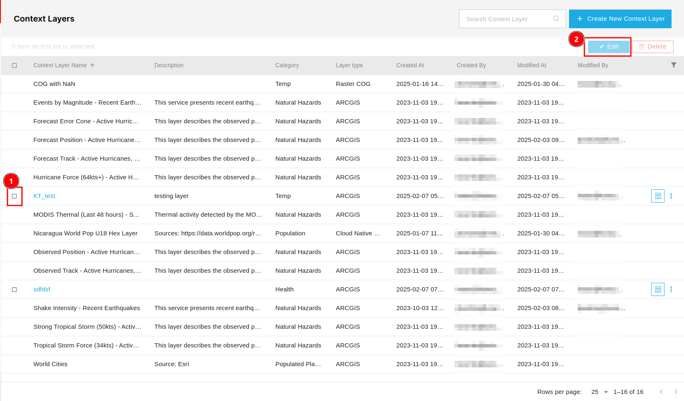](./img/context-layer-img-9.png)

The edit page works the same as the create new layer page, except you need to check the checkbox for the respective field to make it editable.

[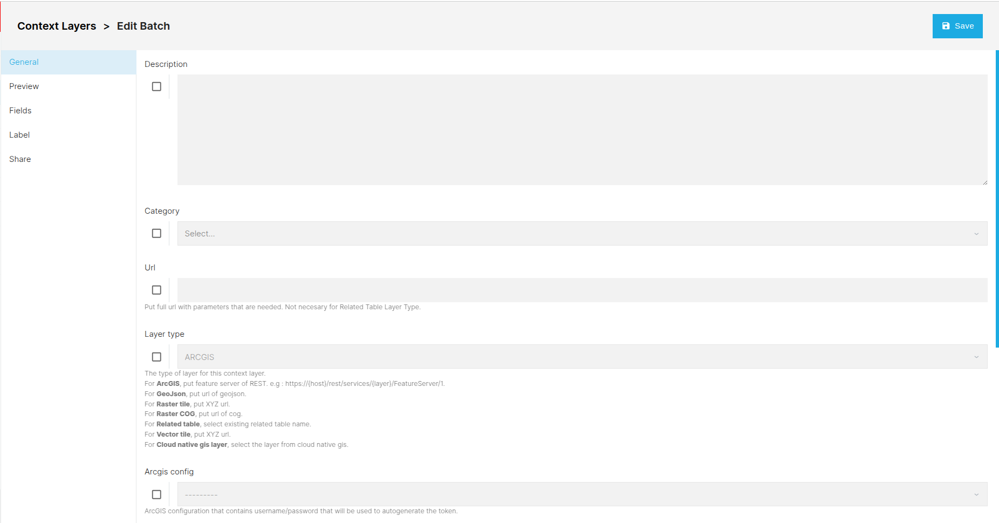](./img/context-layer-img-10.png)

## How to delete context layer?

If you want to delete an existing context layer, first check the 1️⃣ `checkbox` of the respective context layer, then click on the 2️⃣ `Delete` button. Alternatively you can click on the 3️⃣ `Three dots` on the respective context layer and select `Delete` from the dropdown.

[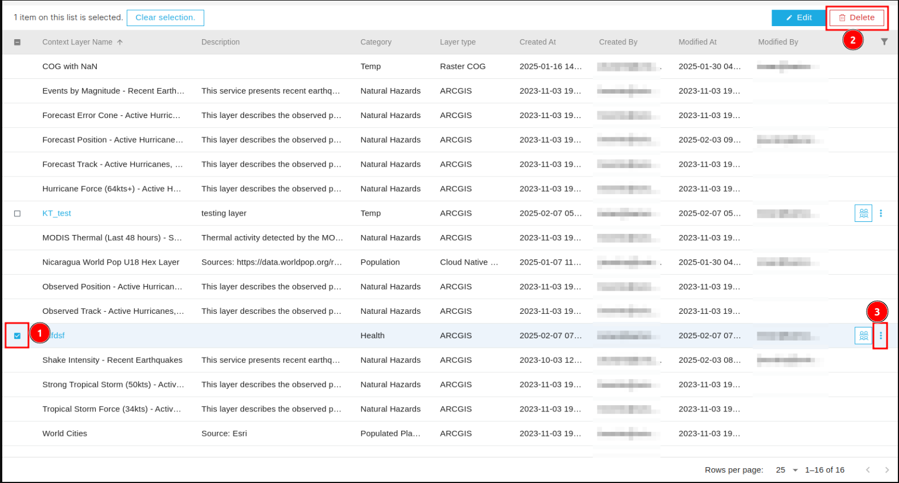](./img/context-layer-img-11.png)

After clicking on the Delete button a confirmation dialog box will appear. You can cancel the deletion process by clicking on the 1️⃣ `Cancel` button or confirm the deletion process by clicking on the 2️⃣ `Confirm` button.

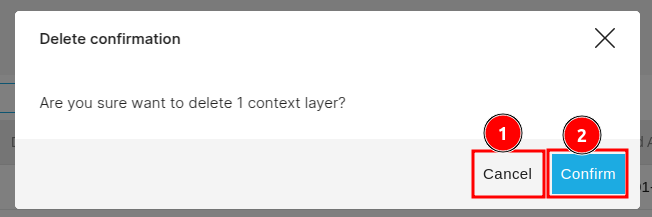

## How to apply filter?

To apply the filter on the available data click on the 1️⃣ `Filter` icon and then fill the necessary criteria in the filter 2️⃣ `Form` then click on the `Apply filter`.

[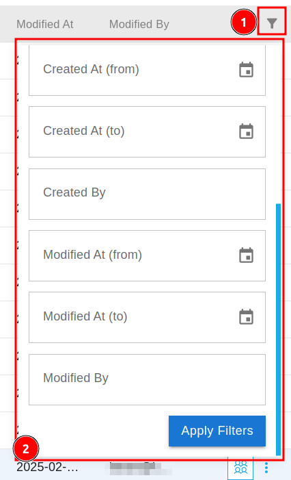](./img/context-layer-img-13.png)

## How to share context layers?

To share the context layer click on the 1️⃣ `Group Icon` of the respective context layer.

[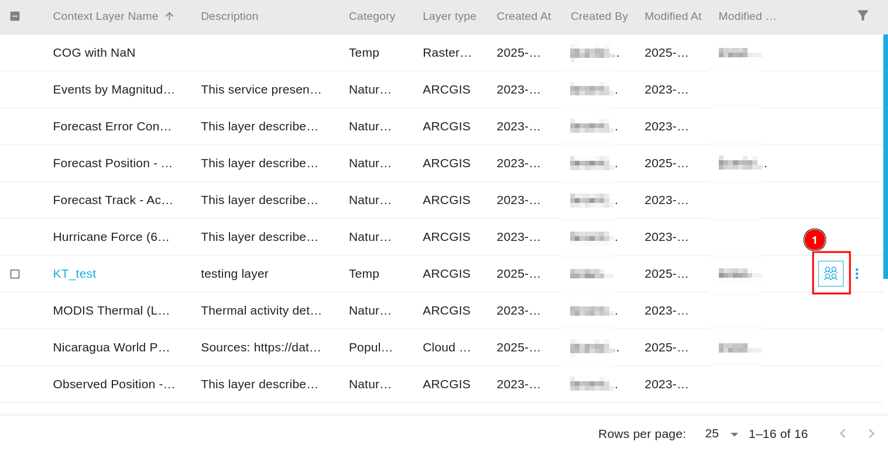](./img/context-layer-img-14.png)

* Click [here](../share.md) to see how the sharing process works.
