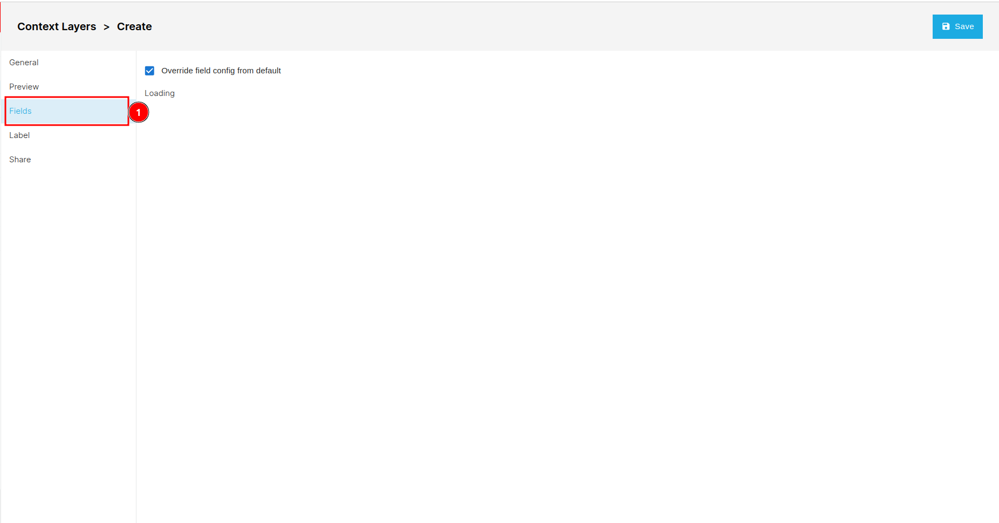

# Context Layers Page

You can access the context layer page by clicking on the 1️⃣ `Context Layers` tab.

You can use the 1️⃣ `Search` field to find specific layers. Create a new context layer by clicking the 2️⃣ `Create New Layer` button. To clear your selection, click on the 3️⃣ `Clear Selection` button, or manually deselect checkboxes. Use the 4️⃣ `Edit` button to modify a layer after selecting it. Delete selected layers by clicking the 5️⃣ `Delete` button. Sort data in ascending or descending order by clicking on the 6️⃣ column headers. To filter data based on specific criteria, use the 7️⃣ `Filter` icon. Share context layers by clicking the 8️⃣ `Share` icon. Remove a selected context layer by clicking the 9️⃣ three dots. At the bottom of the page, the 🔟 `Pagination` shows the number of records on the current page and the total records available in the database.

## How to create new context layer?

You can create new context layer by clicking on the 1️⃣ `Create New Context Layer` button. This will redirected you to the create context layer page.

### General

You can access this tab by clicking on 1️⃣ `General`, although it is selected by default. To create a new layer, fill in the necessary details in the 2️⃣ `form`, and then click the 3️⃣ `Save` button to save the layer.

## Preview

You can access this tab by clicking on 1️⃣ `Preview`. This tab is used to preview the layer.

## Fields

You can access the field tab by clicking on the 1️⃣ `Field`.

## Label

You can access the Label tab by clicking on the 1️⃣ `Label`.

## Share

You can access the share tab by clicking on the 1️⃣ `Share`. Click [here](../share.md) to learn about how the sharing process works.

## How to edit context layer?

If you want to edit an existing context layer, first check the 1️⃣ `checkbox` respective context layer, then click on the 2️⃣ `Edit` button. This will redirect you to the edit context layer page.

The edit page works the same as the create new layer page, except you need to check the checkbox for the respective field to make it editable.

## How to delete context layer?

If you want to delete an existing context layer, first check the 1️⃣ `checkbox` of the respective context layer, then click on the 2️⃣ `Delete` button. Alternatively you can click on the 3️⃣ `Three dots` on the respective context layer and select `Delete` from the dropdown.

After clicking on the Delete button a confirmation dialog box will appear. You can cancel the deletion process by clicking on the 1️⃣ `Cancel` button or confirm the deletion process by clicking on the 2️⃣ `Confirm` button.

## How to apply filter?

To apply the filter on the available data click on the 1️⃣ `Filter` icon and then fill the necessary criteria in the filter 2️⃣ `Form` then click on the `Apply filter`.

## How to share context layers?

To share the context layer click on the 1️⃣ `Group Icon` of the respective context layer.

* Click [here](../share.md) to see how the sharing process works.
