# Indicators Page

You can access the indicators page by clicking on the 1️⃣ `Indicators` tab on the left navigation bar.

[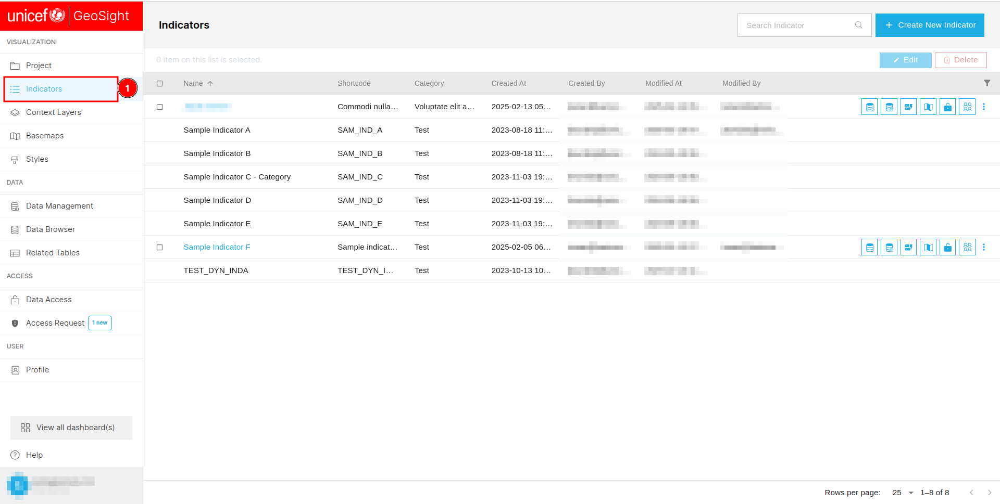](./img/indicators-img-1.png)

You can search for a specific indicator by entering its name in the 1️⃣ `Search` field. To create a new indicator, click on the 2️⃣ `Create New Indicator` button, which redirects you to the add new indicator page. You can deselect a selected indicator by clicking on the 3️⃣ `Clear selection` button. To edit a selected indicator, click on the 4️⃣ `Edit` button, and to delete it, click on the 5️⃣ `Delete` button. To sort the data in the table, click on the 6️⃣ `Column header` of the respective column. You can also filter the data by selecting the 7️⃣ `Filter` icon. Additionally, you can use the 8️⃣ `Utility function` to perform various operations on the data. To navigate through different pages, use the 9️⃣ `Pagination` at the bottom of the page.

[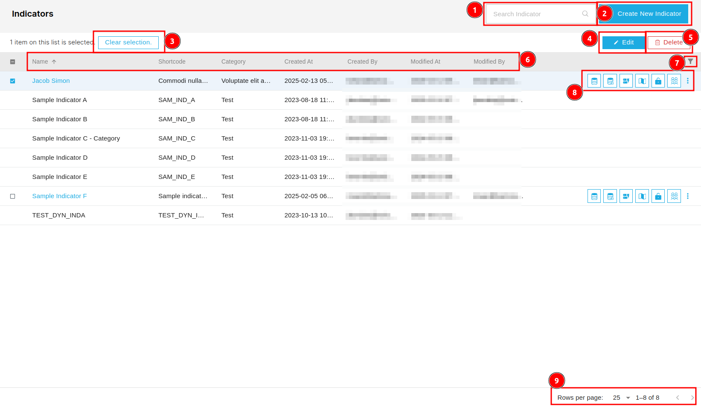](./img/indicators-img-2.png)

## How to create new indicator?

You can create a new indicator by clicking on the 1️⃣ `Create New Indicator` button, which will redirect you to the new indicator creation page.

[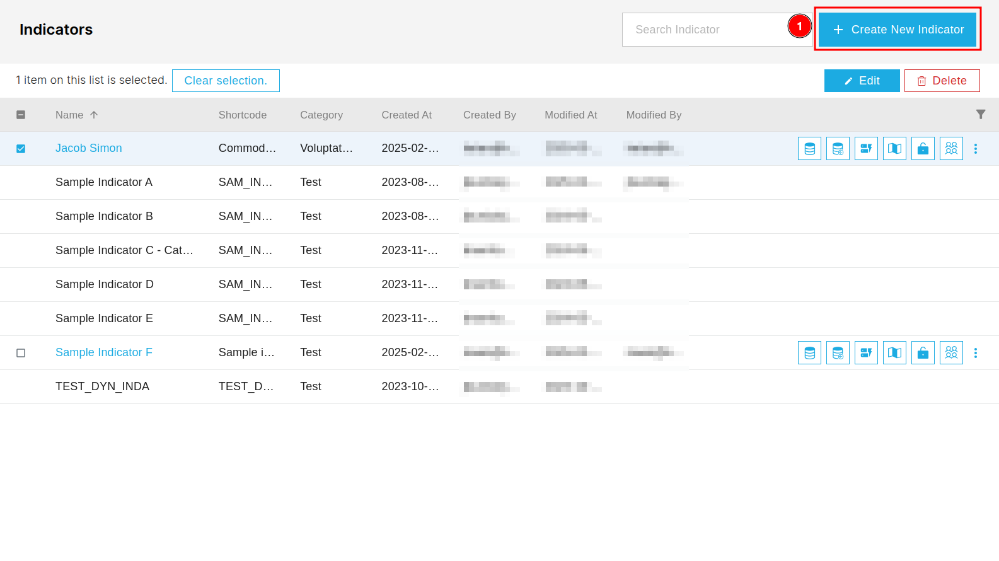](./img/indicators-img-7.png)

To create a new indicator, fill in various details, including general information, aggregation, corresponding style, labels, and share settings. Select the type of information from the 1️⃣ `Navigation Bar`, then complete the corresponding 2️⃣ `Form`. After entering all the details, click on the 3️⃣ `Save` button to save the new indicator.

[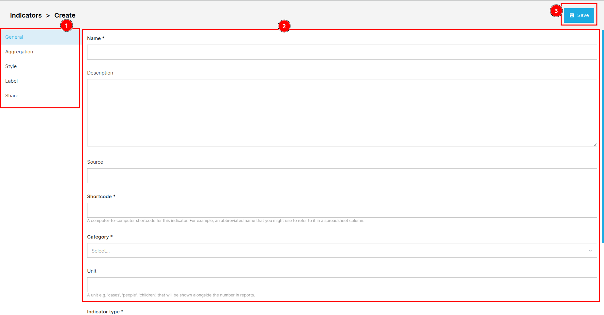](./img/indicators-img-8.png)

### Required filed error

If you forget to fill in a field marked with `*`, you will receive a 1️⃣ `This field is required` error. To avoid this, ensure all required fields are completed before proceeding.

[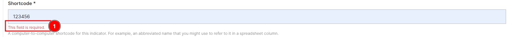](./img/indicators-img-9.png)

After successfully submitting the form an alert message will be displayed.

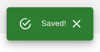

* For more information you can check [Manual](../../manual/visualisation/indicators-page.md#create-new-indicator).

## How to edit indicators?

To edit an indicator, first, check the 1️⃣ `Checkbox` of the corresponding indicator. Then, click on the 2️⃣ `Edit` button. You will be redirected to the edit page.

[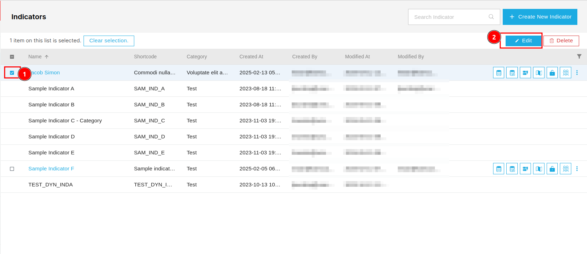](./img/indicators-img-4.png)

You can access the type of information you want to edit for the respective indicator from the 1️⃣ `Navigation bar` on the left. To enable the input field, check the 2️⃣ `Checkbox` of the respective field. After updating the information, save the changes by clicking on the 3️⃣ `Save` button.

[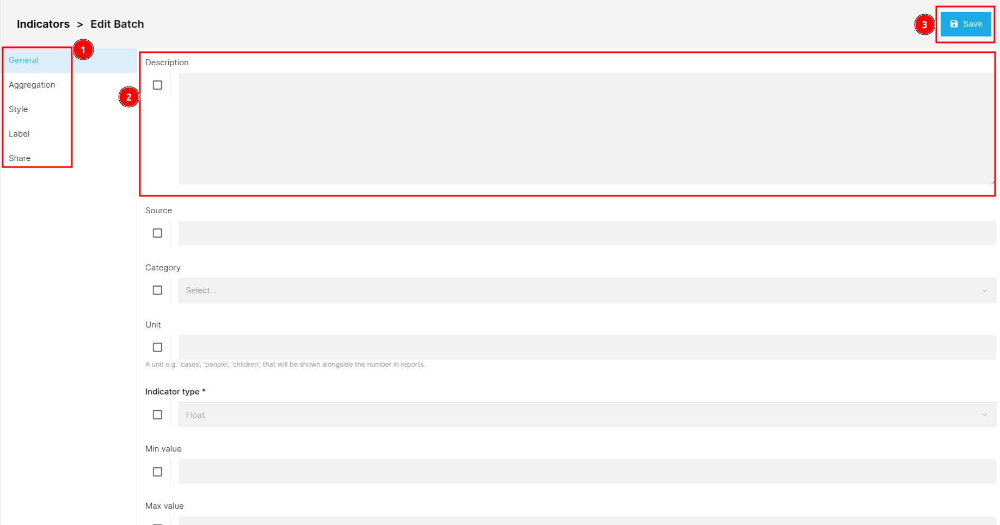](./img/indicators-img-3.png)

## How to delete indicators?

To delete an indicator, first, check the 1️⃣ `Checkbox` of the corresponding indicator. Then, click on the 2️⃣ `Delete` button. Then a delete confirmation dialog box will appear.

[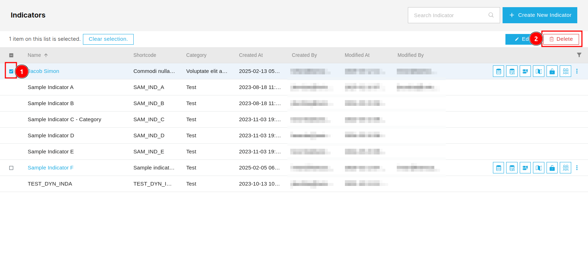](./img/indicators-img-5.png)

You can cancel the deletion process by clicking on the 1️⃣ `Cancel` button. To confirm the deletion, click on the 2️⃣ `Confirm` button.

[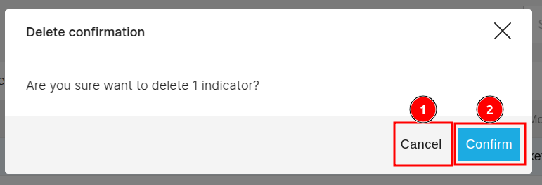](./img/indicators-img-6.png)

## How to access utility functions?

### Browse data

To browse the data of any indicator, click on the 1️⃣  icon of the respective indicator. This will redirect you to the `Data Browser` page.

[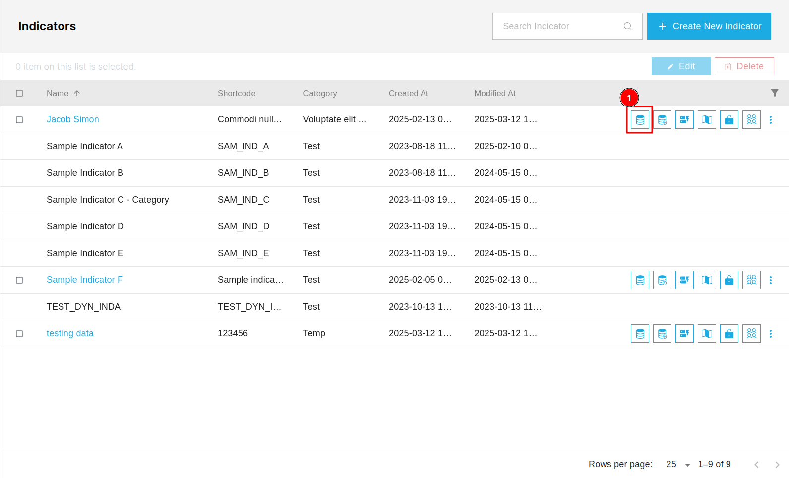](./img/indicators-img-11.png)

In this data browser page you will find all the related information to the indicator.

[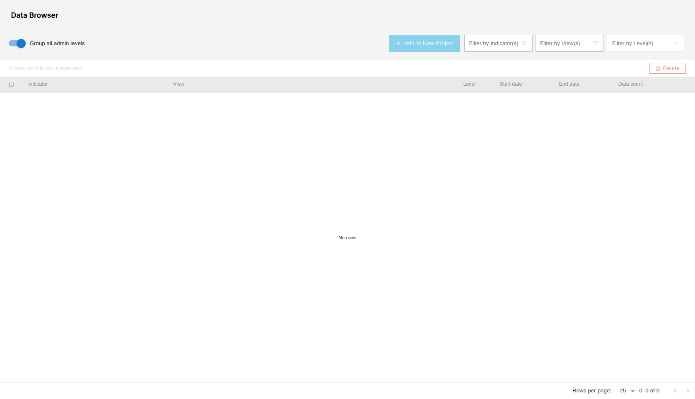](./img/indicators-img-13.png)

* For more information you can check [Manual](../../manual/data/data-browser.md)

### Import data

You can access the import data functionality of any indicator by clicking on the 1️⃣  icon. This will redirect you to the import data page.

[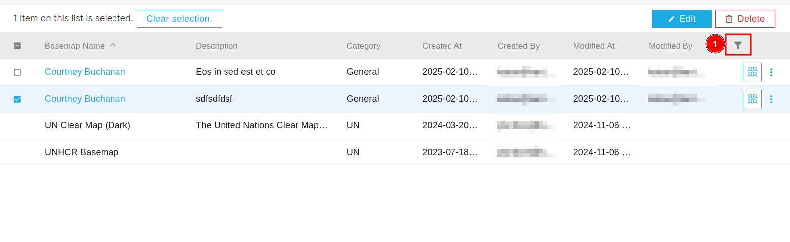](./img/basemap-img-13.png)

* For information you can check the [Manual](../../manual/data/data-management.md#import-data)

### Management Form

You can access the management form by clicking on the 1️⃣  icon of the respective indicator.

[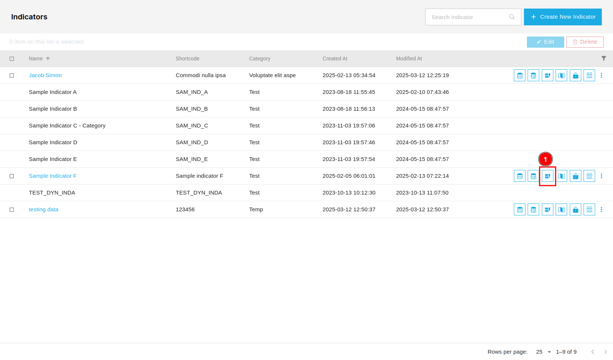](./img/indicators-img-16.png)

### Management Map

You can access the management map by clicking on the  icon of the respective indicator.

[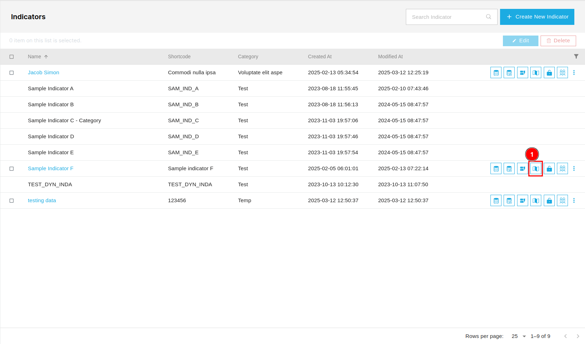](./img/indicators-img-18.png)

### Data access

You can access the data of any indicator by clicking on the 1️⃣  icon of the respective indicator.

[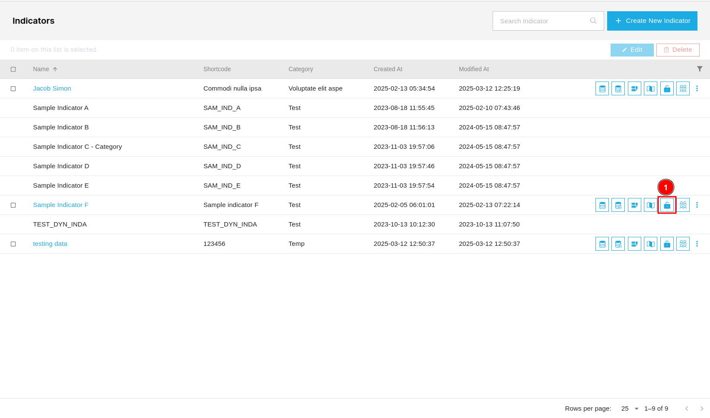](./img/indicators-img-20.png)

### Share

You can access the share functionality of any indicator by clicking on the 1️⃣  icon of the respective indicator.

[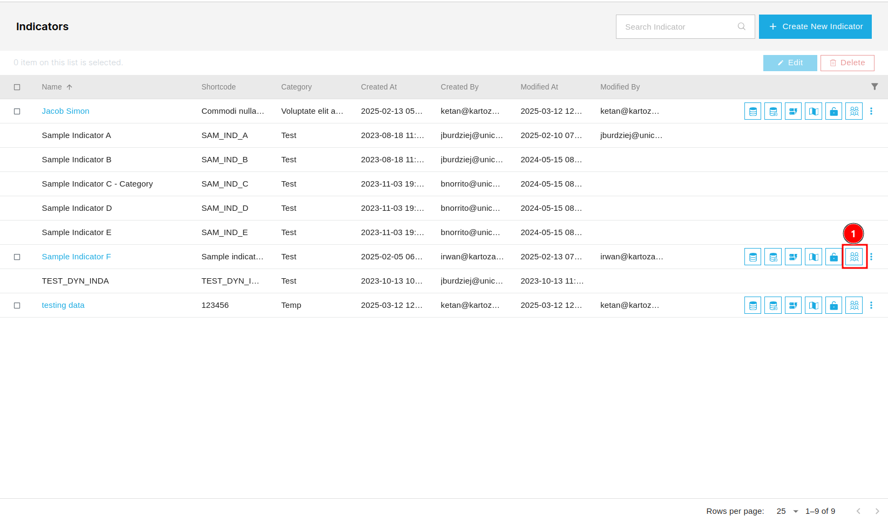](./img/indicators-img-22.png)

* For more information you can check [Share](../../manual/share.md#share-project).

* For a detailed description of the indicators page, you can refer to the [Manual](../../manual/visualisation/indicators-page.md).
