# Style Page

You can access the `Style` page by clicking on the 1️⃣ `Style` tab. You can search for a specific style using the 2️⃣ `Search Style` field. To create a new style, click on the 3️⃣ `Create New Style` button. If you need to deselect the selected styles, use the 4️⃣ `Clear Selection` button. To edit any style, first check the checkbox of the respective style and then click on the 5️⃣ `Edit` button. Similarly, to delete a style, first check the checkbox and then click on the 6️⃣ `Delete` button. You can change the order of styles in the table to ascending or descending by clicking on the 7️⃣ `Header` of the respective column. Additionally, you can filter the data using the 8️⃣ `Filter` button. The available data can be viewed in the 9️⃣ `Data Table`. If you want to share a style, you can do so by clicking on the 🔟 `Icon` of the respective style. At the bottom of the page, you can use `Pagination` to navigate through the pages.

[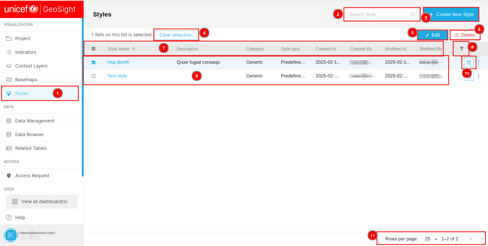](./img/style-img-1.png)

## How to Create New Styles?

### General

After clicking on the `Create New Style` you will be redirected to this page. You can access the general tab clicking on the 1️⃣ `General` tab, although this tab is selected by default. To create new style you need to fill the following information in the 2️⃣ `Form`, then click on the 3️⃣ `Save` button to save the style. After clicking on the saving button you will be notify by an `Saved` alert message.

[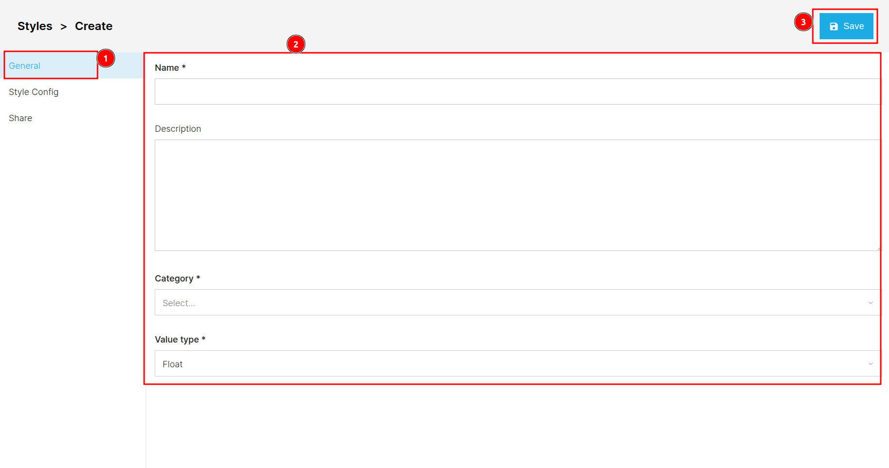](./img/style-img-2.png)

### Style Config

You can access the `Style Config` tab by clicking on the 1️⃣ `Style Config` tab. You are required to select the type of style from the 2️⃣ `Style Type` dropdown menu and fill in the style information in the 3️⃣ `Style` section. The style below varies depending on the style type you select. To create a new rule, click on the `+ Add New Rule` button.  

[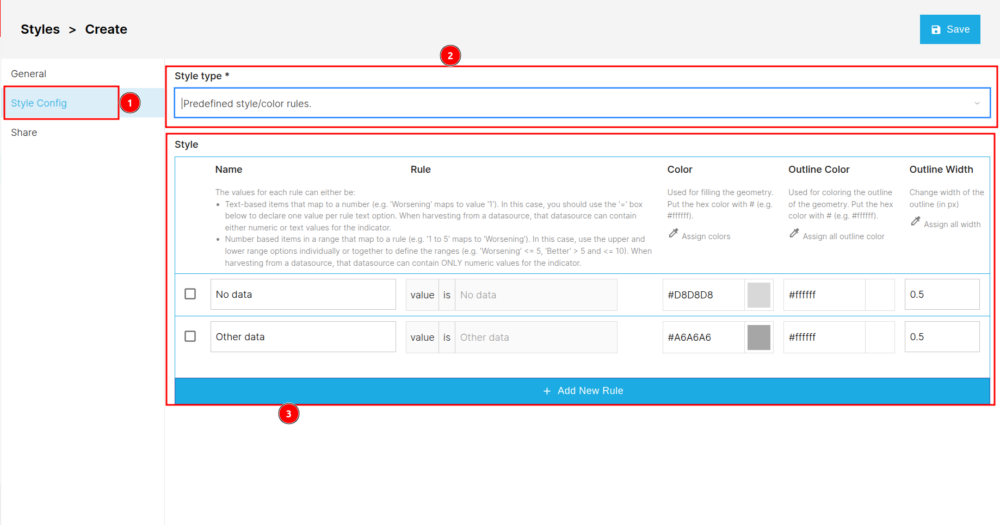](./img/style-img-3.png)

### Share

You can access the `Share` tab by clicking on the 1️⃣ `Share` tab. Click [here](../share.md) to see how the share process works.

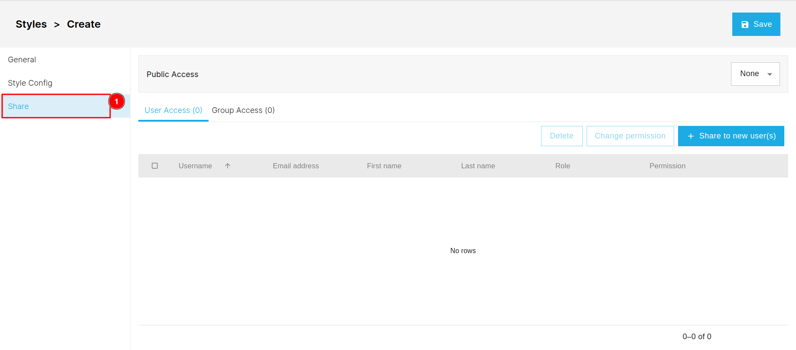

## How to Edit Style?

You can edit a style by first checking the 1️⃣ `Checkbox` of the respective style and then clicking on the 2️⃣ `Edit` button. After clicking on the edit button you will be redirected to the style edit page.

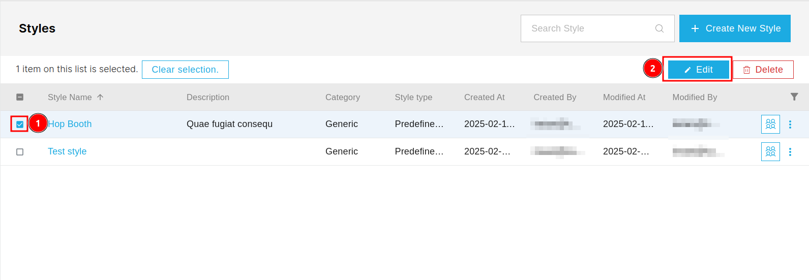

### General
You can access the General Information section by clicking on the 1️⃣ `General` tab. To edit the details of an existing style, you first need to check the 2️⃣ `Checkbox` of the respective field to make it editable. After that, you can fill in the new information. To save the changes, click on the 3️⃣ `Save` button.

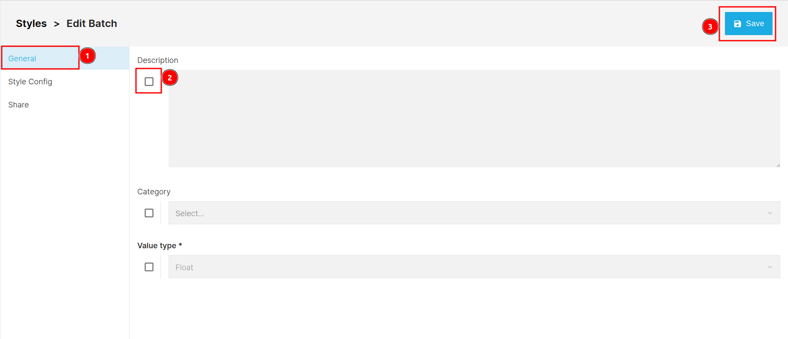

### Share

You can access the share section by clicking on the 1️⃣ `Share` tab, To edit the share permissions you need to first check the 2️⃣ `Checkbox` only then you will be able to edit the share permissions.

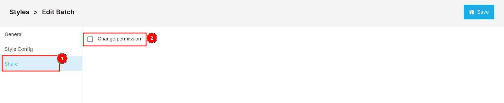

## How to Delete Style?

You can delete a style by first checking the 1️⃣ `Checkbox` of the respective style and then clicking on the 2️⃣ `Delete` button. Alternatively you can click on the 3️⃣ `Three dots` of the respective field then click on the `Delete`. After clicking on the delete button a confirmation dialog will appear.

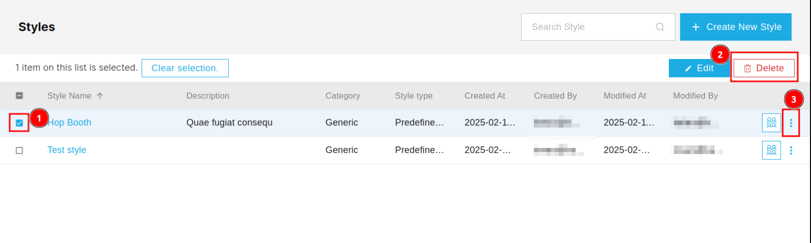

To delete the style click on the 2️⃣ `Confirm` button otherwise click on the 1️⃣ `Cancel` button to cancel the process.

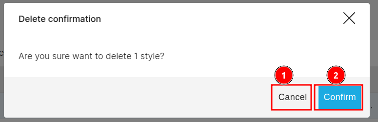

## How to Share Style?

Click on the 1️⃣ `Group` icon of the respective style to share.
Click [here](../share.md) to see how the sharing process works.

## How to Filter Data?

Click on the 1️⃣ `Filter` icon to filter the data.

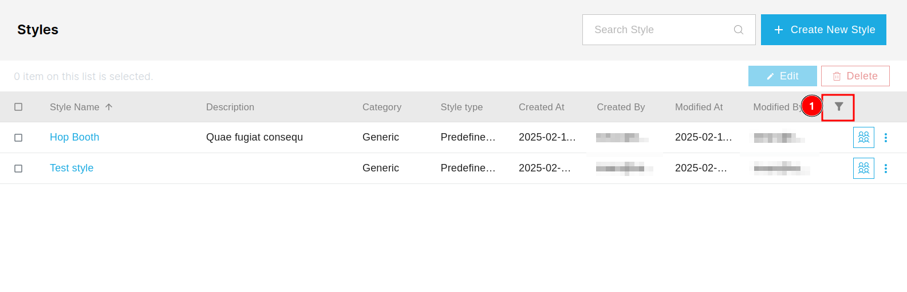

Fill the necessary information in the fields on the basis of you want to filter the data, then click on the 1️⃣ `Apply Filters` to apply the filters.

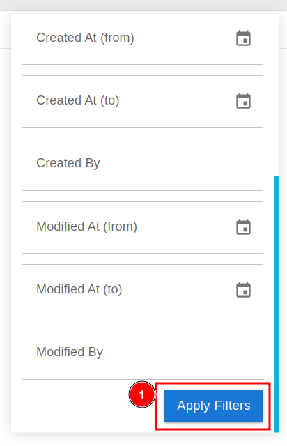
