## Access Request

[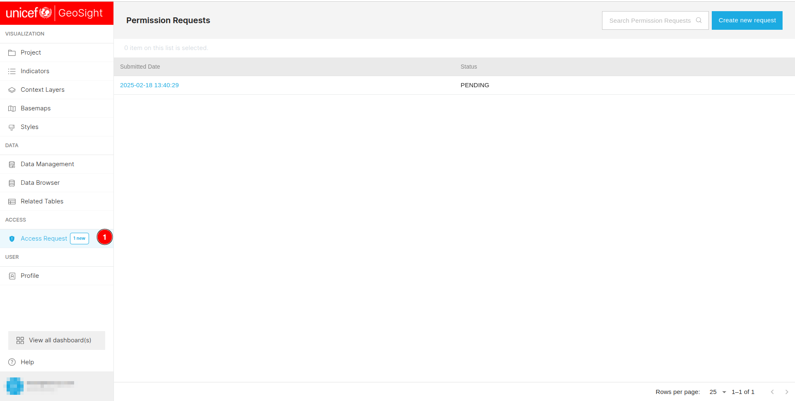](./img/access-img-1.png)

1. **Access Request:** Users can click on this tab to access the `Action Request` page.

[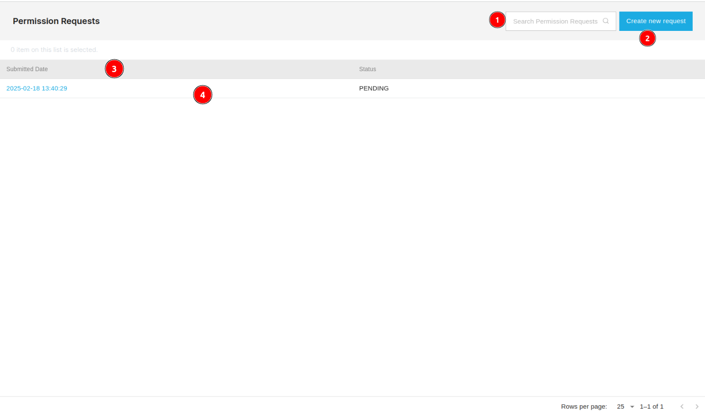](./img/access-img-2.png)

1. **Search Bar:** Users can use this search bar to search for the `Permission Request`.

2. **Create new request:** Allows users to create new request.

3. **Column headers:** Users can sort the table data in ascending or descending order by clicking on the header of the respective column.

4. **Data Table:** Users can view all the requests in the table.

## Create New Request

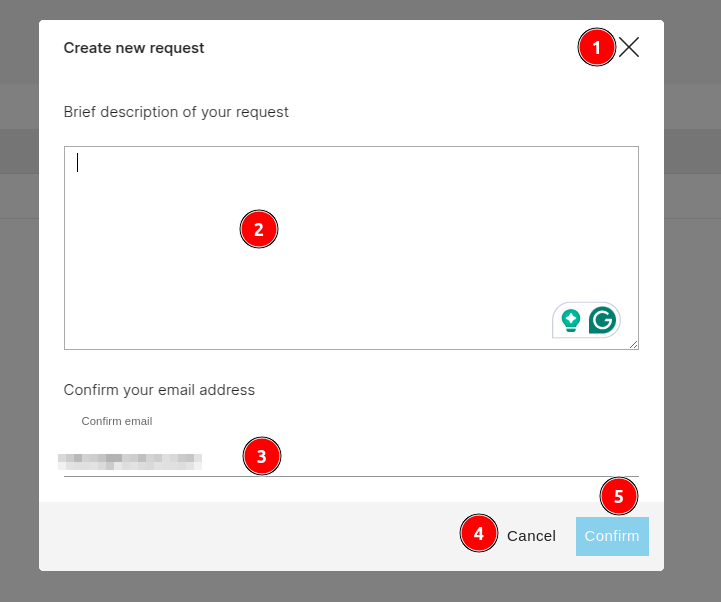

1. **X:** Allows users to close the form.

2. **Description:** Users are required to provide a brief description of the request.

3. **Email:** Users are required to provide their verified email address otherwise the request will not be submitted.

    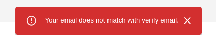

    * **Error:** Users will receive the following error message if they do not provide their verified email address. Users can close this alert message by clicking on the `x` icon.
        
    * **Success:** Users will receive the success message if the request is successfully submitted. Users can close this alert message by clicking on the `x` icon.

4. **Cancel:** Allows users to cancel the request.

5. **Submit:** After filling on the details click on this button to submit the request.

## View Request

[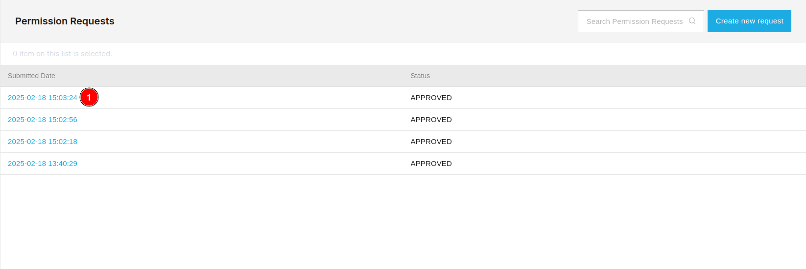](./img/access-img-5.png)

1. **Submitted Date:** Click on the submitted date, which works as a link. This will redirect users to a new page where they can view all the details associated with that particular request.

    [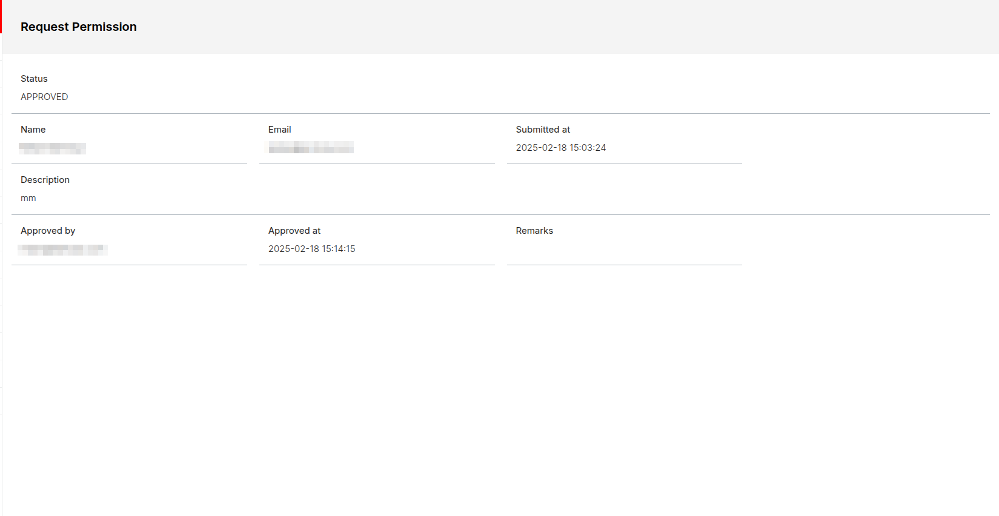](./img/access-img-6.png)

    * **Status:** Current status of the request.

    * **Name:** Name of the person who submitted the request.

    * **Email:** Email address of the person who submitted the request.

    * **Submitted at:** The date on which the request was submitted.

    * **Description:** Associated description with request.

    * **Approved by:** Email address of the person who approved the request.

    *  **Approved at:** The date on which the request was approved.

    * **Remarks:** Remarks associated with the request.

## Request Status

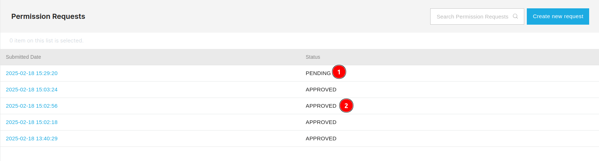

1. **PENDING:** Indicates that request is not approved yet.

2. **APPROVED:** Indicates that request has been approved by the admin.

## Success Email

* Users will receive the following email when their request is approved.

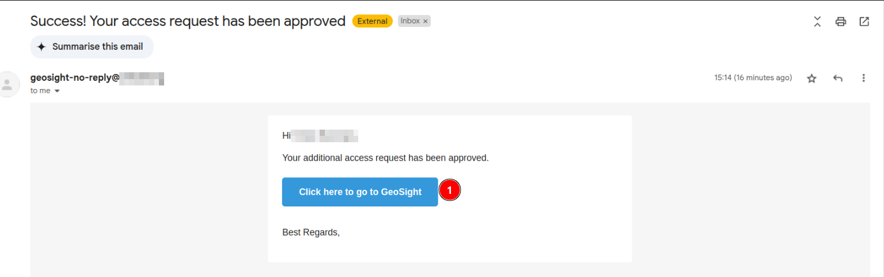

1. **Click here to go to GeoSight:** By clicking on this users will be redirected to the `GeoSight`.

## Modify Column Visibility

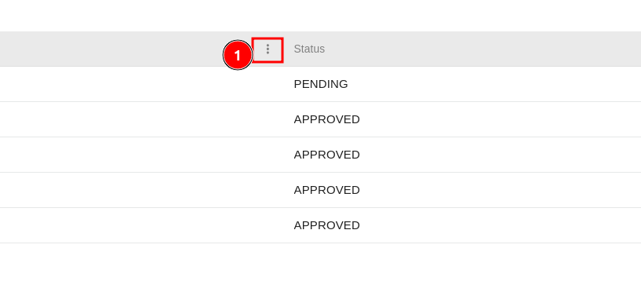

1. **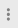 dots:** Click on the three dots to modify the column visibility. This will open a dropdown menu.

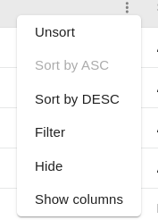

* **Unsort:** Click on this to unsort the table.

* **Sort by ASC:** Click on this to sort the table in ascending order.

* **Sort by DESC:** Click on this to sort the table in descending order.

* **Filter:** By clicking on this, users can filter the table based on the column they want to filter.

    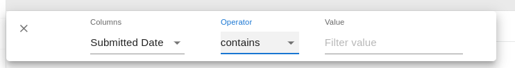

    * To apply the filter first select the `Column` from the dropdown, then choose the operator from the next dropdown, and finally enter the value in the text box. To close the filter, click on the `X` icon.

* **Hide:** Click on this to hide the respective column.

* **Show Columns:** By clicking on this users can select which columns they want to display.

    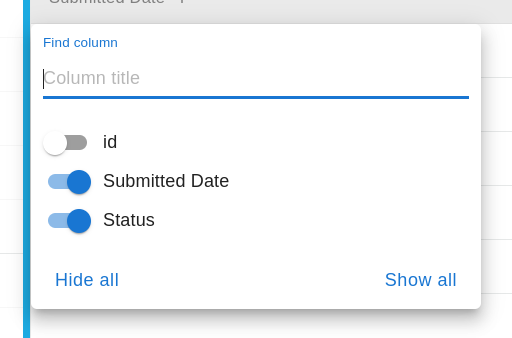

    * **Find Column:** Users can use this search field to search for the specific column.

    * ** button:** Users can toggle the visibility of the column by clicking on this button.

    * **Hide all:** Hide all the columns.

    * **Show all:** Show all the columns.
    