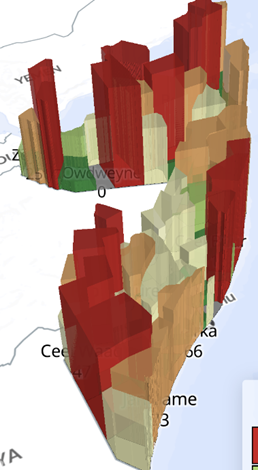
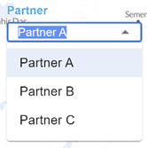
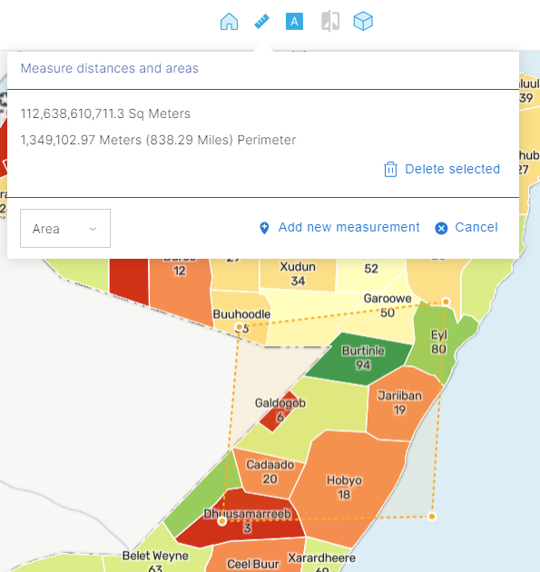

# Analysis Tools

Since GeoSight is a geospatial analysis and visualization, it provides a wide range of tools for users to enable to highlight different dimensions of data, enable spatial analysis and allow for multi-variate analysis. 

## Widgets and Filters
Widgets & filters are some of the most powerful tools on GeoSight as they allow for the multi-variate analysis of humanitarian indicators across time and space. They can highlight areas with specific needs, as well as provide various graphs that help to improve the users understanding and comprehension of the data.

## Compare Layers
The Compare Layers tool is a unique data visualization tool that allows for the direct display of two indicators, within their respective classes, on the one map that occupies the dashboard. The tool can be activated on a project by selecting the compare layers button   which is located at the top of the project. 
This enables the unique data visualization feature where one indicator becomes an outline, reflecting the same class and a secondary indicator fills in the polygon. This allows users to assess the difference in classes between indicators by district. At the same time, the legends of both indicators are provided which allows users to understand precisely what the color differences indicate. 

## 3D Layers

The 3D layers tool is an important tool that enables for the analysis and comprehension of different values across different administrative polygons. In a 2D model, indicators are split into different classifications, but all values within the same class are the same color and so the values appear the same. By enabling a 3D view, GeoSight allows users to consider values within the same class and understand how these administrative areas differ to one another. 

Users can enable this view by clicking the _3D Layers_ button  which is located at the top of the project. 

This adjusts the users viewing angle from 90° to 30°. Users can adjust their viewing angle and orientation by right clicking or clicking the _Reset Tilt_ button. 

## Multi Indicator Layers

Multi-Indicator layers are a dynamic form of symbology that allows users to compare the numeric values of a range of indicators. Within this layer type analysts are able to compare multiple indicators (not just two) in a variety of graph formats, a pie char or a bar chart. In doing so, the values will appear is as these charts in the centroid of their appropriate administrative district. 

## Slicing Toolbar

When a related table is added to a project, it contains an array of data that can be manipulated and filtered to display the multiple dimensions of the dataset. This can be controlled and maintained through the use of slicers- data specific filters that allow end-users to control and manipulate a dataset.

### Using Slicers

When a related table is added to a project, it contains an array of data that can be manipulated and filtered to display the multiple dimensions of the dataset. This can be controlled and maintained through the use of slicers- data specific filters that allow end-users to control and manipulate a dataset.

   

## Measurements

In a project, the users are able to measure the distance between one or more points. Similarly, they can draw an area to calculate both the area and perimeter.

1.	First, select the measurement tool 

2.	Click your starting point

3.	Click the remaining desired areas, this will create either a line or a polygon

4.	Double click to finish

The project will then display the measurements, including the area and perimeter if a polygon was defined. 

Users can have multiple measurements at once. 

## Bookmarks

In order to preserve any analysis that a user may develop, they have the capability to create Bookmarks. These bookmarks capture the current view and returns the user to that view anytime the bookmark is selected. 

To create a bookmark, click the Bookmark star, click “Create New”, enter a name, and save.

## Downloading Data
Through the front-end of a project, users can download the available and currently visualized dataset. On the main toolbar, simply select the download button that is shaped like a downward facing arrow. 

By downloading the dataset, further information is available to the user.

- Improved Analysis- Users can access disaggregated data to incorporate into other projects, further analysis and aggregate values, including how data changed overtime.

- Access Geospatial Codes- By downloading the dataset, users are able to access the Reference Dataset information which can provide the proper codes for 
