# Data Browser

[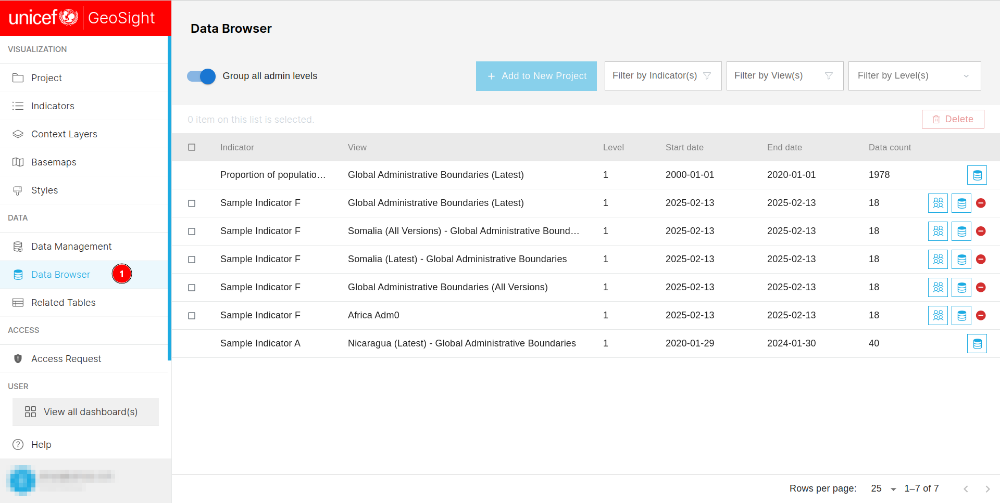](./img/data-browser-img-1.png)

1. **Data Browse:** Users can access this page by clicking on the `Data Browse` tab located at the left side of the page.

[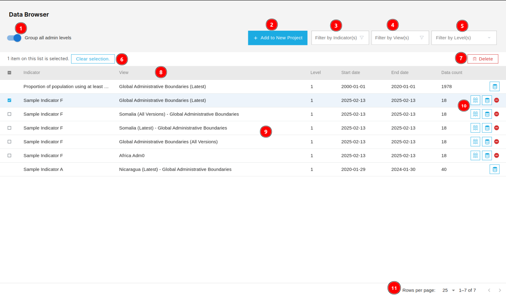](./img/data-browser-img-2.png)

1. **Group all admin level:** Users can use this option to group all the admin level data together.

2. **+Add to New Project:** Users can add new data to a new project by clicking on this button. After clicking on this users will be redirected to the new page.

3. **Filter by Indicator(s):** Users can filter the data by selecting the indicator(s) they are interested in.

4. **Filter by View:** Users can filter the data by selecting the views they are interested in.

5. **Filter by Levels:** Users can filter the data by selecting the levels they are interested in.

6. **Clear selection:** Users can use this option to deselect the selected indicators.

7. **Delete:** Users can delete the selected data by clicking on this button.

8. **Column Headers:** Users can sort the in ascending or descending order data by clicking on the column headers.

9. **Data Table:** Users can view the available data in the data table.

10. **Additional Action:** These optional allow users to perform additional actions on the data.

    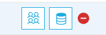

    * **:** Allows users to share the data. Click [here](../share.md) to see how the share process works.

    * **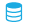:** Allows users to browse the respective data.

        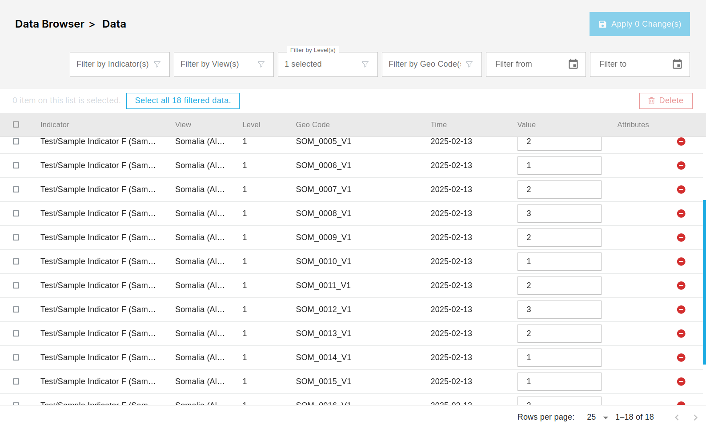

11. **Pagination:** Users can navigate through the pages by using the `Pagination` located at the bottom of the page. They can click on the `<` and `>` buttons to move through the pages. 

## +Add to New Project

>Note: Users can only select one indicator at a time.

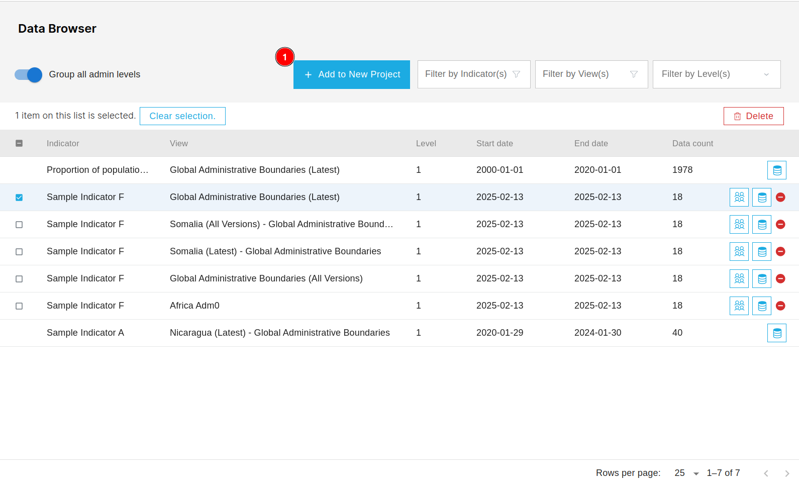

1. **Add to New Project:** After checking the checkbox of the respective data, users can click on the `Add to New Project` button. This action will redirect them to a new page.

### General

[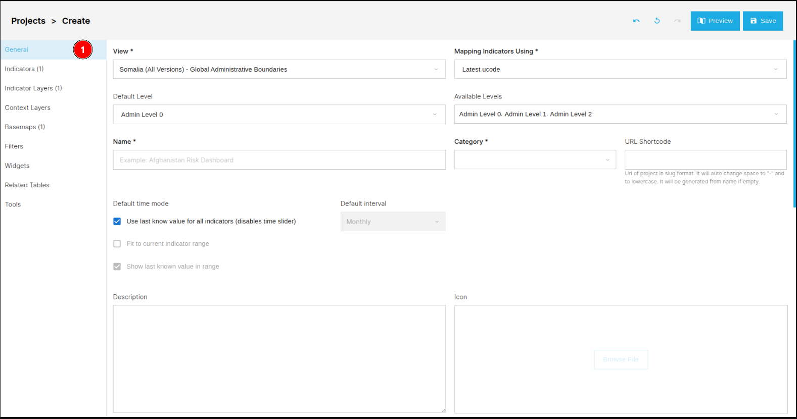](./img/data-browser-img-8.png)

1 **General:** Users can use this tab to access the general information of the data.

* **View:** This field allows users to select the view. It is a mandatory field.  

* **Mapping Indicators Using:**  This field is used to select the mapping method for indicators. It supports different mapping methods, including the `latest ucode` and `concept uuid` option.  

* **Default Level:** This dropdown lets users choose the default administrative level to be displayed on the map.  

* **Available Levels:** This section displays all the available levels that users can select for viewing data.  

* **Name:** Users must provide a name for the view. This is a mandatory field.

* **Category:** This field categorises the view and is required to save the configuration.

* **URL Shortcode:** This field automatically generates a URL in slug format. It converts spaces to hyphens and uses lowercase letters. If left empty, it will be generated from the name.

* Time Settings

    * **Default Time Mode:** Users can choose the default time mode for viewing data. There are three options:

        - **Use last known value for all indicators:** Disables the time slider and displays the most recent data. Deselecting this allows users to access the remaining options. 

        - **Fit to current indicator range:** Adjusts the time slider to fit the available data range.  

        - **Show last known value in range:** Displays the last known value within the selected range.  

* **Description:** This field allows users to add descriptive information about the view.

* **Icon:** Users can upload an icon to represent the view. To upload an icon:  

    * Click on the `Browse File` button. This will the pop-up window.

        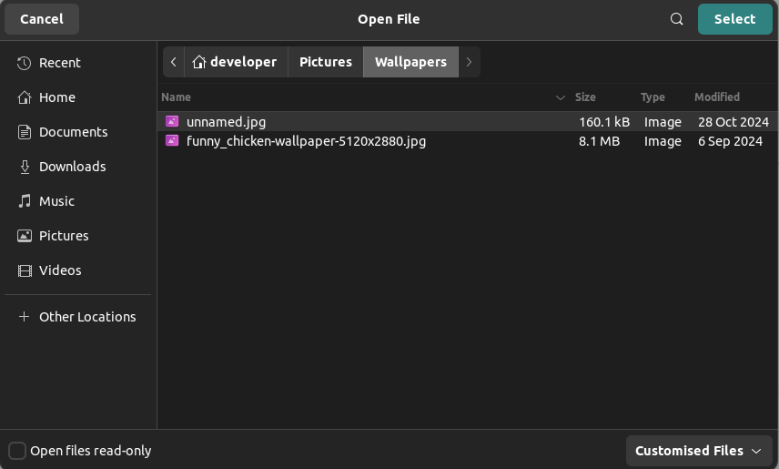  

    * Select the desired image file from your computer.  

    * Click `Select` to upload the file.

[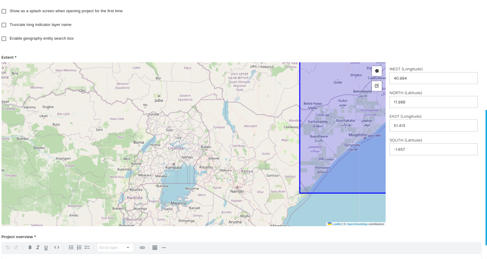](./img/data-browser-img-10.png)

* **Checkboxes:** Users can tick the checkbox according to their preferences:

    * Show as a splash screen when opening project for the first time: This option allows the project to be shown as a splash screen when opening for the first time.  

    * Truncate long indicator layer name: If enabled, long indicator layer names will be truncated for better visibility. 

    * Enable geography entity search box: This option allows users to search for geographical entities on the map.

* **Extent:** The extent defines the geographical boundaries displayed on the map. It is a mandatory field.  

* **Configuring the Extent:** Users can use the coordinates or they can draw the polygon by clicking on the  icon.

    * **WEST (Longitude)**: Enter the westernmost longitude of the area.  
    * **NORTH (Latitude)**: Enter the northernmost latitude of the area.  
    * **EAST (Longitude)**: Enter the easternmost longitude of the area.  
    * **SOUTH (Latitude)**: Enter the southernmost latitude of the area. 

    * **Draw Polygon:** Users can draw the polygon by clicking on the  icon. To draw the polygon, first mark all the points in the east, west, north, and south directions. Then, to end the editing, click on the first point. After this, all the longitude values are automatically filled in the west, east, north, and south fields.

    * **Edit Layer:** Allows users to edit the drawn layer.

        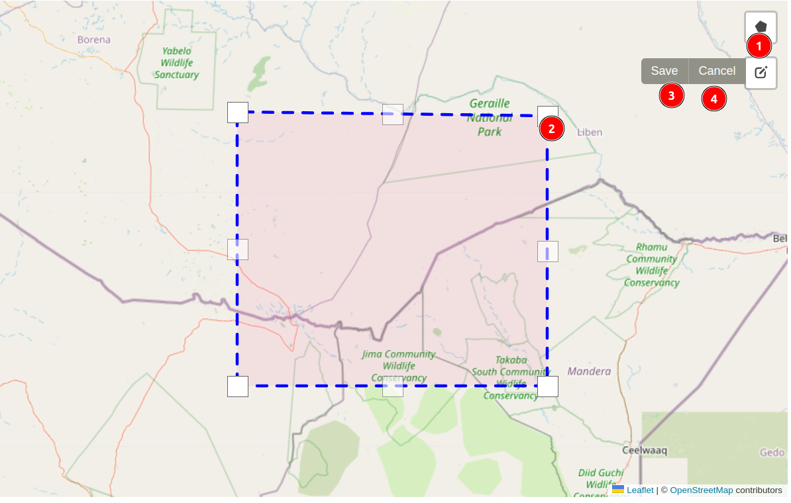

        1 **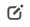:** Allows users to edit the layer.

        2. **Point:** Users required to drag that point according to their preference.

        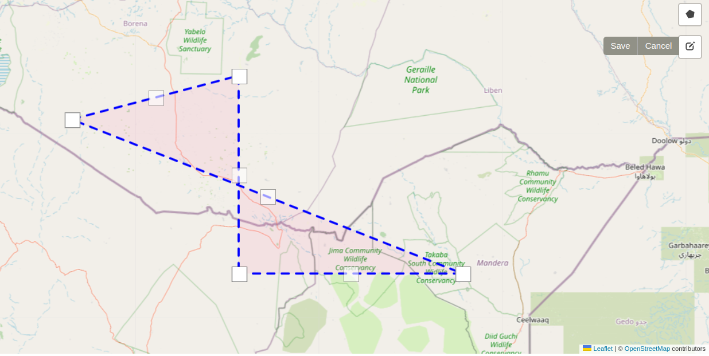

        3. **Save:** After editing click on the save button to save the changes.

        4. **Cancel:** Users can cancel the editing by clicking on the cancel button.

* **Project Overview:** This section allows users to add a detailed project overview. It is a mandatory field and supports rich text formatting, including bold, italics, and bullet points.  

## Save/ Preview/ Undo/ Redo/ Reload

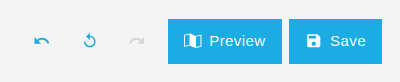

* **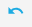:** Users can undo the changes made to the project by clicking on the undo button.

* **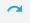:** Users can redo the changes made to the project by clicking on the redo button.

* **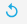:** Users can reload the project by clicking on the reload button.

* **Save:** Users can use this option to save the changes.

* **Preview:** Allows user to preview the project on the map. This will load your drawn area on the map.

    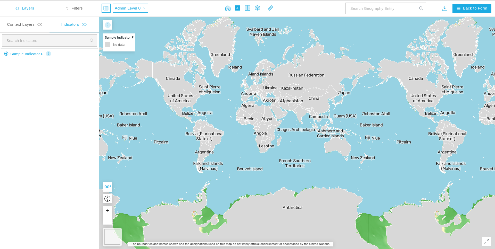

### Indicators

[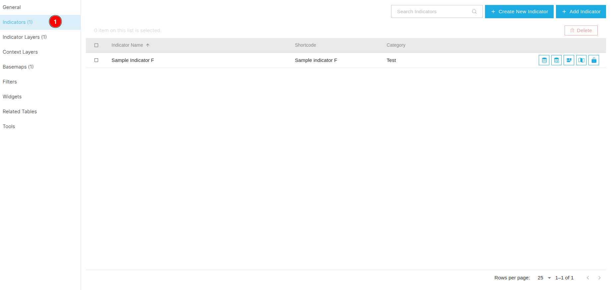](./img/data-browser-img-20.png)

1. **Indicators:** Users can use this tab to access the indicators. For the detailed information click [here](../visualisation/indicators-page.md).

### Indicator Layers

[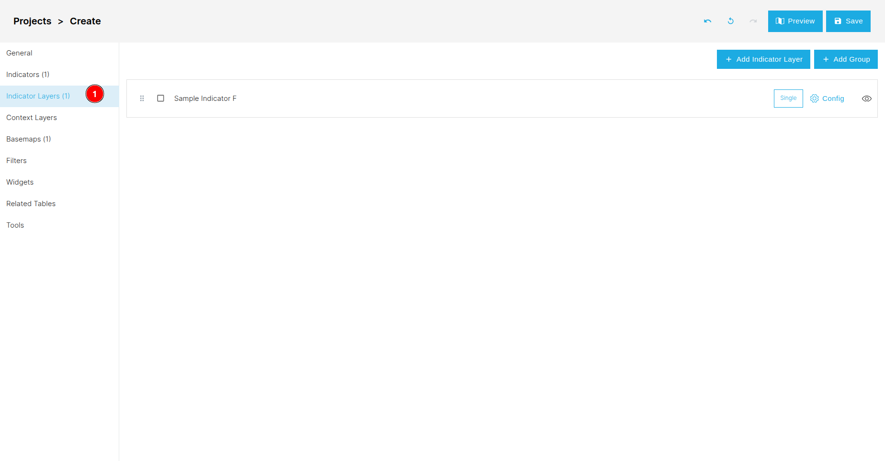](./img/data-browser-img-21.png)

1. **Indicator Layers:** By clicking on this tab users can access the indicator layer page.

### Context Layers

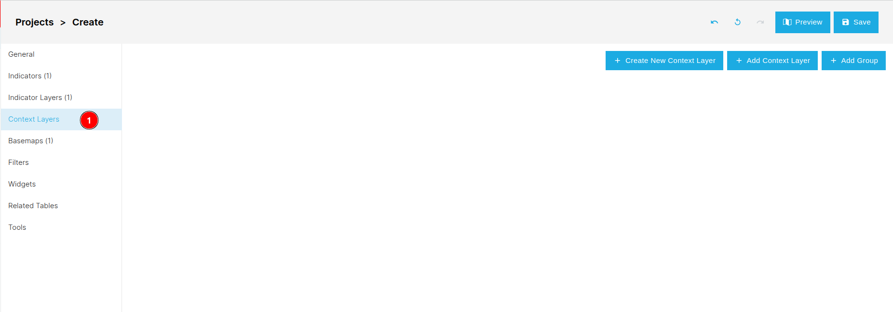

1. **Context Layers:** Users can access the context layers by clicking on this tab. For detailed information click [here](../visualisation/context-layers-page.md).

### Basemaps

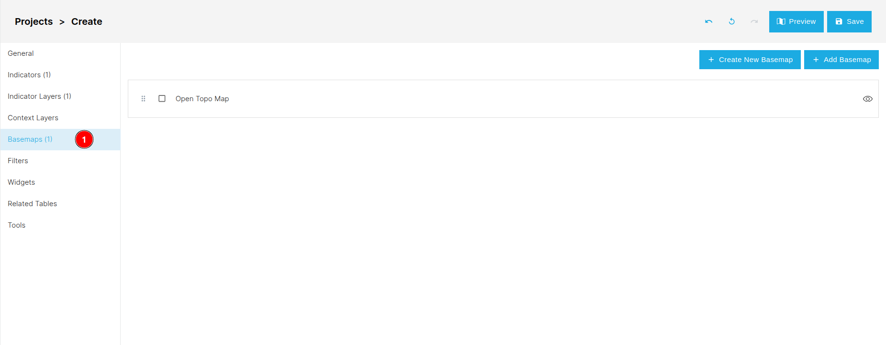

1. **Basemap:** Users can access the basemap by clicking on this tab. For detailed information click [here](../visualisation/basemap-page.md).

### Filter

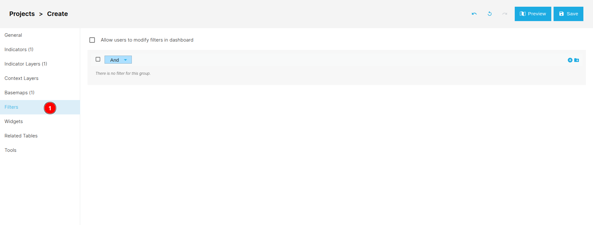

1. **Filter:** Users can access the filter section by clicking on this tab.

### Widget

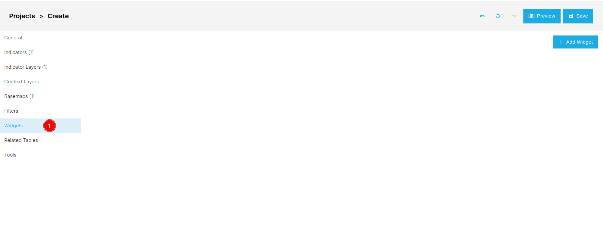

1. **Widget:** Users can access the widget section by clicking on this tab.

### Related Tables

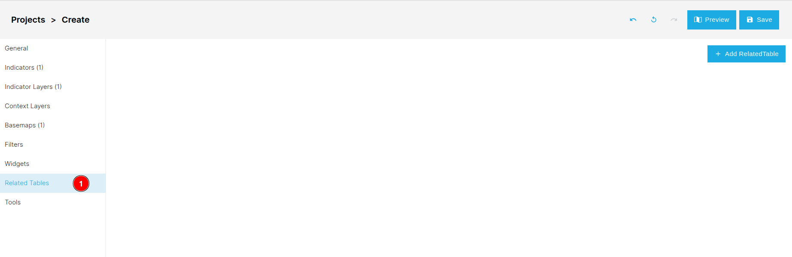

1. **Related Tables:** Users can access the related tables by clicking on this tab.

### Tools

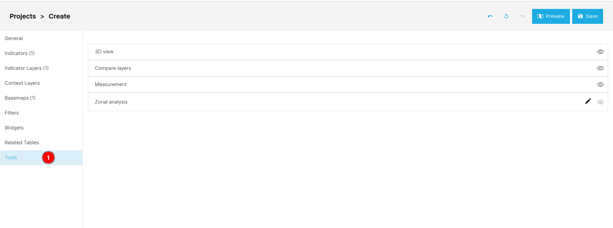

1. **Tools:** Users can access the tools by clicking on this tab.

## Delete Data

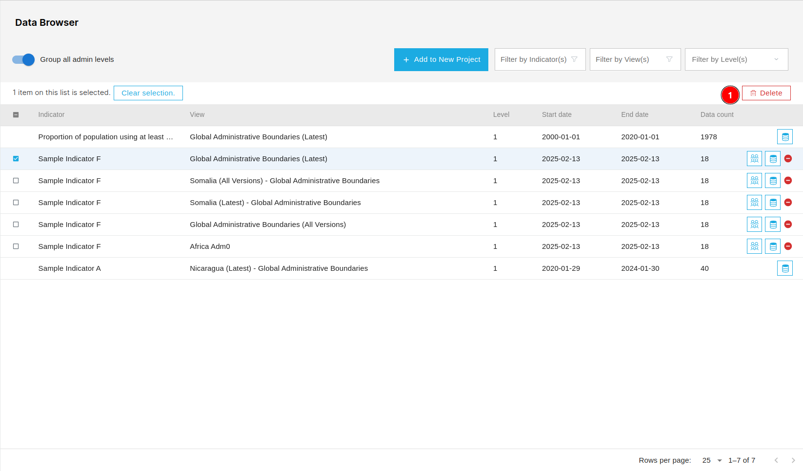

1. **Delete:** Users can use this button to delete the selected data. This will open the confirmation dialog box.

    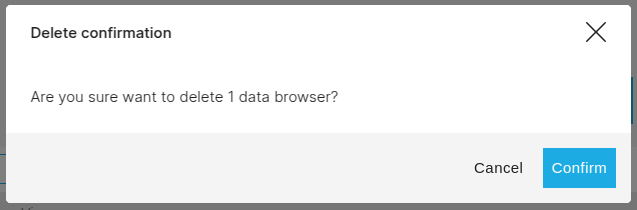

    * **Confirm:** Click on this button to delete the data.

    * **Cancel:** Click on this button to cancel the deletion.

## Filter By Indicator

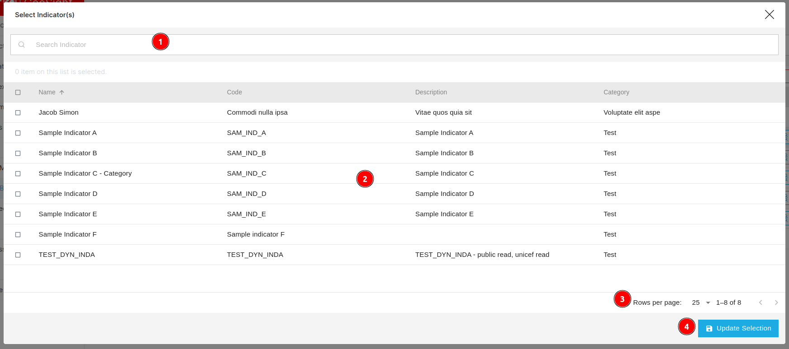

1. **Search Bar:** Allows users to search for specific indicators.

2. **Data Table:** Users can view the available data in the data table.

3. **Pagination:** Allows users to navigate through the pages, users can use the `<` and `>` buttons to navigate.

4. **Update Selection:** Users can select the indicators they want to view by clicking on the checkboxes and then click on the `Update Selection`button to save the changes. This will filter the data based on the indicators you have selected.

## Filter By View

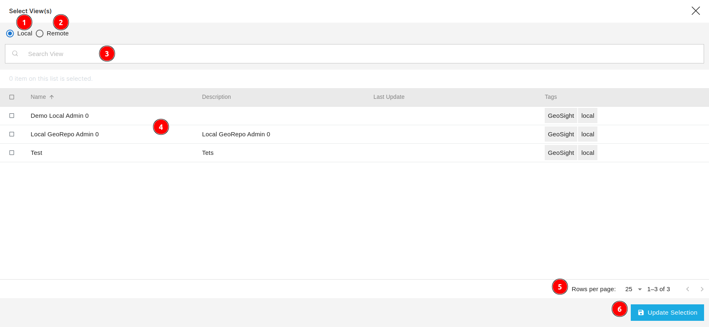

1. **Local:** Allows user to access the views that are available locally.

2. **Remote:** Allows user to access the views that are available remotely.

3. **Search Bar:** Allows users to search for specific views.

4. **Data Table:** Users can view the available data in the data table.

5. **Pagination:** Allows users to navigate through the pages, users can use the `<` and `>` buttons to navigate.

6. **Update Selection:** Users can select the views they want to view by clicking on the checkboxes and then click on the `Update Selection` button to save the changes. This will filter the data based on the views users have selected.

## Filter By Level

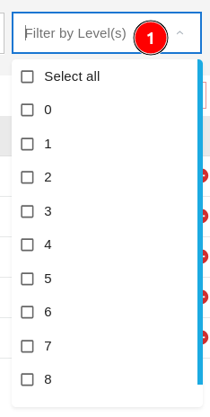

1. **Filter By Level:** Users can select their desired level from this dropdown menu.

## Sort Data

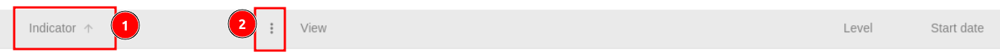

1. **Column Header:** Users can sort the data in the ascending or descending order by clicking on the column header of the respective column.

2. **:** Allows users to modify the view of the data table.

    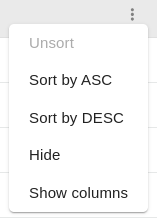

    * **Unsort:** Click on this button to unsort the data.

    * **Sort by ASC:** Click on this option to sort the data in ascending order.
    
    * **Sort by DESC:** Click on this option to sort the data in descending order.

    * **Hide:** Click on this option to hide the respective column.

    * **Show columns:** Allows users to modify the column visibility.

        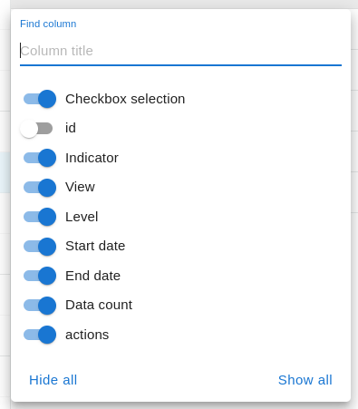

        * **Column title:** Users can search for the specific column by using this search bar.

        * **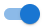:** Users can use this button to enable or disable the visibility of the column in the table.

        * **Hide all:** Hide all the columns.

        * **Show all:** Show all the columns.
