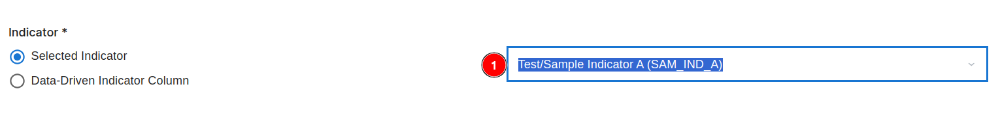

# Data Management

1. **Data Management:** Allows users to access the `Data Management` tab.

## Logs

### Logs Tab

1. **Logs:** Users can use this tab to access the log section. Although this tab is selected by default.

2. **Import Data:** Allows users to import the data.

3. **Clear selection:** Users can use this button to clear the selection.

4. **Delete:** Allows users to delete the selected logs.

5. **Column Header:** Users can use this to sort the logs in ascending or descending order.

6. **Data Table:** Users can view the available logs in the data table. An alert box will appear to confirm the deletion of the selected logs.

    

    * **Confirm:** Users can confirm the deletion of the selected logs.

    * **Cancel:** Users can cancel the deletion of the selected logs.

### Scheduled Jobs

1. **Scheduled Jobs:** Allows users to access the section.

2. **Search Scheduled Jobs:** Users can use this search bar to search for the jobs.

3. **Pause Selected:** After checking the checkboxes of the respective fields users can use this button to pause the selected jobs.

4. **Resume Selected:** After checking the checkboxes of the respective fields users can use this button to resume the selected jobs.

5. **Import Data:** Users can use this button to import data.

6. **Delete:** Users can use this button to delete the job.

7. **Column Headers:** Users can change the order of the data in the table to ascending or descending by clicking on the respective header of the column.

8. **Data Table:** Data table contains the list of all the `Scheduled Jobs` with their name, type, format etc.

#### Last Run Result

* **Success:** If the job is successful it will display the success message.

* **Failure:** If the job fails it will display the failure message.

* **Running:** If the job is running it will display the running message.

## Import Data

* Users will be redirected to this page by clicking on the `Import Data` button.

### General

1. **General:** Users can use the general information section by clicking on this tab. Although this tab is selected by default.

2. **Import type:** The `Import type` section requires users to select the type of data they want to import. The available options are:

    * **Indicator Value:** Use this option when importing indicator-based data such as statistics, metrics, or other measurable values.

    * **Related Tables:** Choose this option if the import involves tables that are linked or related to other datasets. This is useful for maintaining data relationships and dependencies.

    >Note: The selection of the import type may influence the available input formats.

3. **Input Format:** The `Input Format` section provides multiple options to select the data's structure and source format. The input formats are varies on the import type.

**Available Input Formats:**

* **API With Geography Long Format:** Used for importing data through an API where geographical information is structured in a long format. Suitable for datasets with multiple rows per geographical unit.

* **Excel Long Format:** Ideal for importing excel files where data is organised in a long format with multiple observations per entity.

* **SharePoint Long Format:** Utilised for importing data stored in SharePoint lists or libraries with a long format structure. Supports integration with Microsoft SharePoint environments.

* **Vector Context Layer Format:** Suitable for geospatial data containing vector layers such as points, lines, or polygons. Commonly used in Geographic Information Systems (GIS).

* **Related Table Format:** Use this format when importing data that maintains relational links between multiple tables. Ensures data integrity by preserving foreign key relationships.

* **API With Geography Wide Format:** For importing geographical data from an API where each row represents a geographical unit with multiple columns for different variables.

* **Excel Wide Format:** Designed for importing excel sheets where each row corresponds to an entity, and columns represent different variables or time points.

* **SharePoint Wide Format:** Specifically for importing data from SharePoint in a wide format layout. Useful for datasets with one-to-one relationships across columns.

* **SDMX Format:** For importing data in SDMX (Statistical Data and Metadata eXchange) format. Widely used for statistical data exchange between international organisations.

* **Formula Based on Other Indicators:** This option is for importing calculated indicators based on formulas that use other imported indicators. Enables dynamic calculation and aggregation of data.

### Attributes

1. **Attribute:** Users can use this tab to access the attribute section.

2. **Excel file:** Click `Choose file` to upload the Excel file containing the data. This is a mandatory field (*) as the import process cannot proceed without the source file. Ensure that the file is in Excel format (.xls or .xlsx).

3. **Sheet Name:** After uploading the file, use the sheet name dropdown to select the specific sheet containing the data. This is required when the Excel file has multiple sheets. Only the selected sheet's data will be imported.

4. **Row Number of the Header:** Specify the Row number of the header to identify where the column headers are located in the selected sheet. Default value is 1, which means the first row is considered the header. Adjust this value if headers are present on a different row.

5. **Geo Code Column:** Select the column that contains the geographical codes (e.g., country codes, region IDs). This is a mandatory field (*) as it helps to map the data to geographical entities. The dropdown will list all columns from the selected sheet.

6. **Indicator:** This section allows users to specify how indicators are handled:

    * **Selected Indicator:** Choose this option if the indicator is predefined. A dropdown appears to select from existing indicators (e.g., Test/Sample Indicator A (SAM_IND_A) in the image).

        

        **1 Dropdown:** After clicking on this a new pop-up window will appear.

        

        **1 X:** Users can close the window by clicking on this icon.

        **2 Search Indicator:** Allows users to search for the specific indicator.

        **3 Column Headers:** Users can use these column header to change the order of the data to the ascending or descending.

        **4  Data Table:** Users can view all the available indicators here.

        **5 Pagination:** Users can navigate through the pages by this pagination.

    * **Data-Driven Indicator Column:** Use this option if the indicator is dynamically derived from a column in the excel file. This is useful when importing multiple indicators from a single dataset.

        

        * Enter the field for the indicator key in the input field.

7. **Value Column:** Specify the Value Column where the data values are stored. This is a mandatory field (*) as it indicates which column contains the numerical values or measurements to be imported.
The dropdown lists all available columns from the selected sheet.

### Reference Layer & Time

1. **Reference Layer & Time:** Users can use this tab to access the `Reference Layer & Time` section.

2.  **Reference Layer:** Use the Reference Layer dropdown to select the geographical layer that the data should be mapped to. This is a mandatory field (*) as it establishes the spatial context for the data. After clicking on the dropdown a select view window will appear.

    

    * **Local:** Users can use this tab to select the local reference layer.

    * **Search View:** Users can search for the specific reference layer.

    * **Column Headers:** Users can use these column headers to change the order of the data to the ascending or descending.

    * **Data Table:** Users can view all the available reference layers here.

    

    * **Global:** Users can use this tab to select the global reference layer.

    * **Search View:** Users can search for the specific reference layer.

    * **Column Headers:** Users can use these column headers to change the order of the data to the ascending or descending.

    * **Data Table:** Users can view all the available reference layers here.

* **Template:** User can use this button to download the template.

    

3. **Admin Level:** This option allows users to define the administrative level of the data:

* **Any Level (Data Driven):** Select this option if the administrative level is specified within the data file itself. This allows the data to be dynamically mapped to different levels, such as country, region, or district, based on the content of the geo code column.

* **Specific Level:** Use this option to manually specify a fixed administrative level for the data. Upon selection, an additional dropdown appears, allowing the user to select the desired administrative level (e.g., Country, Province, District).

4. **Type of Geo Code:** Use the Type of Geo Code dropdown to specify the type of geographical code used in the data file. This is a mandatory field (*) as it ensures the geo codes are accurately interpreted. The dropdown lists various geo code types supported by the system (e.g., ISO codes, uuid codes).

    

5. **Date Time Setting:** This section is used to configure the date and time context for the data:

* **Selected Date:** Choose this option to manually set a fixed date and time for the imported data. A date-time picker appears, allowing the users to select the desired date.

* **Data-Driven Date:** Use this option if the date and time are specified within a column in the data file. This is useful when the data file contains timestamps for each row. Users need to select the column name and the time format from the belonging dropdowns.

    

* **Now (Current date/time of the run):** Select this option to use the current date and time of the import process.

### Aggregations

1. **Aggregation:** Allows users to access the aggregation section.

2. **Handling Multiple Values:** This section manages how to handle multiple values for the same geo code and time period:

* **Last Value:** Only the last occurrence of the value is considered, ignoring previous values.

* **Aggregate:** Combines multiple values into a single value based on the selected aggregation method. This option is suitable for scenarios where all values are relevant and should be summarised. When selected, the following sub-options appear:

    * **Use aggregation from indicator:** Uses the aggregation method defined in the indicator settings.

    * **Default Aggregations:** Users can define a default aggregation.

        

        * Select the value of the `Numbers` and the `Categories` from the dropdowns and select the value.

3. **Aggregate Admin Level:** This section defines how data is aggregated across different administrative levels:

    * **Do not Aggregate:** No aggregation is applied, and data is kept at the original administrative level.

    * **Aggregate up to level:** Aggregates data to a specific administrative level. Enter the desired level in the text box next to this option.

    * **Aggregate n level up:** Aggregates data by moving up n levels from the original level. Enter the number of levels to move up in the text box next to this option. 

        * **Use default aggregation from indicator:** Utilises the default aggregation method defined in the indicator settings.

        * **Use custom aggregations:** Allows the users to define custom aggregation methods, overriding the defaults.

            

            * Select the value of the `Numbers` and the `Categories` from the dropdowns and select the value.
