# Related Table

[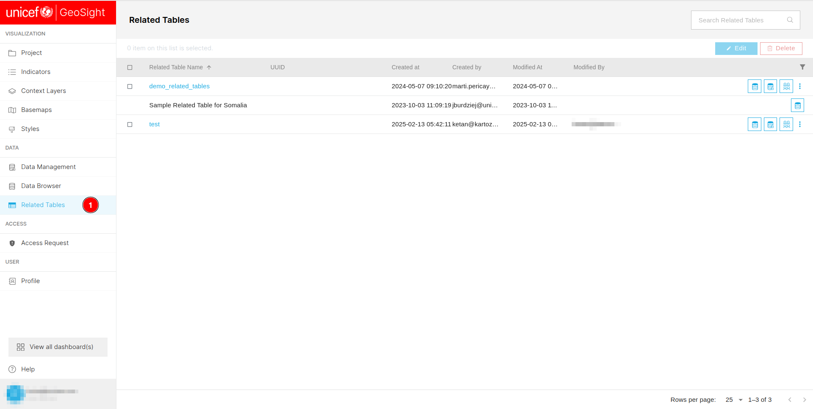](./img/related-table-img-1.png)

1. **Related Table:** Users can use this tab to access the related table section.

[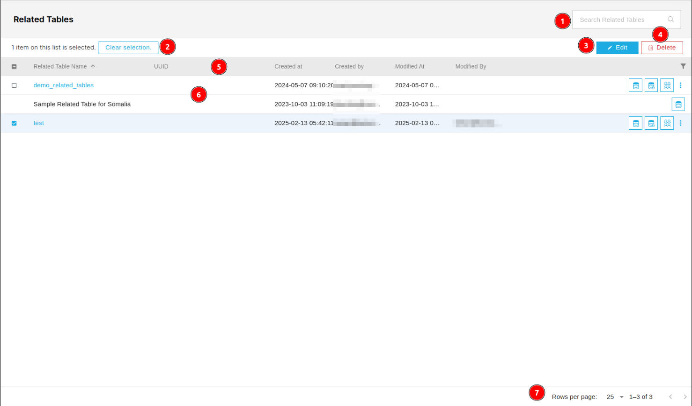](./img/related-table-img-2.png)

1. **Search Related Table:** Users can search for specific data in the related table section.

2. **Clear selection:** Users can use this button to deselect the selected data in the related table.

3. **Edit:** Users can use this button to edit the selected data in the related table.

4. **Delete:** Users can use this button to delete the selected data in the related table.

5. **Column Headers:** By clicking on the column headers users can sort the data in the ascending or descending order.

6. **Data Table:** Users can view the available data in this table.

7. **Pagination:** Users can use this pagination to navigate through the pages.

## Edit Data

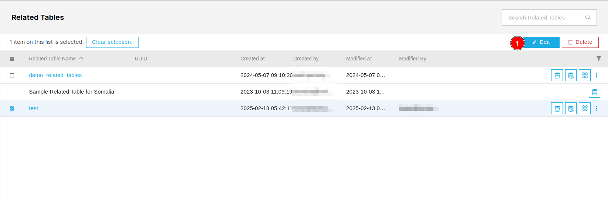

1. **Edit:** First users are required to check the checkbox of the relative data then users will able to click on this edit button. This button will redirects the users to the edit page.

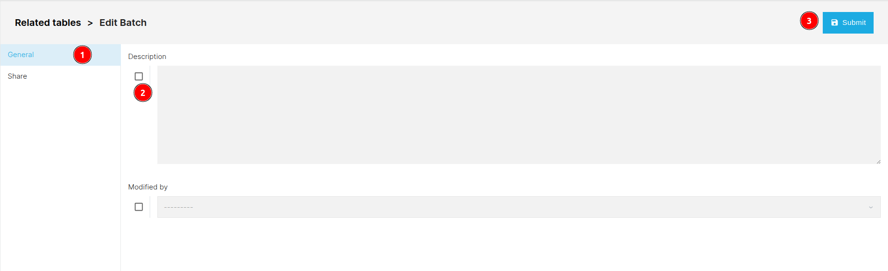

### General

1. **General:** Users can access this tab by clicking on the general tab.

2. **Checkbox:** Initially all the fields are disabled, to make it editable users are required to check the checkbox of the respective field.

3. **Submit:** Allows users to submit the changes.

### Share

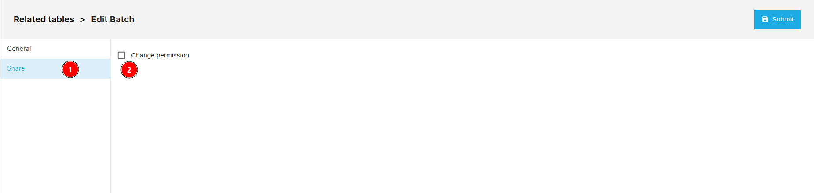

1. **Share:** Users can access this section by clicking on the share tab. Click [here](../share.md) to see the process of how to share the data.

2. **Checkbox:** Users are required to check the checkbox to make it editable.

## Delete Data

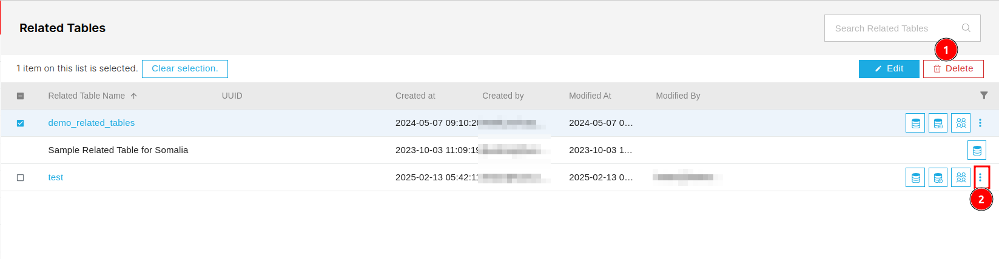

1. **Delete:** First check the checkbox of the respective field then click on this `Delete` button to delete the data. This will open a confirmation dialog box.

2. ** Three Dots:** Users can use this three dots to delete the data of the respective row.

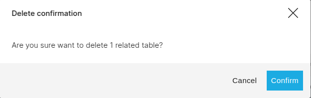

* **Confirm:** Users can confirm the deletion by clicking on this button.

* **Cancel:** Users can cancel the deletion by clicking on this button.

* **X:** Users can cancel the deletion by clicking on this `X` icon.

## Filter Data

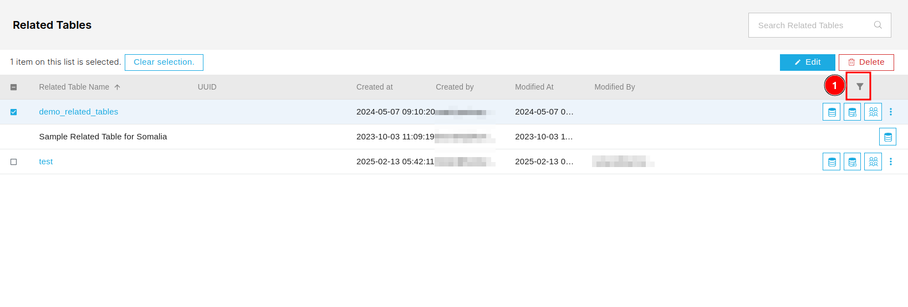

1. ** Icon:** Users can click on the filter icon to filter the data.

    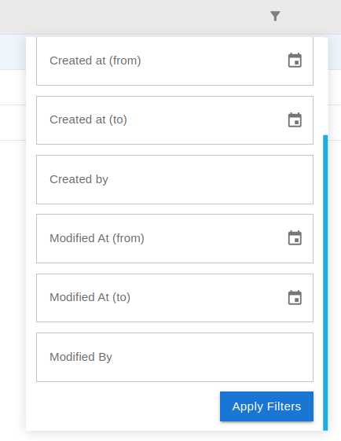

    * **Apply Filters:** First users are required to fill the field on the basis of which they want to filter the data. After selecting the filter, users can apply it by clicking on this button.

## Additional Operations

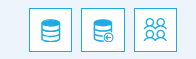

* **:** Users can use this icon to browse the data.

    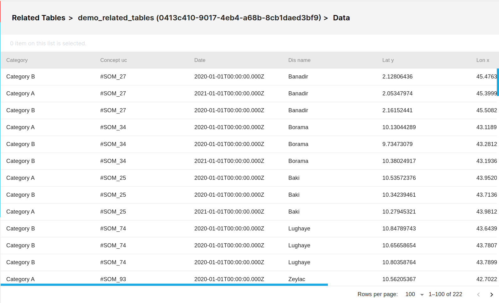

* **:** Users can use this icon to replace the data. This will redirects you to the `Data Management > Import Data` tab

    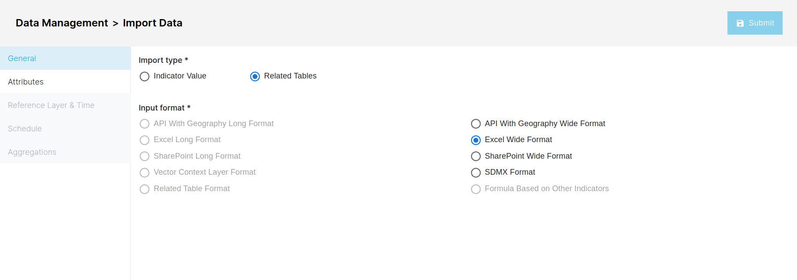

* **:** Users can use this icon to share the data. For more information, click [here](../share.md)
