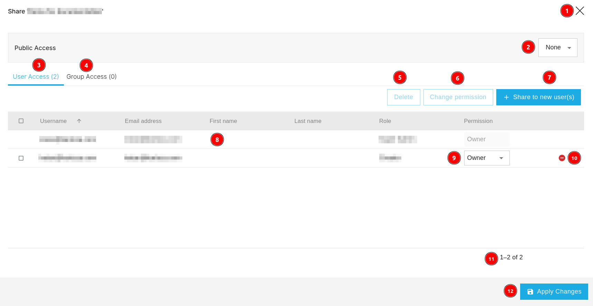
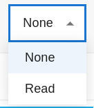
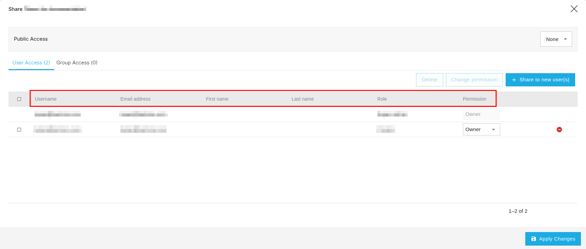
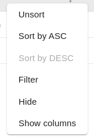
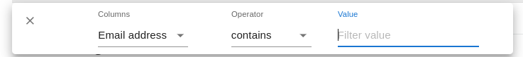
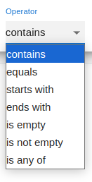
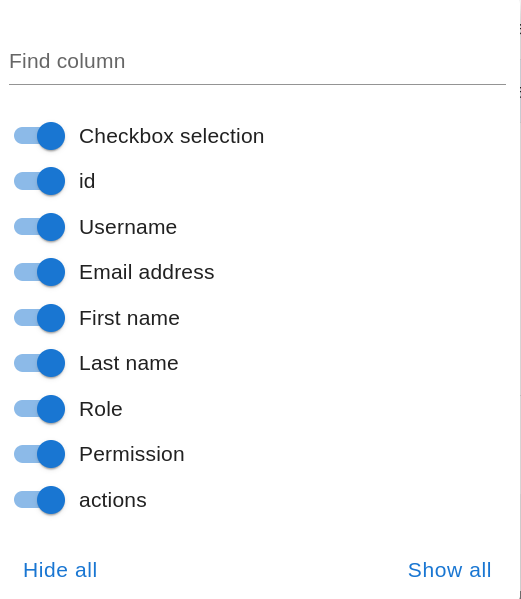

# Share Project

1. ** Icon:** Allows users to share the project.

1. **X:** Allows users to close the current pop up page.

2. **Public Access:** Allows users to grant permissions for project access.

    * Users can choose the permissions from the dropdown menu. 

        

        * **Read:** Private Access. 

        * **None:** Public Access.
    
3. **User Access(2):** This tab allows users to view a list of users who have access to the projects and users can view the  number of users who have access to the project.

4. **Group Access(0):** This tab allows users to view a list of groups who have access to the projects and also users can view the number of groups who have access to the projects.

    

5. **Delete:** Allows users to delete the users.

    * Users are required to check the checkbox to the corresponding users they want to delete and then click on the `Delete` button. This open a confirmation dialog box.

        

        * **Confirm:** Delete the users.

        * **Cancel:** Cancel the deletion.

        * **X:** Close the confirmation dialog box.

6. **Change Permission:** Allows users to change the permissions of individual users. Users are required to check the checkbox to the corresponding users they want to change the permissions then click on the `Change Permission` button.

    

    * **X:** Close the pop up page.

    * **List:** Users can select the permissions from this dropdown menu.

        
    
    * **Apply Changes:** Allows users to apply the changes.

7. **Share to new user(s):** Allows users to share the project with new users.

    

    **1 X:** Allows users to close the current pop up page.

    **2 List:** This is the list of the available permissions.

    **3 Search User:** Allows users to search the user.

    **4 Table:** This table contains the information about the available users.

    **5 Pagination:** This is the pagination for the table, which shows the number of current records out of the total available records. Users can use the `<` and `>` buttons to navigate between pages.

    **6 Update Selection:** Allows users to update the selection of users.

8. **Table:** This table contains the information about the users who access to the project.

9. **Permission:** This shows the permission given to the user. Users can change the permissions by choosing the appropriate permission from the dropdown menu.

10. ** Icon:** Users can click on this icon to delete the respective user. This will open the delete confirmation dialog box. To remove the user click on the `Confirm` button otherwise click on the `Cancel` button to cancel the process.

11. **Pagination:** This is the pagination for the table, which shows the number of current records out of the total available records.

12. **Apply Changes:** Allows users to apply the changes.

## Sort By

Users can arrange the order of data in the table by clicking on the column headers. The data will be sorted in ascending order by default.

* Also user can arrange the order of the record in various ways by clicking on the three dots.

    

* These are available options:

    

    * **Unsort:** This option will remove the sort order of the data.

    * **Sort by ASC:** Allows users to sort the data in ascending order.

    * **Filter:** Allows users to filter the data.

        

        * **Columns:** Column name on which user want to apply the filter.

            

        * **Operator:** Operator to apply on the column.

            

        * **Value:** Value to apply on the column.

    * **Hide:** Hide the current column.

    * **Show Columns:** Users can choose the columns they want to display by this option.

    

    * ** Button:** Users can toggle the visibility of the column by this button.

    * **Hide all:** Hide all the columns.

    * **Show all:** Show all the columns.
