# Basemaps Page

[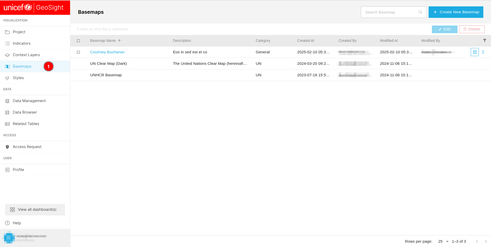](./img/basemap-img-1.png)

1. **Basemaps:** Allows users to access the `Basemaps` page.

[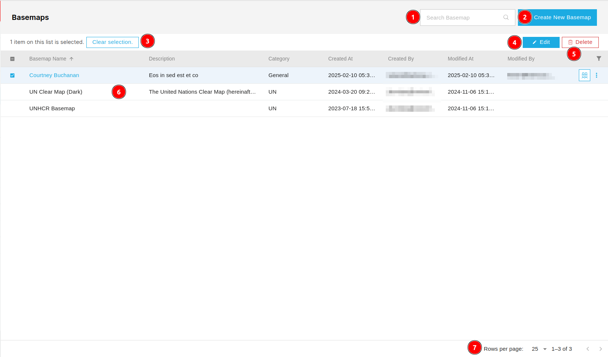](./img/basemap-img-2.png)

1. **Search Basemap:** Users can search for the specific basemap by entering the name in the search bar. To search enter the name of the basemap in the search bar and press the `enter` button.

2. **Create New Basemap:** Users can create a new basemap by clicking on the `Create New Basemap` button.

3. **Clear selection:** Users can deselect the selected basemap by clicking on the `Clear selection` button.

4. **Edit:** Users can edit the selected basemap by clicking on the `Edit` button.

5. **Delete:** Users can delete the selected basemap by clicking on the `Delete` button.

6. **Data Table:** Users can view all the available basemaps in the data table. 

7. **Pagination:** Here, users can see the current number of records in the table along with the total records in the database. They can also navigate between pages using the `<` and `>` buttons.

## Create New Basemap

[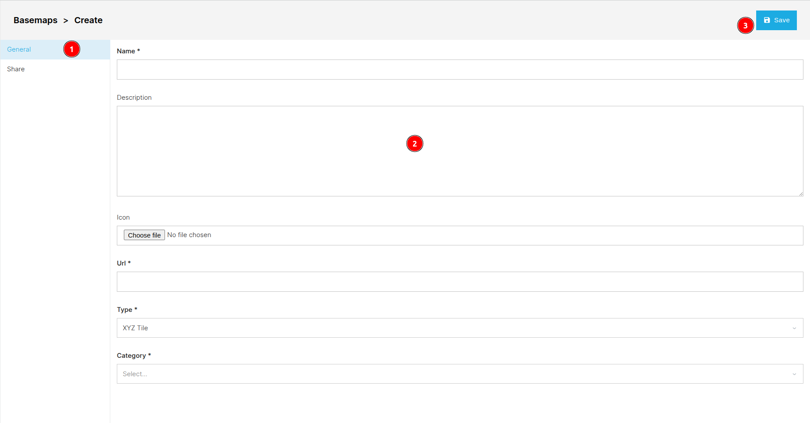](./img/basemap-img-3.png)

1. **General:** Users can access the general information section by clicking on this `General` tab, although it is selected by default.

2. **Form:** Users are required to fill the general information about the basemap in th form.

    * **Name:** Users are required to enter the name of the basemap here.

    * **Description:** Description of the basemap.

    * **Url:** Users are required to enter the URL of the basemap here.

    * **Type:** Users are required to select the type of the basemap from the drop down menu.

    * **Category:** Users are required to select the category of the basemap from the drop down menu.

3. **Save:** After filling in all the necessary details in the form users can use this `Save` button to save the basemap. After saving the basemap users will be notify by the alert notification.

    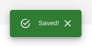

## Edit Basemap

[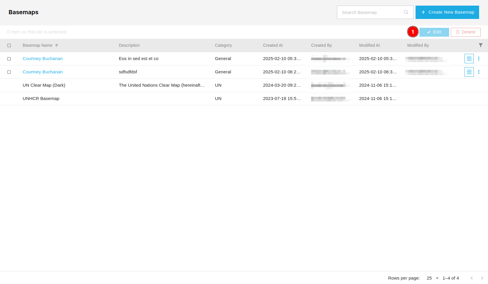](./img/basemap-img-5.png)

1. **Edit:** After checking the checkbox of the respective basemap users can click on the `Edit` button to edit the basemap.

### General

[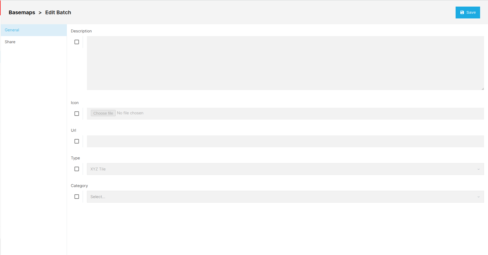](./img/basemap-img-6.png)

* The edit page works the same as the create new basemap page, except users must check the checkbox of the respective field to make it editable.

### Share

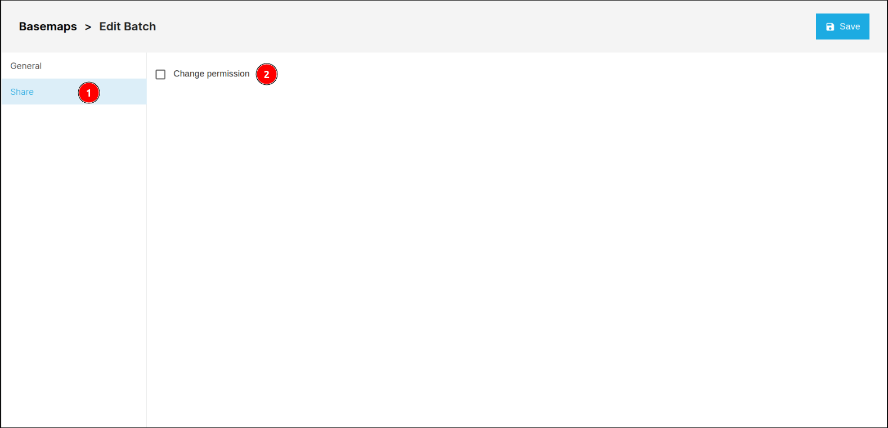

1. **Share:** Allows users to access the share page.

2. **Change permission:** Users are required to check the checkbox to access the further functionality.

    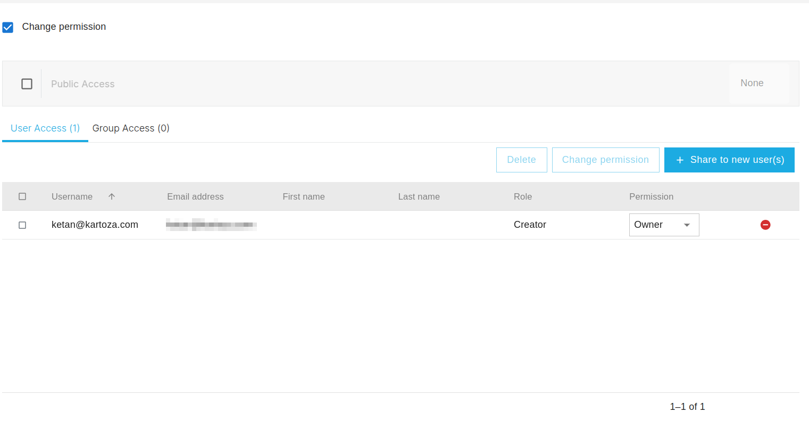

    * Click [here](../share.md) to see how the share process works.

## Delete Basemap

[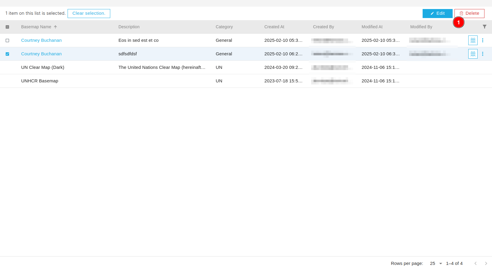](./img/basemap-img-7.png)

1. **Delete:** After checking the checkbox of the respective basemap users can click on the `Delete` button to delete the basemap. This will open a confirmation dialog box.

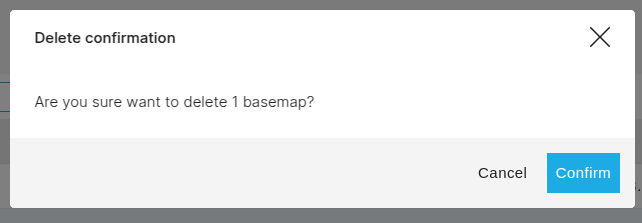

* **Confirm:** Users can confirm the deletion of the basemap by clicking on the `Confirm` button.

* **Cancel:** Users can cancel the deletion of the basemap by clicking on the `Cancel` button.

* **X:** Users can also cancel the deletion of the basemap by clicking on the `X` button.

## Sort Data

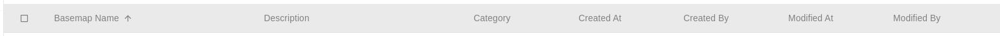

* Users can sort the data of the table in ascending and descending order by clicking on the respective column headers.

* Users can also use the three dots to sort the data.

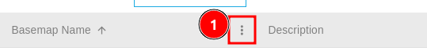

1. **Three dots:** Users can click on the three dots to sort the data.

    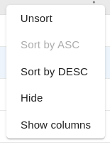

    * **Unsort:** Users can use this option to unsort the data.

    * **Sort by ASC:** Users can use this option to sort the data in the ascending order.

    * **Sort by DESC:** Users can use this option to sort the data in the descending order.

    * **Hide:** Allows users to hide the respective column.

    * **Show columns:** Users can use this option to modify the visibility of the column.

        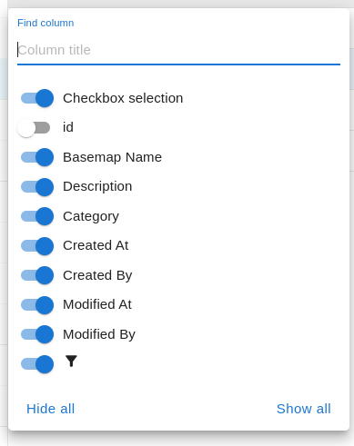

        * **Column title:** Users can use this search field to find the column.

        * **:** Users can use this toggle button to enable or disable column visibility. Blue indicates the column is enabled, while grey indicates it is disabled.

        * **Hide all:** Allows users to hide all the columns.

        * **Show all:** Allows users to show all the columns.

## Filter Data

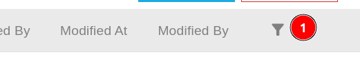

1. ** Icon:** Users can use this icon to filter the data. 

    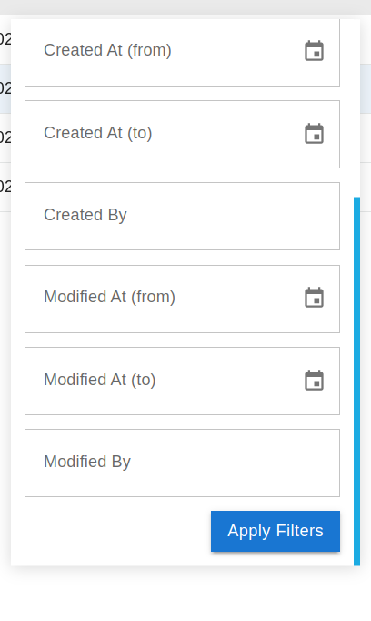

    * **Apply Filter:** First users are required to fill the fields on the basis of they want to filter the data. After selecting the filter, users can apply it by clicking on this button.

## Share Basemap

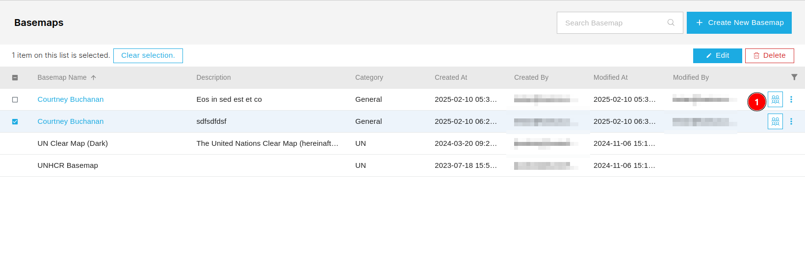

1. ** Icon:** Users can use this icon to share the basemap.

    To see how the share process works click [here](../share.md).
