# Context Layers Page

[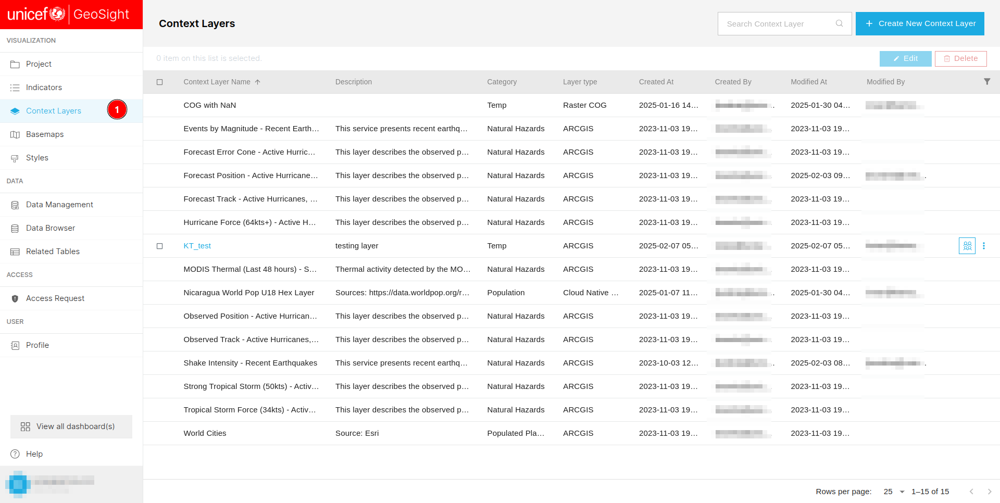](./img/context-layer-img-1.png)

1. **Context Layers:** Allows users to access the `Context Layers` page.

[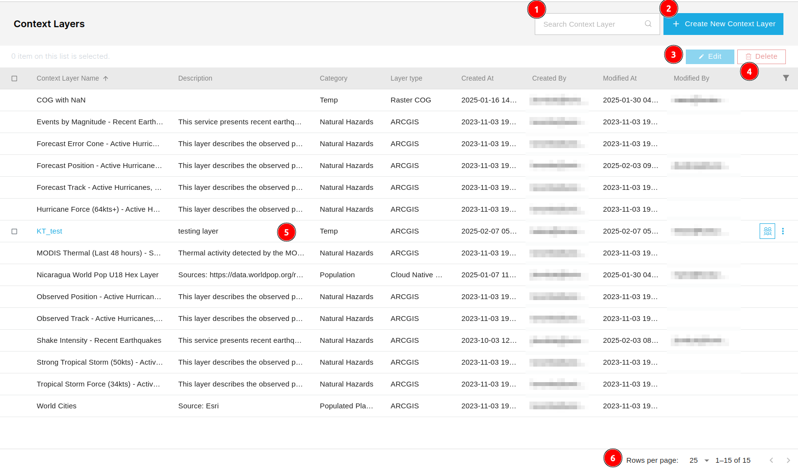](./img/context-layer-img-2.png)

1. **Search Context Layer:** Allows users to search for a specific `Context Layer`.

2. **Create New Context Layer:** Users can use this button to create new context layers.

3. **Edit:** Allows users to edit the available context layers.

4. **Delete:** Allows users to delete the available context layer.

5. **Table:** Users can see all the available context layers here.

6. **Pagination:** Users can see the number of records on the current page along with the total record count.

## Create New Context Layer

### General

[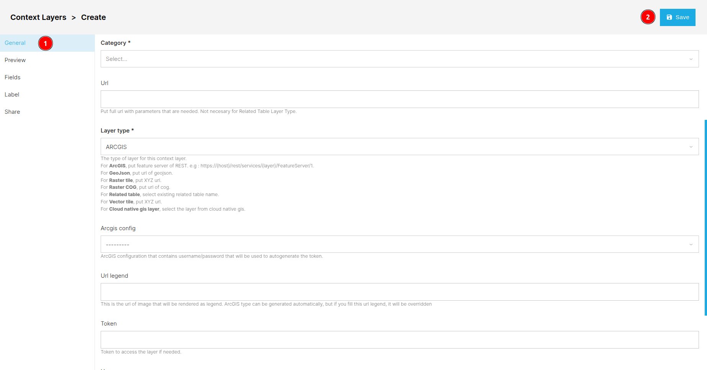](./img/context-layer-img-3.png)

1. **General:** Users can fill in the general information of the context layer here.

    * **Name:** The name of the context layer.
    * **Description:** The description of the context layer.
    * **Category:** The category name to which the context layer belongs to.
    * **Url:** The URL needed to access the context layer.
    * **Layer type:** Users are required to choose the type of layer from the drop down manu.
        ```
        The type of layer for this context layer.
        For ArcGIS, put feature server of REST. e.g : https://{host}/rest/services/ {layer}/FeatureServer/1.
        For GeoJson, put url of geojson.    
        For Raster tile, put XYZ url.   
        For Raster COG, put url of cog. 
        For Related table, select existing related table name.
        For Vector tile, put XYZ url.
        For Cloud native gis layer, select the layer from cloud native gis.
        ```
    * **Arcgis config:** Users can select the `Arcgis config` from the drop down menu. The ArcGIS configuration contains the username and password required to automatically generate authentication tokens. This is essential for connecting and accessing the arcgis Enterprise Portal securely.

    * **URL legend:** The URL Legend provides a reference for the URLs used within the application, detailing their purpose and functionality for easier navigation and understanding.

    * These fields are only accessible if the `Arcgis config` is none.

        * **Token:** Token to access the layer if needed.

        * **Username:** Username to access the layer if needed.

        * **Password:** Password to access the layer if needed.
    
2. **Save:** Users can use this button to save the context layer. An alert notification will confirm that the context layer has been saved successfully.

    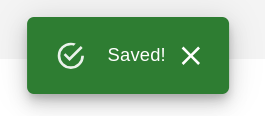

### Preview

[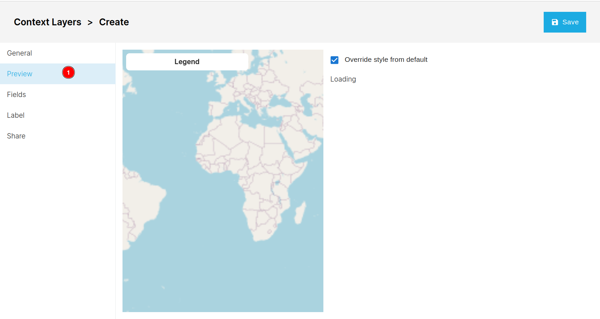](./img/context-layer-img-5.png)

1. **Preview:** Users can use the preview by clicking on this preview tab.

### Fields

[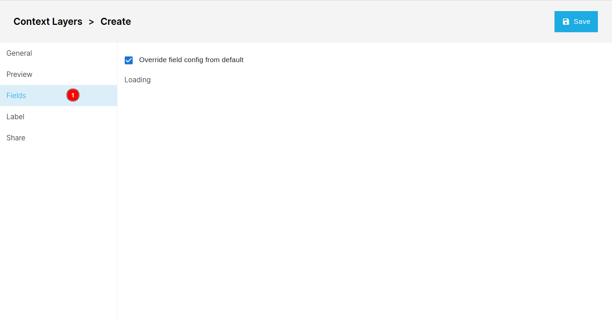](./img/context-layer-img-6.png)

1. **Fields:** Users can add fields to the context layer here.

### Label

[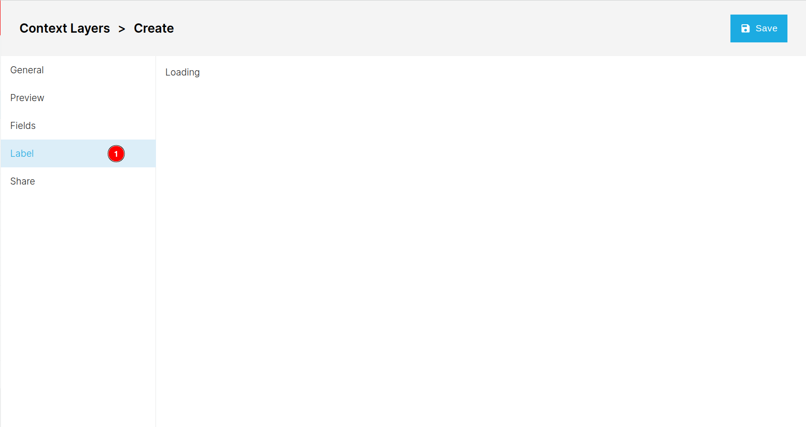](./img/context-layer-img-7.png)

1. **Label:** Users can click here to access the label tab.

### Share

[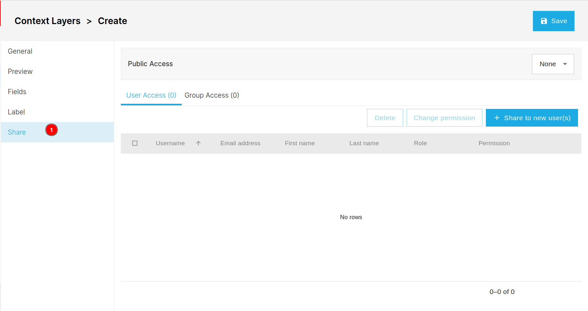](./img/context-layer-img-8.png)

1. **Share:** Allows users to share the layer with other users. Click [here](../share.md) to see how to share the context layers.

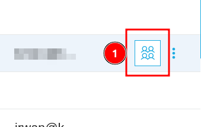

1. ** Icon:** Users can click on this icon to share the layer. Click [here](../share.md) to see how to share the context layers.

## Edit Context Layers

[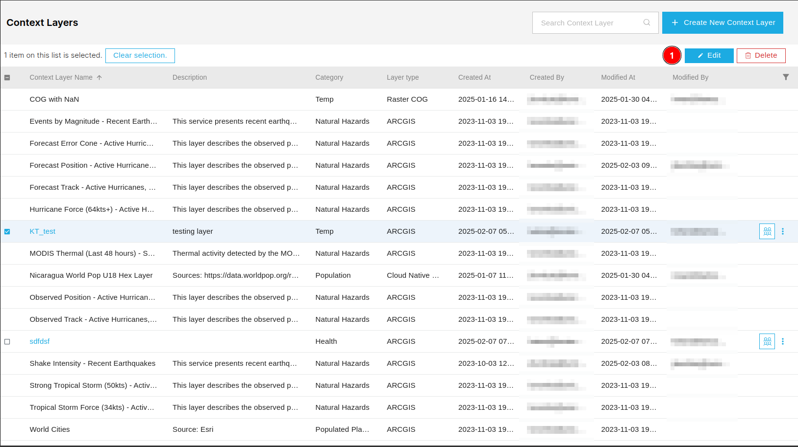](./img/context-layer-img-9.png)

1. **Edit:** First users are required to check the checkbox of the respective context layer, only then users will able to edit the layer.

[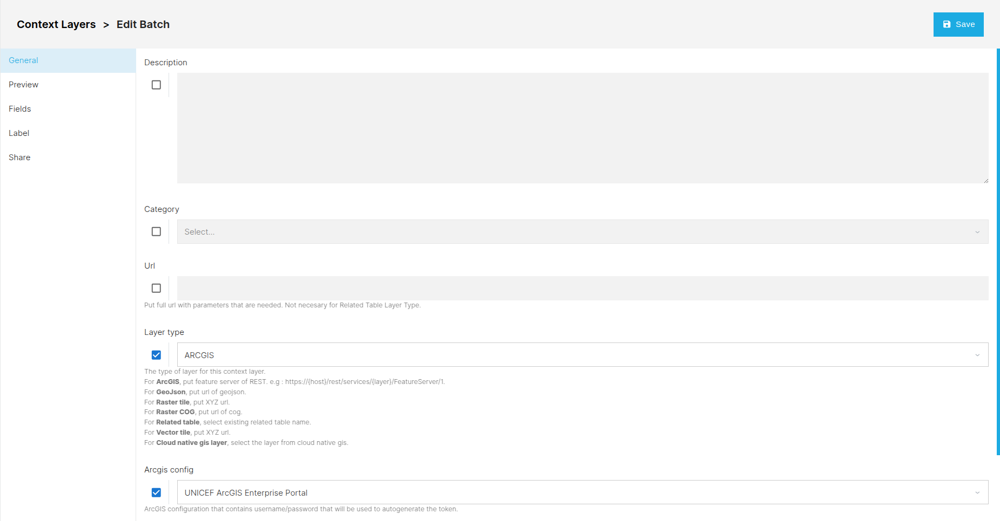](./img/context-layer-img-10.png)

* The edit page is same as add new context layers page, the only thing is that users are required to check the checkbox of the respective field to enable the editing of that field.

* After edit the context layer, users are required to click on the save button to save the changes.

## Delete Context Layers

[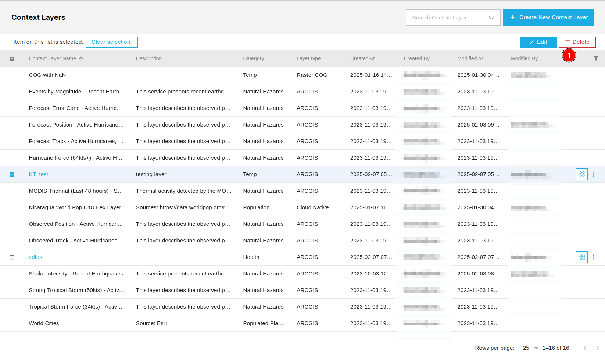](./img/context-layer-img-11.png)

1. **Delete:** First users are required to check the checkbox of the respective context layer, only then users will able to delete the layer. After clicking on the delete button , users will be asked to confirm the deletion.

    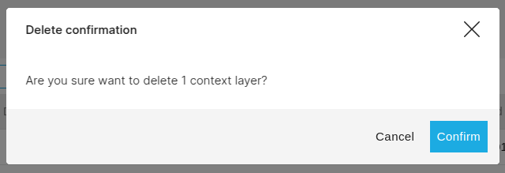

    * **Cancel:** Users can cancel the deletion by clicking on the cancel button.

    * **Confirm:** Users can confirm the deletion by clicking on the confirm button.

    * **X:** Users can also cancel the deletion by clicking on the X button.

## Sort Context Layers

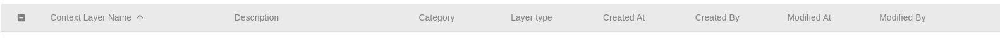

Users can sort the context layers by clicking on any column header to arrange them in ascending or descending order.

* Users also sort the data by clicking on the three dots.

    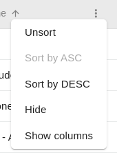

    * **Unsort:** Allows users to unsort the data.
    * **Sort by ASC:** Allows users to sort the data in ascending order.
    * **Sort by DESC:** Allows users to sort the data in descending order.
    * **Hide:** Users can hide the specific column by clicking on the hide option.
    * **Show columns:** Users can change the visibility of the columns by clicking on this option.

        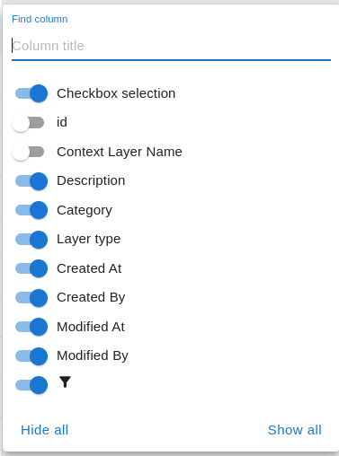

        * **Find Column:** Users can search the specific column by entering the name of the column in the search field.
        
        * ** Button:** Users can change the visibility of the column by clicking on this toggle button. Blue color indicates that the column is visible and gray color indicates that the column is hidden.
        
        * **Hide all:** Users can hide all the columns by clicking on this option.

        * **Show all:** Users can show all the columns by clicking on this option.

## Filter Data

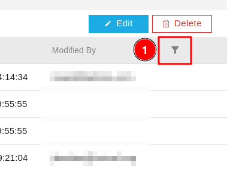

1. ** Icon:** Users can use this button to filter the data.

    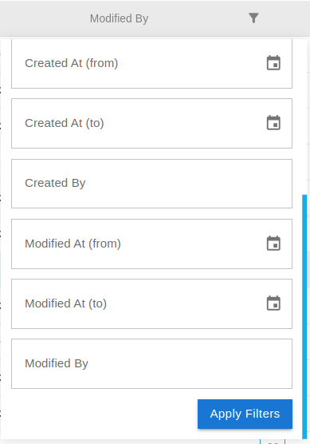

    * **Apply Filter:** First users are required to fill the field on the basis of they want to filter the data. After selecting the filter, users can apply it by clicking on this button.
