# Indicators

[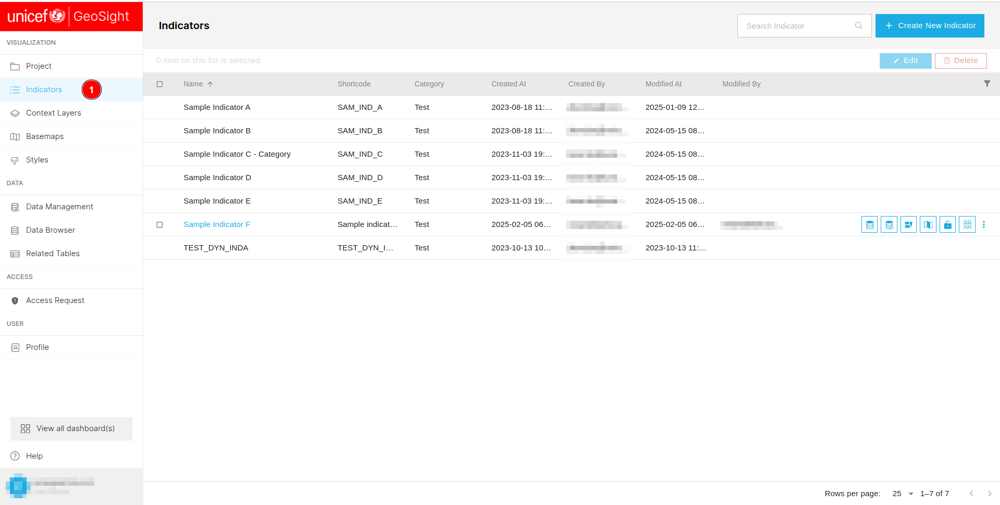](./img/indicators-img-1.png)

1. **Indicators:** Users are required to click on this tab to view the list of indicators available.

[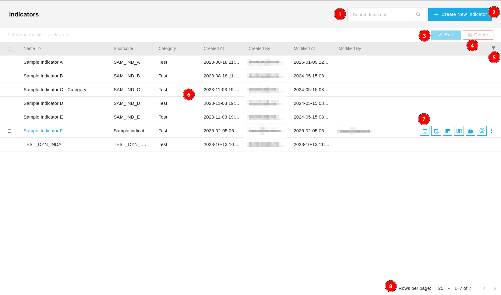](./img/indicators-img-2.png)

1. **Search Indicator:** Users can search for specific indicators using the search bar.

2. **Create New Indicator:** Users can create a new indicator by clicking on the `Create New Indicator` button.

3. **Edit:** Allows users to edit the selected indicator.

4. **Delete:** Allows users to delete the selected indicator.

5. **Filter:** Allows users to filter the data based on specific criteria.

6. **Data Table:** Displays the list of available indicators.

7. **Additional Operations:** Allows users to perform additional operations on the indicator.
 
8. **Pagination:** Displays the current number of records along with the total number of records. 

## Create New Indicator

### General

[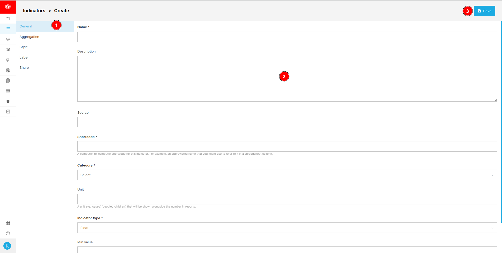](./img/indicators-img-3.png)

1. **General:** Allows users to access the general tab.

2. **Form:** This form contains the general information about the indicator.

    * **Name:** The name of the indicator. After entering the name of the indicator similar indicators are also displayed.

        [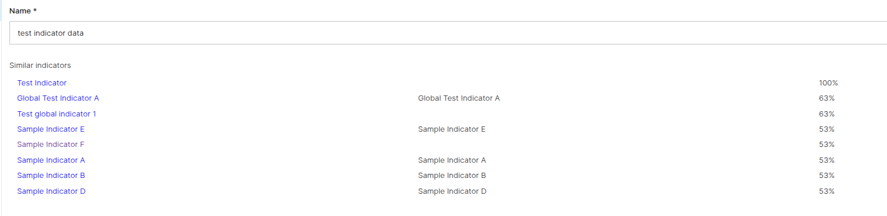](./img/indicators-img-4.png)

    * **Description:** The description of the indicator.

    * **Source:** The source of the indicator.

    * **Shortcode:** The shortcode for the indicator.

    * **Category:** Users are required to select the category for the respective indicator from the dropdown menu.

    * **Unit:** Respective unit for the indicator.

    * **Indicator type:** Users are required to select the type of indicator from the dropdown menu.

    * **Min value:** Minimum value of the indicator.

    * **Max value:** Maximum value of the indicator.

3. **Save:** Saves the indicator. After saving the indicator users will be notified by the alert notification and the indicator will be displayed in the data table.

    

### Aggregation

[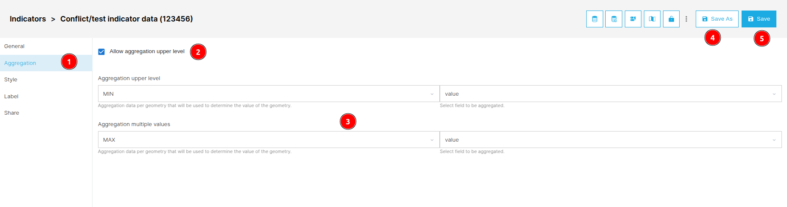](./img/indicators-img-6.png)

1. **Aggregation:** Allows users to access the aggregation tab.

2. **Allow aggregation upper level:** Users are required to check whether the aggregation is allowed at the upper level or not.

3. **Aggregation upper level/values:** Users can select the aggregation upper level and values.

4. **Save As:** Saves the aggregation as a new indicator.

5. **Save:** Saves the aggregation. After saving the aggregation users will be notified by the alert notification and

### Style

[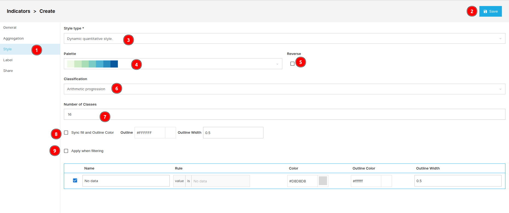](./img/indicators-img-7.png)

1. **Style:** Allows users to access the style tab.

2. **Save:** Saves the style. After saving the style users will be notified by the alert notification.

3. **Style type:** Users are required to select the style type from the dropdown menu.

4. **Palette:** Users are required to select the colour palette from the dropdown menu.

    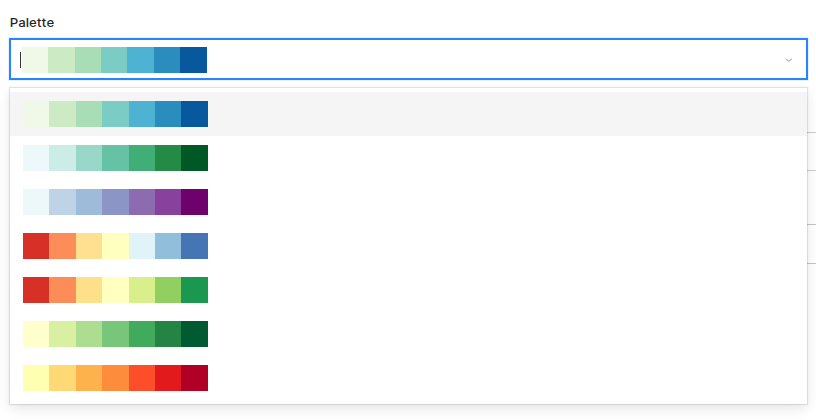

5. **Reverse:** Reverse the colour palette.

6. **Classification:** Users can select the classification from the dropdown menu.
    
    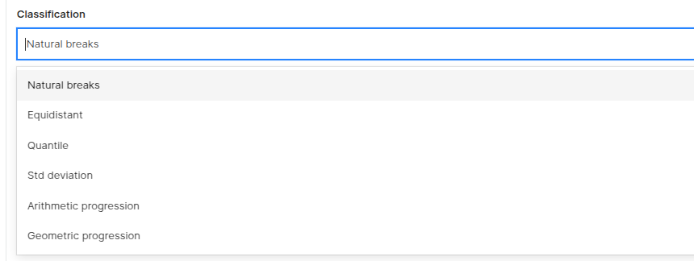

7. **Number of Classes:** Users can enter the number classes they want in this input field.

8. **Sync fill and Outline Color:** Users can fill the outline colour and width here.

9. **Apply when filtering:** Users can apply style on filter as well by checking this.

### Label 

[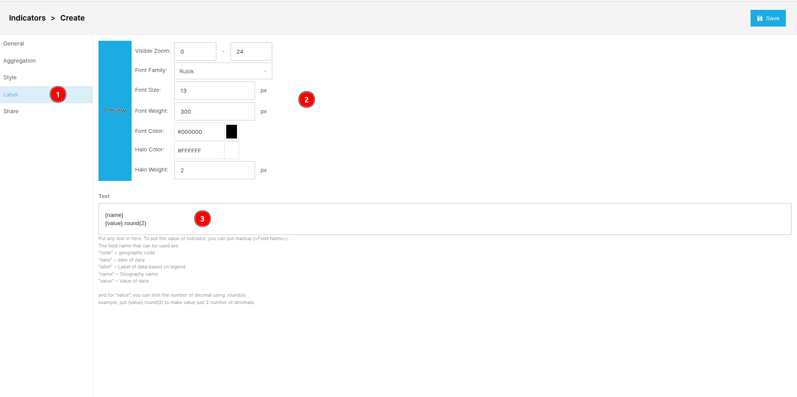](./img/indicators-img-10.png)

1. **Label:** Allows users to access the label tab.

2.  **Style Label:** Users can style the label according to their preference using this tab and view the preview as well.

3. **Text:** Users can modify the label text here.

### Share

User can use this tab to share the indicators with other users. Click [here](../share.md) to see how to share.

## Edit Indicators

[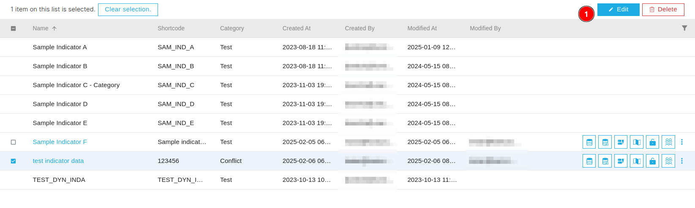](./img/indicators-img-11.png)

1. **Edit:** Users are required to check the checkbox of the respective indicator, only then users will be able to edit the indicator.

[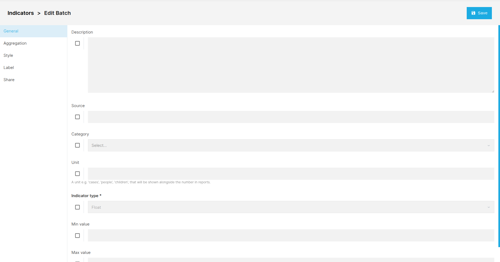](./img/indicators-img-12.png)

* All the fields are same as the create indicator tab except they are all disabled. Users can enable them by checking the checkbox of the respective field.

    [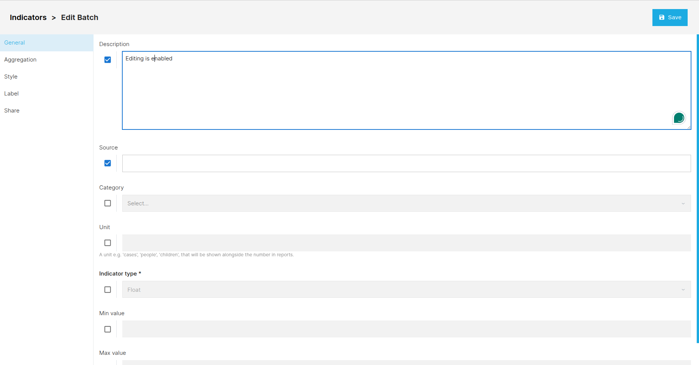](./img/indicators-img-13.png)

    [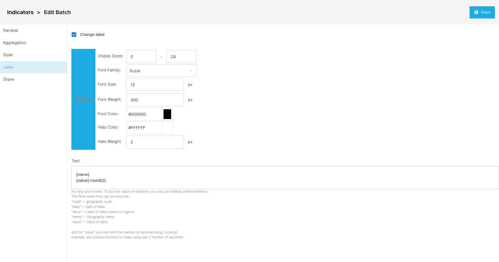](./img/indicators-img-14.png)

## Delete Indicators

[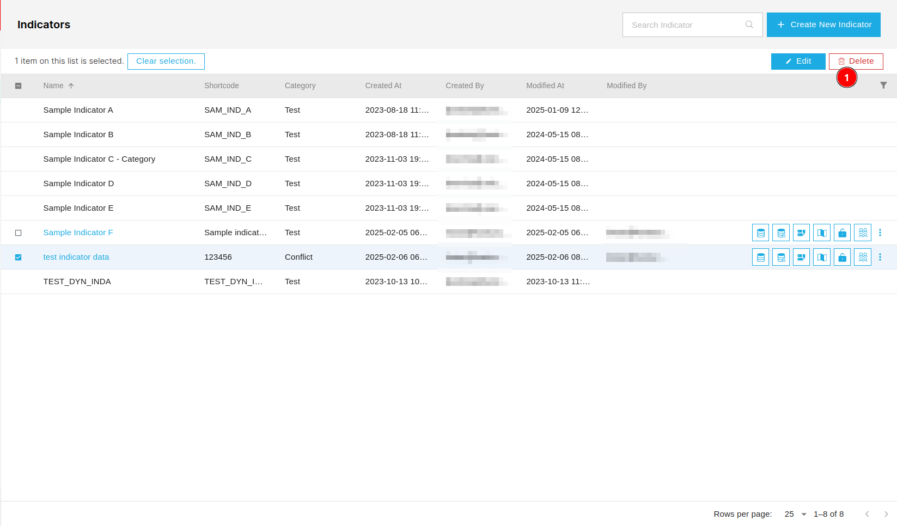](./img/indicators-img-15.png)

1. **Delete Indicator:** Users are required to check the checkbox of the respective indicator, only then users will be able to delete the indicator. Users will receive a pop-up dialog box to confirm the deletion. Users can also delete multiple indicators at once.

    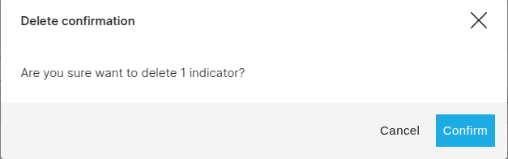

    * **Cancel:** Users can cancel the deletion by clicking on this button.

    * **Confirm:** Users can confirm the deletion by clicking on this button.

    * **X:** Users can close the pop-up dialog box by clicking on this button.

## Filter the data

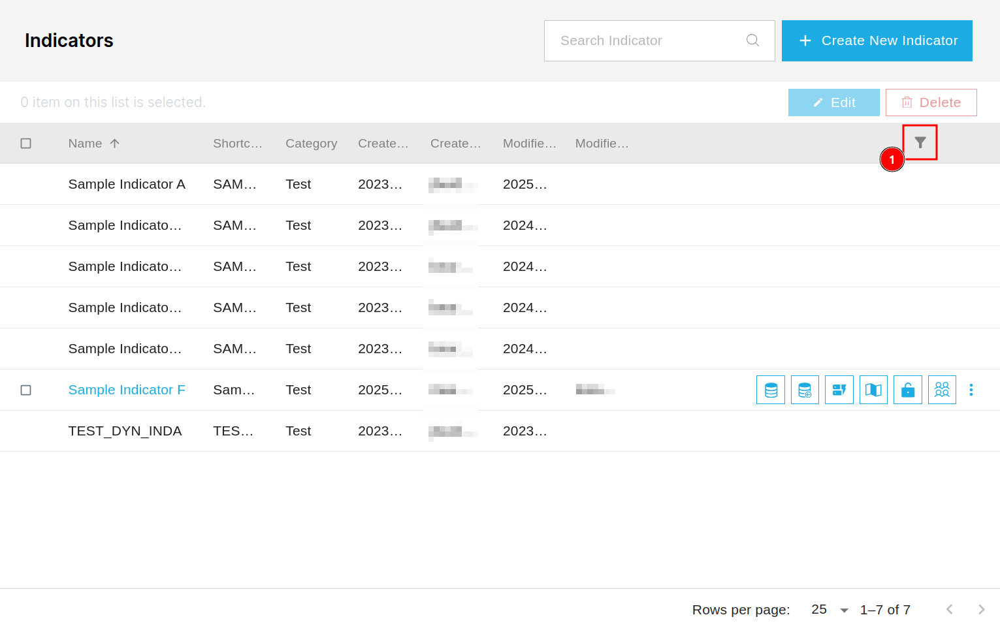

1. **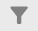:** Users can filter the data by clicking on this icon.

    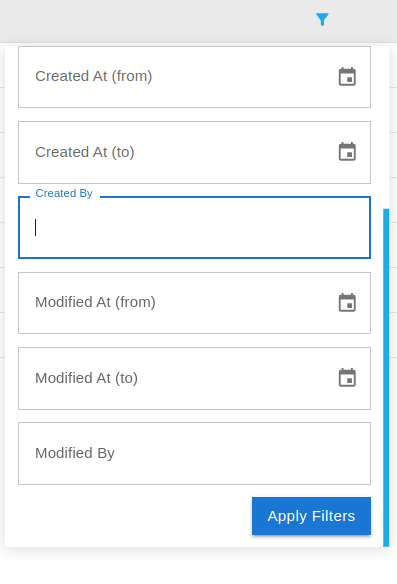

    * **Apply Filters:** First users are required to fill the field on the basis of which they want to filter the data. After selecting the filter, users can apply it by clicking on this button.

## Additional Operations

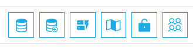

1. **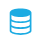:** Users can browse the data by clicking on this icon.

2. **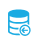:** Users can import the data by clicking on this icon.

3. **:** Users can manage the form by clicking on this icon.

4. **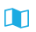:** Users can manage the map by clicking on this icon.

5. **:** Users can go to the data access page by clicking on this icon.

6. **:** Users can share the data by clicking on this icon. Click [here](../share.md) to know more about sharing.
