# Style Page

[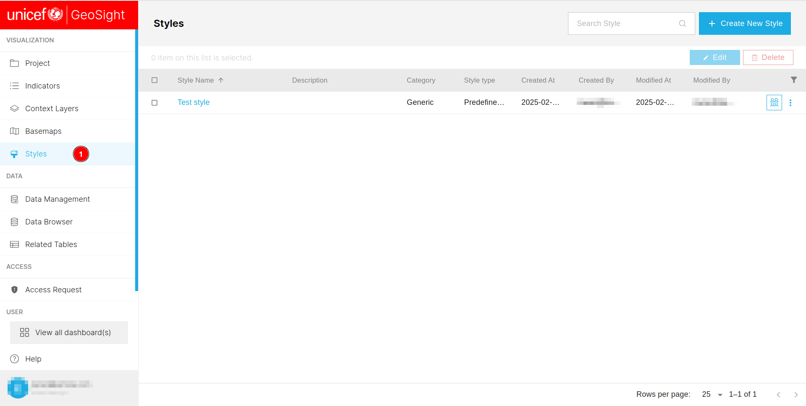](./img/style-img-1.png)

1. **Style:** Allows users to access the style page.

[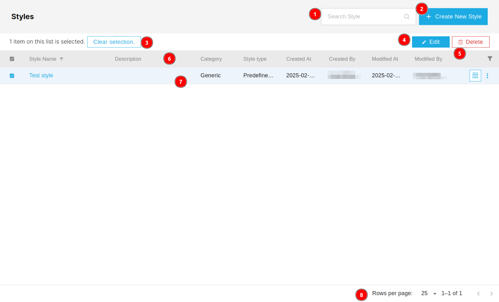](./img/style-img-2.png)

1. **Search Style:** Users can use this search field to search fot any specific style.

2. **Create New Style:** Users can create a new style by clicking on this button.

3. **Clear selection:** Users can use this button to deselect the selected style.

4. **Edit:** Allows users to edit the existing style.

5. **Delete:** Allows users to delete the existing style.

6. **Header:** Users can arrange the data in the ascending or descending order by clicking on the header of the respective column.

7. **Data Table:** This is the table that displays the list of styles.

8. **Pagination:** Here, users can see the current number of records in the table along with the total records in the database. They can also navigate between pages using the `<` and `>` buttons.

## Create New Style

### General

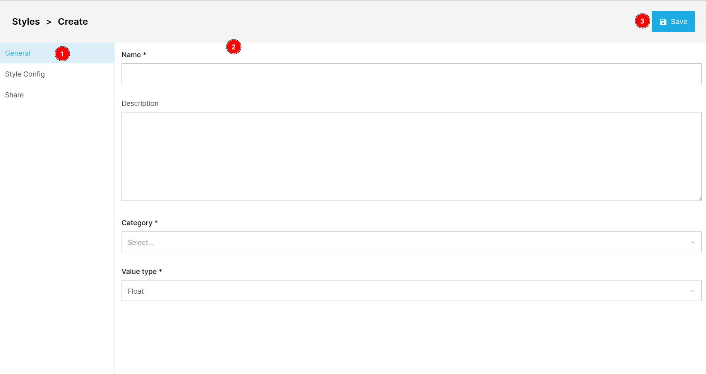

1. **General:** Users can access the general information section by clicking on this `General` tab, although it is selected by default.

2. **Form:** Users are required to fill the general information about the style in th form.

    * **Name:** User are required to fill the name of the style.

    * **Description:** Users can use this input to add a description of the style.

    * **Category:** Users are required to select the category of the style from the dropdown menu.

    * **Value type:** Users are required to select the value type of the style from the dropdown menu.

3. **Save:** After filling in all the necessary details in form users can use this `Save` button to save the style. After saving the style an alert notification will appear.

    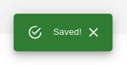

### Style Config

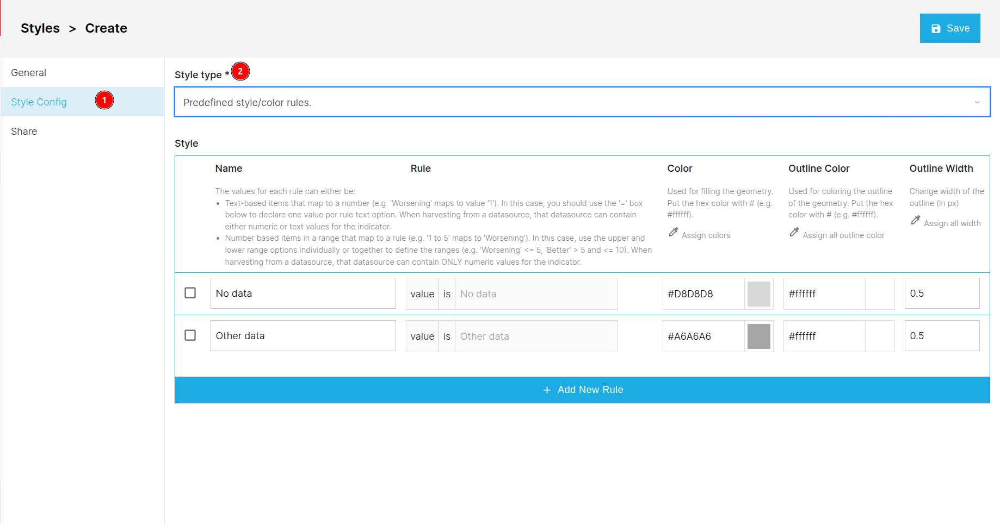

1. **Style Config:** Users can access the style configuration section by clicking on this `Style Config` tab.

2. **Style type:** Users must select a style type from the dropdown menu, based on which they can specify the style.

    #### Predefined style/color rules

    The style is depends on the style type.

    ##### Style

    The **Style** section allows users to define and customise styles for different data values.  

    * **Define Rule Name:** Enter a label in the `Name` field (e.g., "No data" or "Other data").  

    * **Set Value Mapping:** Enter the `value` that should be mapped to this rule.  

    >Note: You can use `text-based values` (e.g., "Worsening" = `1`) or `numeric ranges` (e.g., `1-5` = "Worsening").  

    *  **Colour** Enter a hex code in the `Color` field to define the fill colour (e.g., `#D8D8D8`).  

    * **Outline Colour:** Enter a hex code in the `Outline Colour` field to set the border colour (e.g., `#ffffff`). 

        * Alternatively, users can click on the  icon which will open a colour palette.

            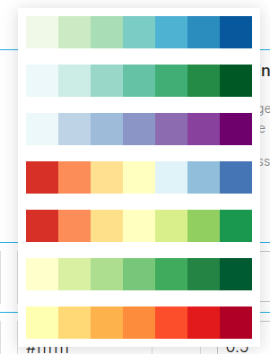

        * Or they can click on the  colour box which will open a colour picker.

            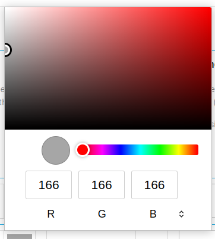

    * **Set Outline Width:** Define the thickness of the outline in pixels (default: `0.5 px`).  

    * **Add a New Rule** Click on the `+ Add New Rule` button to create a new style rule. This will add a new rule to the style configuration. The new rule includes an additional `Category` field, where users are required to select a category from the dropdown menu.

        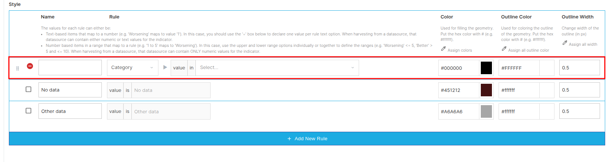

        * **Remove new rule:** Users can use the  icon to remove the new rule.

    #### Dynamic quantitative style

    [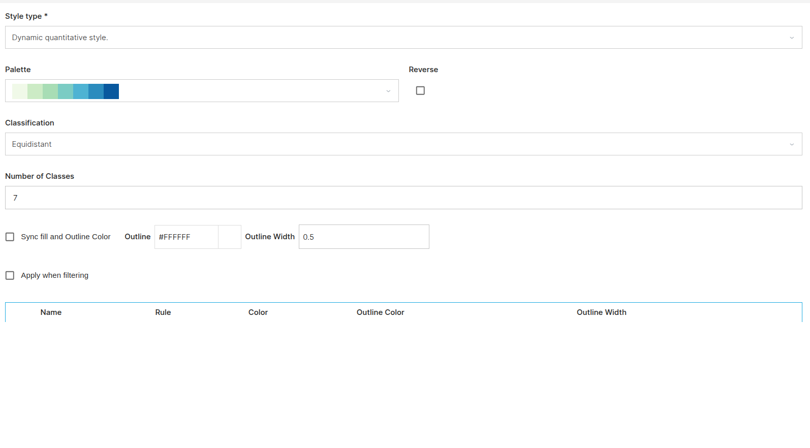](./img/style-img-17.png)

    * **Palette:** Users are required to select the colour palette from the dropdown menu.

        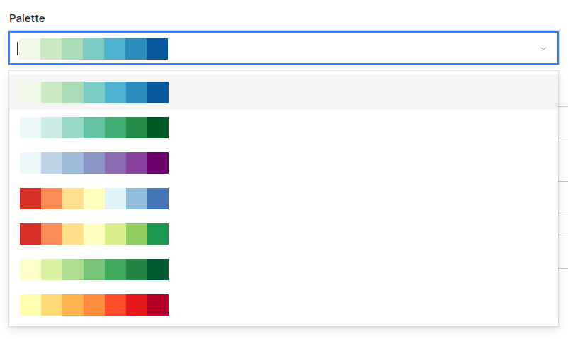

    * **Reverse:** Reverse the colour palette.

    * **Classification:** Users can select the classification from the dropdown menu.

        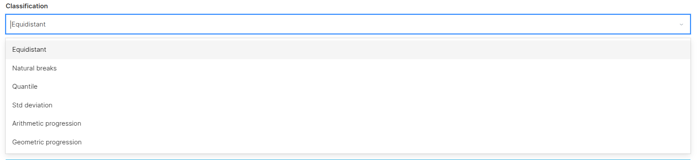

    * **Number of Classes:** Users can enter the number classes they want in this input field.

    * **Sync fill and Outline Color:** Users can fill the outline colour and width here.

    * **Apply when filtering:** Users can apply style on filter as well by checking this.

    #### Dynamic qualitative style

    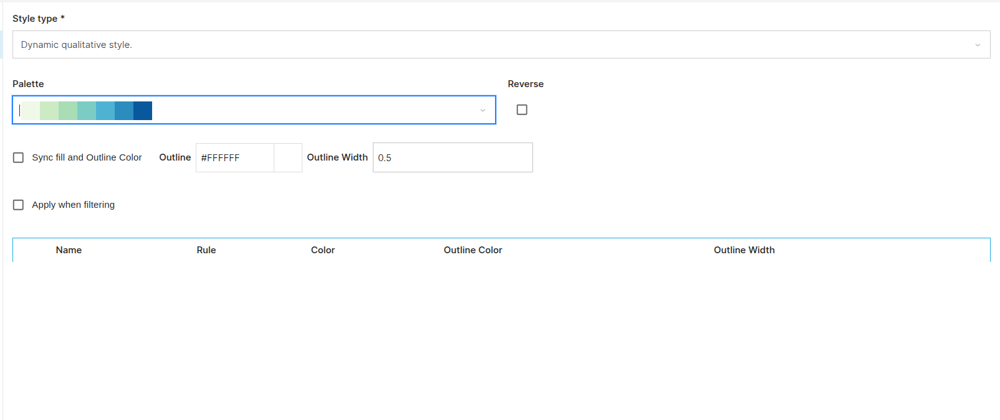

    * **Palette:** Users are required to select the colour palette from the dropdown menu.

    *  **Reverse:** Reverse the colour palette.

    * **Sync fill and Outline Color:** Users can fill the outline colour and width here.

    * **Apply when filtering:** Users can apply style on filter as well by checking this.

### Share

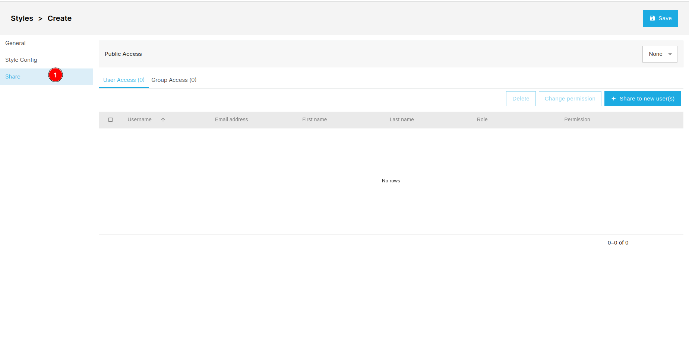

1. **Share:** Users can use tab to access the share section.

Click [here](../share.md) to know more about the share page. 

## Edit Style

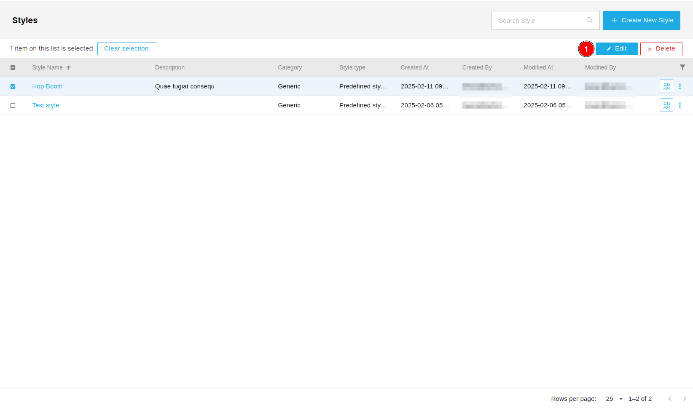

1. **Edit:** After checking the checkbox of the respective style users can click on the `Edit` button to edit the style.

### General/Style

[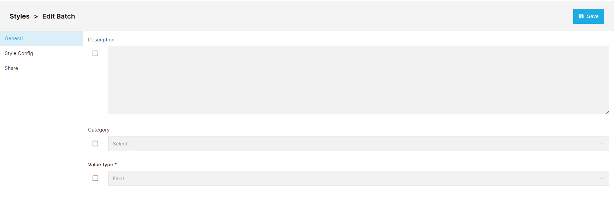](./img/style-img-15.png)

[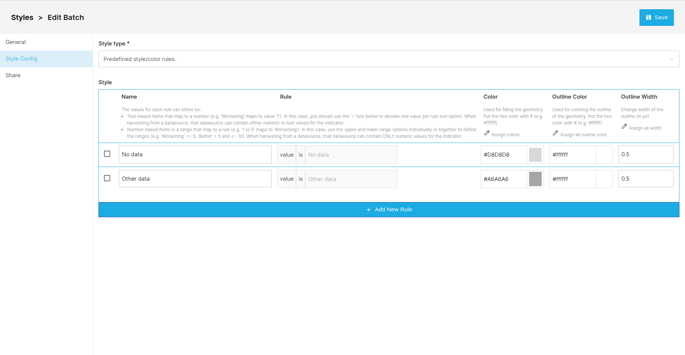](./img/style-img-16.png)

* The edit page works the same as the create new style page, except users must check the checkbox of the respective field to make it editable.

### Share

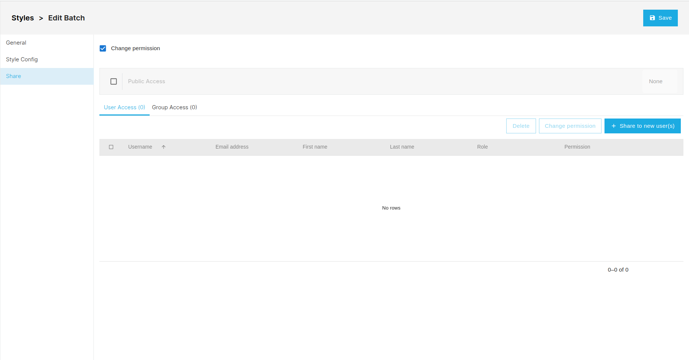

* **Change Permission:** Users are required to check the checkbox to access the further options.

Click [here](../share.md) to see how the share process works.

## Delete Style

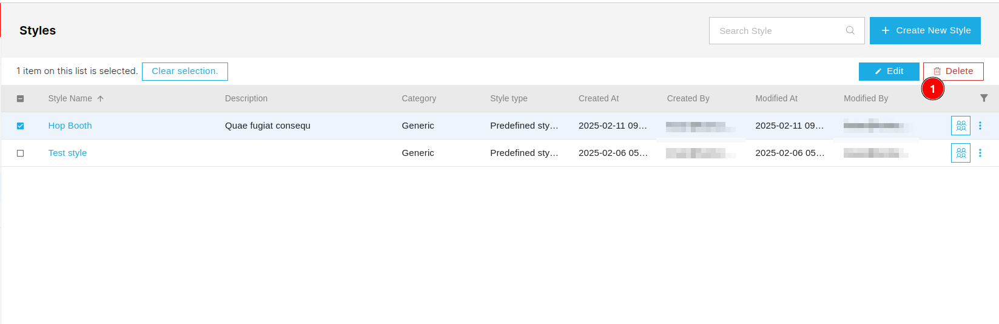

1. **Delete:** Users are required to check the checkbox of the respective style, only then users will be able to delete the style. Users will receive a pop-up dialog box to confirm the deletion. Users can also delete multiple styles at once.

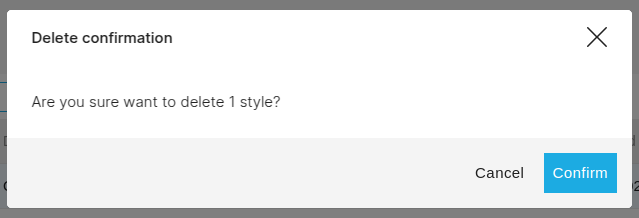

* **Confirm:** Users can confirm the deletion by clicking on the `Confirm` button.

* **Cancel:** Users can cancel the deletion by clicking on the `Cancel` button.

## Sort Data

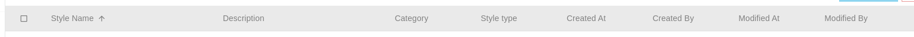

* Users can sort the data in the ascending or descending order by clicking on the header of the respective column.

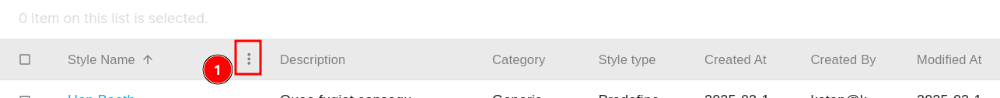

* Users also sort the data by clicking on the three dots.

    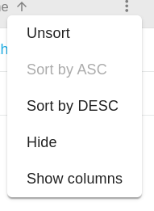

    * **Unsort:** Allows users to unsort the data.
    * **Sort by ASC:** Allows users to sort the data in ascending order.
    * **Sort by DESC:** Allows users to sort the data in descending order.
    * **Hide:** Users can hide the specific column by clicking on the hide option.
    * **Show columns:** Users can change the visibility of the columns by clicking on this option.

        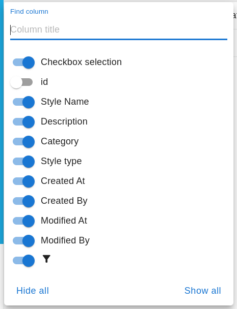

        * **Find Column:** Users can search the specific column by entering the name of the column in the search field.
        
        * ** Button:** Users can change the visibility of the column by clicking on this toggle button. Blue color indicates that the column is visible and gray color indicates that the column is hidden.
        
        * **Hide all:** Users can hide all the columns by clicking on this option.

        * **Show all:** Users can show all the columns by clicking on this option.

##  Filter Data 

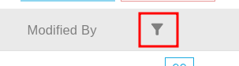

* ** Icon:** Users can click on the filter icon to filter the data.

    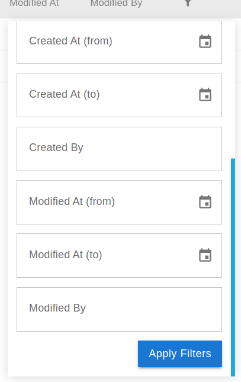

    * **Apply Filters:** First users are required to fill the field on the basis of which they want to filter the data. After selecting the filter, users can apply it by clicking on this button.

## Share Style

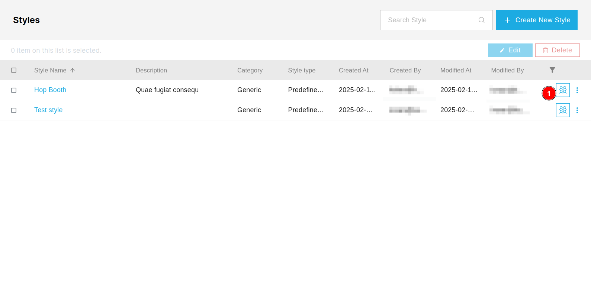

1. ** Icon:** Users can click on the group icon to share the style.

* Click [here](../share.md) to see how the share process works.
