## Quickstart

This section describes the key steps for preparing your first GeoSight dashboard.

1. Find existing or create a new reference boundary dataset (e.g. world country boundaries or subnational boundaries for your country / region of interest). You can use either local dataset (uploaded to GeoSight) or connect to a dedicated app called GeoRepo.

2. Find existing or create new Indicator(s) ➡️ e.g. Number of armed conflict events, level of malnutrition, number of children etc

3. Import data for Indicator(s) ➡️ e.g. import one-time from Excel file, or add scheduled data harvesters (from SharePoint or API)

4. Find existing or add new Context Layer(s) ➡️ e.g. Armed conflict events, location of schools / hospitals / UNICEF offices, areas of control etc

5. Create a new Project ➡️ Add Indicators ➡️ Create Indicator Layers ➡️ Add Context Layers ➡️ Define Filters ➡️ Define Widgets ➡️ Share your Project

### Basic Configurations (for Admins)
Before you start using GeoSight, you will need to configure some default GeoSight settings, e.g. color palettes.

1. Click on your user icon (either upper right corner or, if you are in the admin panel - bottom left)

2. Click ➡️ Django admin

3. In Django, go to ➡️ Home ➡️ Core ➡️ Color palettes

4. Click ➡️ Add new color palette

5. Use the following sample configuration or use your own:
Name: Red-Yellow-Green Diverging
Colors: #d73027,#fc8d59,#fee08b,#ffffbf,#d9ef8b,#91cf60,#1a9850

6. Click Save and go back to GeoSight admin panel

### Create New Reference Dataset
Reference datasets are boundaries that will be used to visualize your indicator data. You can use either a local dataset (uploaded to GeoSight) or connect to a dedicated app called GeoRepo. In this section we will guide you how to upload a new Reference Dataset to GeoSight

1. Go to ➡️ Reference Datasets ➡️ Create New Reference Dataset

2. Provide name of your dataset (e.g. "Somalia Districts")

3. Click ➡️ Add new level

4. Change admin level name as needed (e.g. "District")

5. Click ➡️ Submit

6. Click ➡️ Import data (upper right corner)

7. Drag and drop or click to browse for a file in one of these formats: .json, .geojson, .gpkg or a zip file containing a shapefile with administrative boundaries. 

[District Boundaries for Somalia (SHP)](data/som_admin_2.zip)

8. Select the column with name and unique code (Ucode)

9. Click ➡️ Submit

### Create New Basemap

1. Go to ➡️ Basemaps ➡️ Create New Basemap

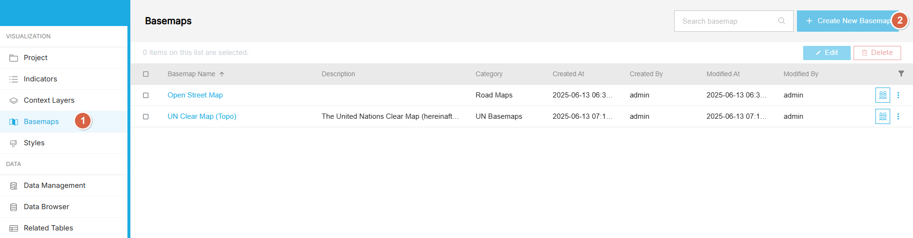

2. Use the following sample settings:
- Name: Open Street Map
- Url: https://a.tile.openstreetmap.org/{z}/{x}/{y}.png?noWrap=true
- Type: XYZ tile
- Category: create new Category (e.g. "Road Maps")
- click ➡️ Save

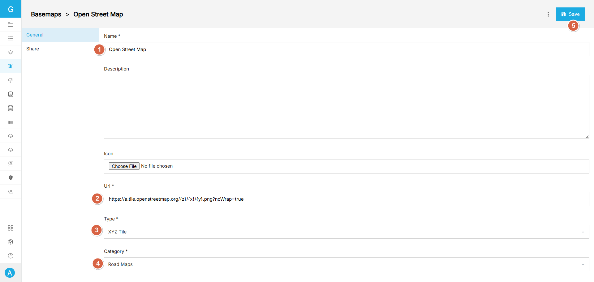

### Create New Indicator
1. Go to ➡️ Indicators ➡️ Create New Indicator

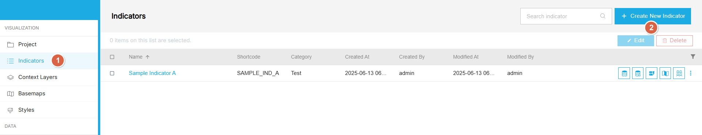

2. Use the following sample settings or create your own:

- Name: Sample Indicator A
- Shortcode: SAMPLE_IND_A
- Category: Type in "TEST" and click Create "TEST"

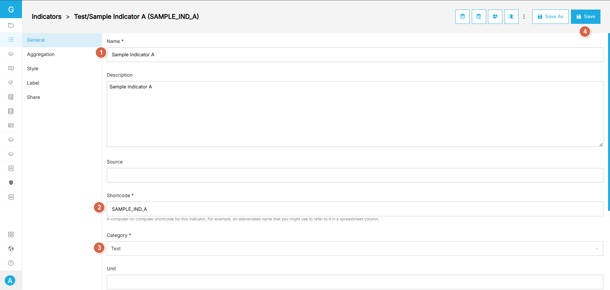

3. You can leave other settings as default

4. Click ➡️ Save

### Import Indicator Data
1. Go to ➡️ Indicators ➡️ Find "Sample Indicator A" ➡️ Click Import data

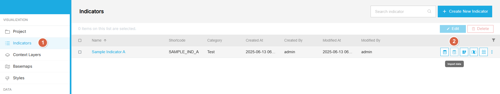

2. Use the following settings:
- Import type: Indicator Value
- Input format: Excel Long Format

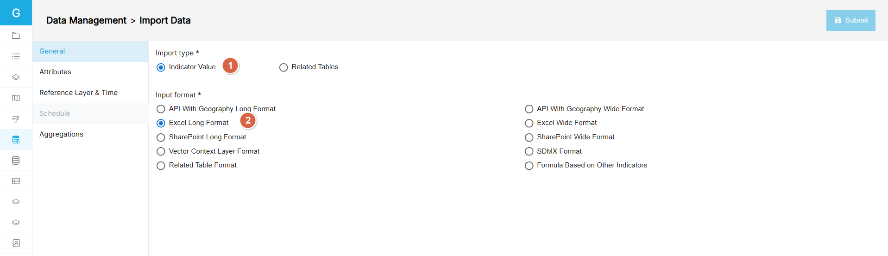

3. Go to ➡️ Attributes tab and use the following settings:
- Click ➡️ Choose file and select a file with indicator data: [Sample Indicator A - sample data for Somalia](data/som_sampl_ind_a_2010_2020.xlsx)

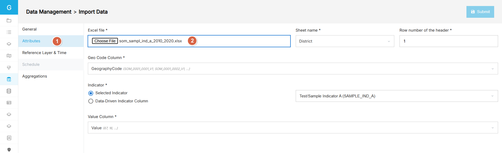

4. Go to ➡️ Reference Layer & Time tab
- Click on ➡️ Reference Layer dropdown and select "Somalia Districts"
- For "Date Time Setting" use "Data-Driven Date" option and make sure that the "Date" field is selected with a proper Date Time format
- Click ➡️ Submit

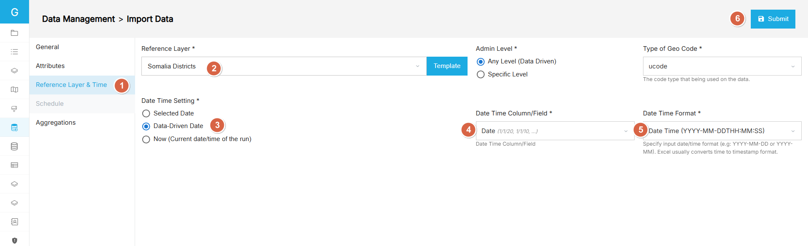

5. Preview data
- Once you see the "Success" message, click ➡️ See the data

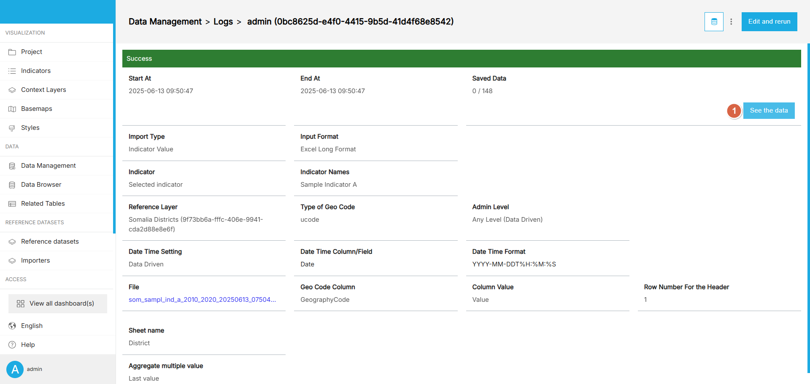

6. Save data
- Click ➡️ "Select all 148 data"
- Click ➡️ Save

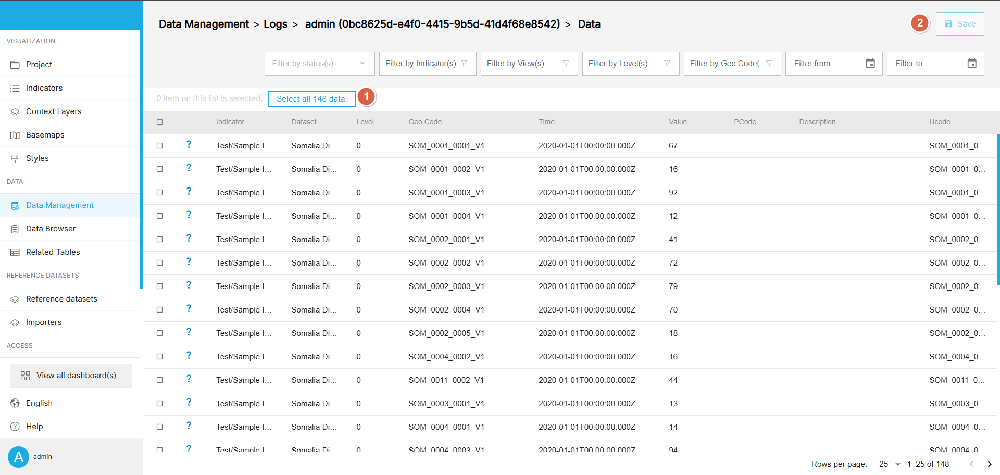

Your data has been now imported to GeoSight.

### Create new Dashboard
1. Go to ➡️ Projects ➡️ Create New "Project"

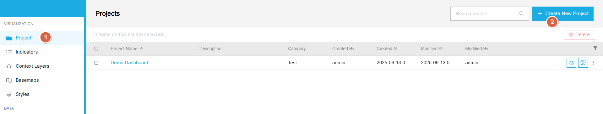

2. Use the following settings:
- View: "Somalia Districts"
- Name: "First Project"

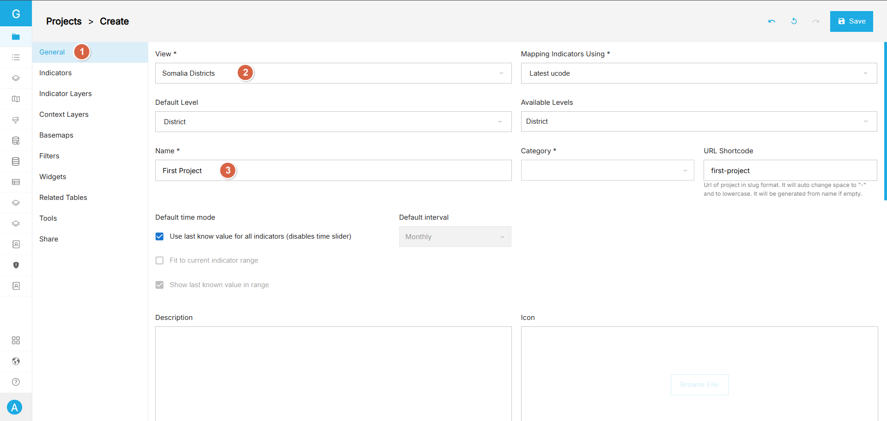

3. Go to Indicators:
- Click ➡️ Add Indicator
- Select "Sample Indicator A" and click ➡️ "Update Selection"

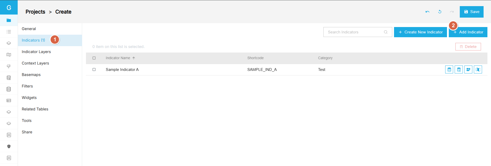

4. Go to Indicator Layers:
- Click ➡️ Add Indicator Layer
- Choose "Single Indicator Layer"
- Select "Sample Indicator A" and click ➡️ "Apply Selection"

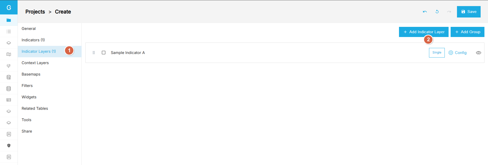

5. Go to Basemaps:
- Click ➡️ Add Basemap
- Choose "Open Street Map" and click ➡️ "Apply Selection"

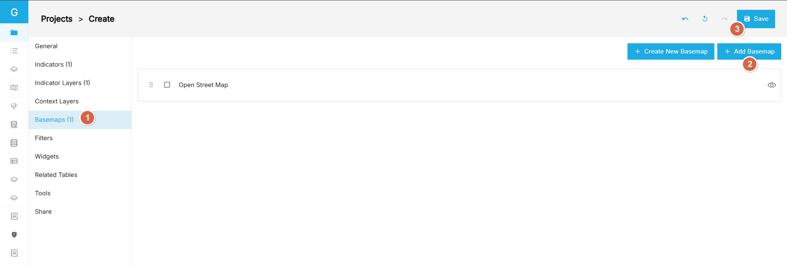

6. Save the dashboard:
- Click ➡️ Save

7. Preview your first GeoSight Dashboard:
- Click ➡️ Preview

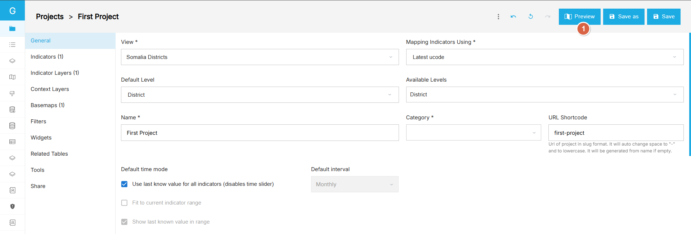

8. Your final dashboard:

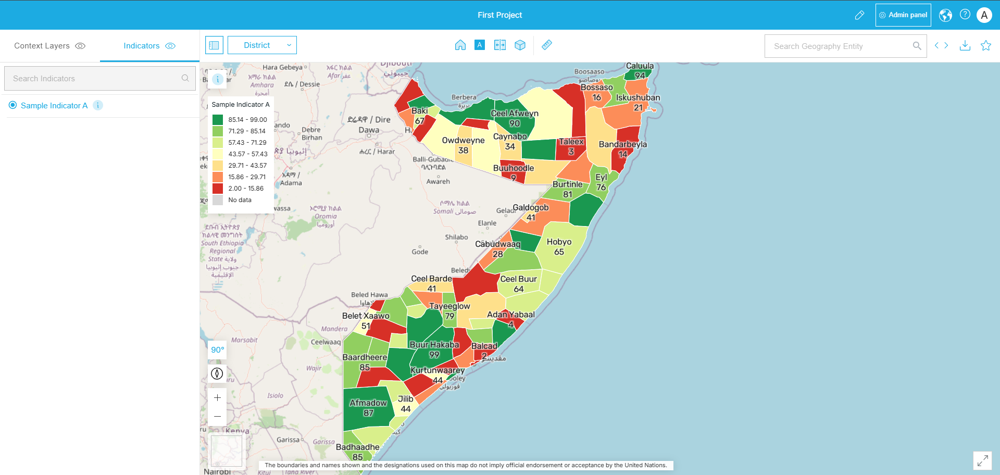

### How to prepare data for GeoSight?

In GeoSight users can import data from multiple sources:

- APIs (JSON)
- Excel files
- SharePoint Excel
- SDMX Data Warehouse (coming soon)

The easiest way is to import data using standalone Excel file.Excel import supports two formats:

- LONG and
- WIDE

#### Excel LONG format

- Can be used to import multiple indicators, geographies (e.g. districts) and dates in one go
- Required columns:
  - GeographyCode – contains unique code for identifying a geographic entity (e.g. district). NOTE: currently geographic entities must be from a single admin level
  - IndicatorCode – should match the Indicator’s shortcode as defined in GeoSight
  - DateTime – valid date, e.g. 01-01-2022
  - Value – observation value

#### Excel WIDE format

- Can be used to import multiple indicators, geographies (e.g. districts) for a single date only
- Required columns:
  - GeographyCode – Contains unique code for identifying a geographic entity (e.g. district). NOTE: currently geographic entities must be from a single admin level
  - Indicator columns – name of each column should match the Indicator’s shortcode as defined in GeoSight
  - Value – observation value
